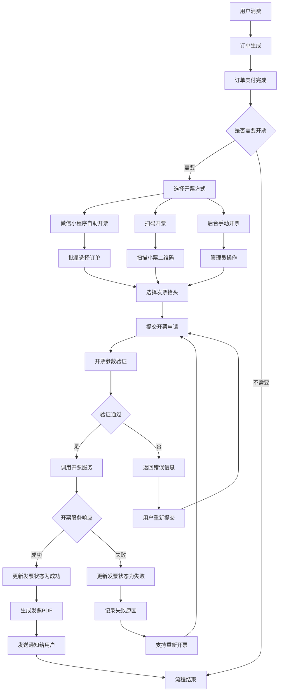
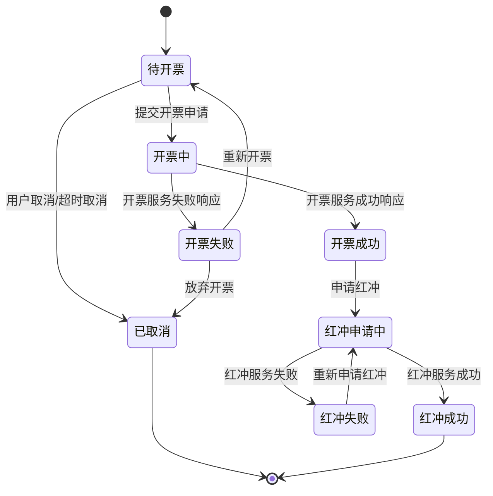
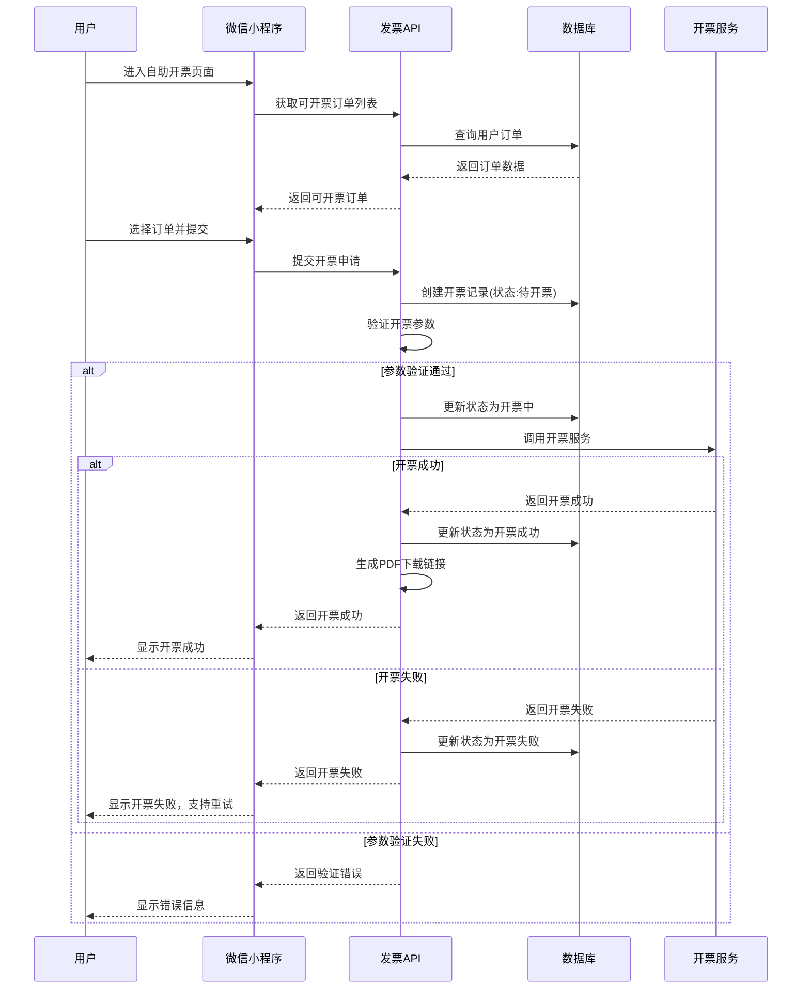
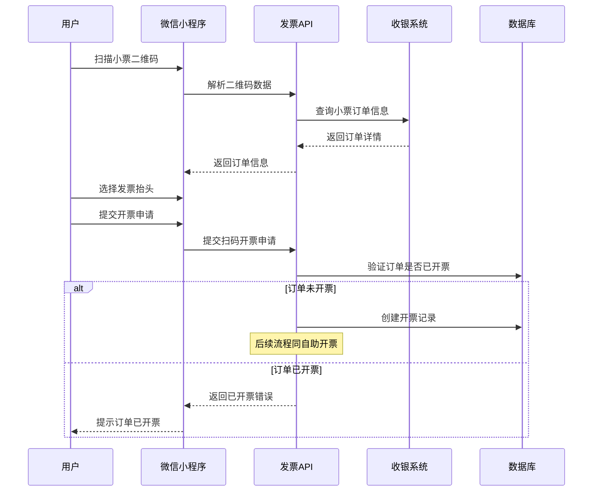
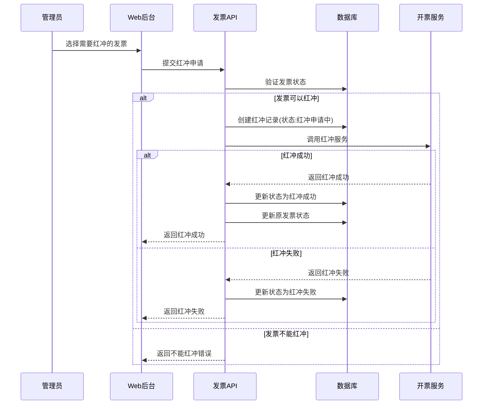

# 发票业务流程和状态管理设计 v1.0

## 1. 业务流程总体设计

### 1.1 发票业务流程图



### 1.2 核心业务节点

#### 1.2.1 开票申请节点
- **触发条件**: 用户主动申请或管理员代开
- **输入参数**: 订单信息、发票抬头、开票类型
- **验证内容**: 订单有效性、抬头完整性、开票权限
- **输出结果**: 开票申请记录或错误信息

#### 1.2.2 开票执行节点
- **触发条件**: 开票申请通过验证
- **执行内容**: 调用第三方开票服务
- **异步处理**: 支持异步开票避免长时间等待
- **结果处理**: 成功更新状态，失败记录原因

#### 1.2.3 结果通知节点
- **成功通知**: 发送开票成功消息给用户
- **失败通知**: 发送开票失败原因和重试入口
- **状态同步**: 实时更新前端显示状态

## 2. 发票状态管理设计

### 2.1 状态定义

```javascript
// 发票状态枚举
const INVOICE_STATUS = {
  PENDING: '00',        // 待开票
  PROCESSING: '01',     // 开票中  
  SUCCESS: '02',        // 开票成功
  FAILED: '03',         // 开票失败
  CANCELLED: '04',      // 已取消
  RED_APPLIED: '05',    // 红冲申请中
  RED_SUCCESS: '06',    // 红冲成功
  RED_FAILED: '07'      // 红冲失败
};

// 状态描述映射
const STATUS_DESCRIPTIONS = {
  [INVOICE_STATUS.PENDING]: '发票申请已提交，等待处理',
  [INVOICE_STATUS.PROCESSING]: '正在调用开票服务，请稍候',
  [INVOICE_STATUS.SUCCESS]: '发票开具成功，可以下载',
  [INVOICE_STATUS.FAILED]: '发票开具失败，可以重试',
  [INVOICE_STATUS.CANCELLED]: '发票申请已取消',
  [INVOICE_STATUS.RED_APPLIED]: '红冲申请已提交，等待审批',
  [INVOICE_STATUS.RED_SUCCESS]: '发票红冲成功',
  [INVOICE_STATUS.RED_FAILED]: '发票红冲失败'
};
```

### 2.2 状态流转规则

```javascript
// 状态流转规则定义
const STATUS_TRANSITIONS = {
  [INVOICE_STATUS.PENDING]: [
    INVOICE_STATUS.PROCESSING,
    INVOICE_STATUS.CANCELLED
  ],
  [INVOICE_STATUS.PROCESSING]: [
    INVOICE_STATUS.SUCCESS,
    INVOICE_STATUS.FAILED
  ],
  [INVOICE_STATUS.SUCCESS]: [
    INVOICE_STATUS.RED_APPLIED
  ],
  [INVOICE_STATUS.FAILED]: [
    INVOICE_STATUS.PENDING,    // 重新开票
    INVOICE_STATUS.CANCELLED
  ],
  [INVOICE_STATUS.RED_APPLIED]: [
    INVOICE_STATUS.RED_SUCCESS,
    INVOICE_STATUS.RED_FAILED
  ],
  [INVOICE_STATUS.RED_FAILED]: [
    INVOICE_STATUS.RED_APPLIED  // 重新申请红冲
  ]
};

// 状态流转验证函数
function canTransitionTo(currentStatus, targetStatus) {
  const allowedTransitions = STATUS_TRANSITIONS[currentStatus] || [];
  return allowedTransitions.includes(targetStatus);
}
```

### 2.3 状态流转图



## 3. 具体业务流程设计

### 3.1 自助开票流程



### 3.2 扫码开票流程



### 3.3 发票红冲流程



## 4. 业务规则设计

### 4.1 开票前置条件验证

```javascript
// 开票前置条件验证规则
const INVOICE_VALIDATION_RULES = {
  // 订单验证
  ORDER_VALIDATION: {
    // 订单必须已支付
    ORDER_PAID: {
      check: (order) => order.payStatus === 'PAID',
      message: '订单尚未支付，不能开票'
    },
    
    // 订单未开票或部分开票
    NOT_FULLY_INVOICED: {
      check: (order) => order.invoiceStatus !== 'FULLY_INVOICED',
      message: '订单已全额开票'
    },
    
    // 订单在有效期内
    ORDER_VALID: {
      check: (order) => {
        const days = (Date.now() - new Date(order.payTime)) / (1000 * 60 * 60 * 24);
        return days <= 365; // 一年内可开票
      },
      message: '订单超过开票有效期'
    }
  },
  
  // 用户验证
  USER_VALIDATION: {
    // 用户不在黑名单
    NOT_BLACKLISTED: {
      check: async (userId) => {
        const isBlacklisted = await checkUserBlacklist(userId);
        return !isBlacklisted;
      },
      message: '用户已被列入开票黑名单'
    },
    
    // 开票频率检查
    FREQUENCY_CHECK: {
      check: async (userId) => {
        const todayCount = await getTodayInvoiceCount(userId);
        return todayCount < 10; // 每日最多开票10次
      },
      message: '今日开票次数已达上限'
    }
  },
  
  // 发票抬头验证
  HEADER_VALIDATION: {
    // 抬头信息完整
    HEADER_COMPLETE: {
      check: (header) => {
        if (header.type === 'COMPANY') {
          return header.taxNumber && header.name && header.address && header.phone;
        }
        return header.name;
      },
      message: '发票抬头信息不完整'
    },
    
    // 税号格式验证
    TAX_NUMBER_FORMAT: {
      check: (header) => {
        if (header.type === 'COMPANY' && header.taxNumber) {
          return /^[A-Z0-9]{15,20}$/.test(header.taxNumber);
        }
        return true;
      },
      message: '统一社会信用代码格式不正确'
    }
  }
};
```

### 4.2 开票金额计算规则

```javascript
// 开票金额计算服务
class InvoiceAmountCalculator {
  
  // 计算订单可开票金额
  static calculateInvoiceableAmount(orders) {
    return orders.reduce((total, order) => {
      // 已支付金额 - 已开票金额
      const invoiceableAmount = order.paidAmount - (order.invoicedAmount || 0);
      return total + Math.max(0, invoiceableAmount);
    }, 0);
  }
  
  // 按商品类型分组计算税额
  static calculateTaxByCategory(orderDetails) {
    const taxGroups = {};
    
    orderDetails.forEach(detail => {
      const category = detail.productCategory;
      const taxRate = this.getTaxRateByCategory(category);
      
      if (!taxGroups[taxRate]) {
        taxGroups[taxRate] = {
          amount: 0,
          taxRate: taxRate,
          items: []
        };
      }
      
      taxGroups[taxRate].amount += detail.amount;
      taxGroups[taxRate].items.push(detail);
    });
    
    return taxGroups;
  }
  
  // 获取商品类别对应税率
  static getTaxRateByCategory(category) {
    const TAX_RATE_MAP = {
      'OIL': 0.13,          // 成品油 13%
      'GOODS': 0.13,        // 一般商品 13%
      'FOOD': 0.13,         // 食品 13%
      'SERVICE': 0.06,      // 服务类 6%
      'PREPAID_CARD': 0     // 预付卡充值 0%
    };
    
    return TAX_RATE_MAP[category] || 0.13;
  }
  
  // 计算总税额
  static calculateTotalTax(taxGroups) {
    return Object.values(taxGroups).reduce((total, group) => {
      return total + (group.amount * group.taxRate);
    }, 0);
  }
}
```

## 5. 异常处理机制

### 5.1 开票失败处理策略

```javascript
// 开票失败处理服务
class InvoiceFailureHandler {
  
  // 处理开票失败
  static async handleInvoiceFailure(invoiceRecord, errorInfo) {
    const { id, retryCount = 0 } = invoiceRecord;
    const { errorCode, errorMessage } = errorInfo;
    
    // 更新失败状态
    await this.updateInvoiceStatus(id, {
      status: INVOICE_STATUS.FAILED,
      errorCode,
      errorMessage,
      retryCount: retryCount + 1
    });
    
    // 根据错误类型决定处理策略
    const strategy = this.getFailureStrategy(errorCode);
    
    switch (strategy) {
      case 'AUTO_RETRY':
        // 自动重试
        if (retryCount < 3) {
          await this.scheduleRetry(id, retryCount + 1);
        }
        break;
        
      case 'MANUAL_INTERVENTION':
        // 需要人工干预
        await this.createManualTask(id, errorMessage);
        break;
        
      case 'USER_ACTION_REQUIRED':
        // 需要用户重新操作
        await this.notifyUser(invoiceRecord.userId, errorMessage);
        break;
        
      default:
        // 记录日志等待处理
        await this.logFailure(id, errorInfo);
    }
  }
  
  // 获取失败处理策略
  static getFailureStrategy(errorCode) {
    const STRATEGY_MAP = {
      'NETWORK_ERROR': 'AUTO_RETRY',
      'SERVICE_UNAVAILABLE': 'AUTO_RETRY',
      'TAX_NUMBER_INVALID': 'USER_ACTION_REQUIRED',
      'AMOUNT_INVALID': 'USER_ACTION_REQUIRED',
      'SYSTEM_ERROR': 'MANUAL_INTERVENTION'
    };
    
    return STRATEGY_MAP[errorCode] || 'MANUAL_INTERVENTION';
  }
  
  // 安排重试任务
  static async scheduleRetry(invoiceId, retryCount) {
    const delay = Math.pow(2, retryCount) * 60000; // 指数退避
    
    setTimeout(async () => {
      await invoiceService.retryInvoice(invoiceId);
    }, delay);
  }
}
```

### 5.2 数据一致性保障

```javascript
// 数据一致性服务
class InvoiceConsistencyService {
  
  // 开票事务处理
  static async processInvoiceTransaction(invoiceRequest) {
    const transaction = await db.transaction();
    
    try {
      // 1. 锁定相关订单
      await this.lockOrders(invoiceRequest.orderIds, transaction);
      
      // 2. 验证订单状态
      const orders = await this.validateOrders(invoiceRequest.orderIds, transaction);
      
      // 3. 创建开票记录
      const invoiceRecord = await this.createInvoiceRecord(invoiceRequest, transaction);
      
      // 4. 更新订单开票状态
      await this.updateOrderInvoiceStatus(invoiceRequest.orderIds, invoiceRecord.id, transaction);
      
      // 5. 提交事务
      await transaction.commit();
      
      return invoiceRecord;
      
    } catch (error) {
      // 回滚事务
      await transaction.rollback();
      throw error;
    }
  }
  
  // 开票成功后处理
  static async handleInvoiceSuccess(invoiceId, invoiceInfo) {
    const transaction = await db.transaction();
    
    try {
      // 1. 更新开票记录
      await this.updateInvoiceRecord(invoiceId, {
        status: INVOICE_STATUS.SUCCESS,
        invoiceNo: invoiceInfo.invoiceNo,
        invoiceCode: invoiceInfo.invoiceCode,
        invoiceDate: invoiceInfo.invoiceDate,
        pdfUrl: invoiceInfo.pdfUrl
      }, transaction);
      
      // 2. 更新订单已开票金额
      await this.updateOrderInvoicedAmount(invoiceId, transaction);
      
      // 3. 生成开票通知
      await this.createInvoiceNotification(invoiceId, transaction);
      
      await transaction.commit();
      
    } catch (error) {
      await transaction.rollback();
      throw error;
    }
  }
}
```

## 6. 状态机实现

### 6.1 发票状态机类

```javascript
// 发票状态机实现
class InvoiceStateMachine {
  
  constructor(initialStatus) {
    this.currentStatus = initialStatus;
    this.listeners = [];
  }
  
  // 状态转换
  async transitionTo(targetStatus, context = {}) {
    if (!canTransitionTo(this.currentStatus, targetStatus)) {
      throw new Error(`Cannot transition from ${this.currentStatus} to ${targetStatus}`);
    }
    
    const previousStatus = this.currentStatus;
    
    try {
      // 执行状态转换前的动作
      await this.executeBeforeAction(targetStatus, context);
      
      // 更新状态
      this.currentStatus = targetStatus;
      
      // 执行状态转换后的动作
      await this.executeAfterAction(targetStatus, context);
      
      // 通知监听器
      this.notifyListeners(previousStatus, targetStatus, context);
      
      return true;
    } catch (error) {
      // 状态转换失败，回滚
      this.currentStatus = previousStatus;
      throw error;
    }
  }
  
  // 执行转换前动作
  async executeBeforeAction(targetStatus, context) {
    const actionMap = {
      [INVOICE_STATUS.PROCESSING]: () => this.beforeProcessing(context),
      [INVOICE_STATUS.SUCCESS]: () => this.beforeSuccess(context),
      [INVOICE_STATUS.FAILED]: () => this.beforeFailed(context)
    };
    
    const action = actionMap[targetStatus];
    if (action) {
      await action();
    }
  }
  
  // 执行转换后动作
  async executeAfterAction(targetStatus, context) {
    const actionMap = {
      [INVOICE_STATUS.PROCESSING]: () => this.afterProcessing(context),
      [INVOICE_STATUS.SUCCESS]: () => this.afterSuccess(context),
      [INVOICE_STATUS.FAILED]: () => this.afterFailed(context)
    };
    
    const action = actionMap[targetStatus];
    if (action) {
      await action();
    }
  }
  
  // 添加状态变化监听器
  addListener(listener) {
    this.listeners.push(listener);
  }
  
  // 通知所有监听器
  notifyListeners(from, to, context) {
    this.listeners.forEach(listener => {
      try {
        listener(from, to, context);
      } catch (error) {
        console.error('State change listener error:', error);
      }
    });
  }
}
```

---

**文档版本**: v1.0  
**创建日期**: 2025-08-27  
**创建人**: 孙杨竣@喂车 