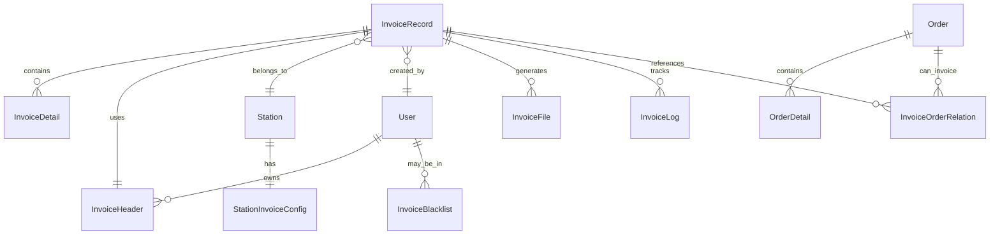

# 发票数据模型和前后端接口规范设计 v1.0

## 1. 数据模型设计

### 1.1 核心实体关系图



### 1.2 核心数据表设计

#### 1.2.1 发票记录主表 (invoice_record)

```sql
CREATE TABLE invoice_record (
    id BIGINT PRIMARY KEY AUTO_INCREMENT,
    order_code VARCHAR(50) NOT NULL UNIQUE COMMENT '发票请求流水号(内部订单编号)',
    user_id BIGINT NOT NULL COMMENT '用户ID',
    merchant_id BIGINT NOT NULL COMMENT '商户ID',
    invoice_flag CHAR(1) DEFAULT '0' COMMENT '蓝字发票标志：0-蓝字发票，1-红字发票',
    platform_code VARCHAR(20) COMMENT '平台代码',
    invoice_type CHAR(2) NOT NULL COMMENT '发票票种：01-数电专，02-数电普',
    buyer_type CHAR(1) DEFAULT 'N' COMMENT '购买方类型',
    special_elements TEXT COMMENT '特殊要素',
    region_code VARCHAR(10) COMMENT '地区代码',
    
    -- 销方信息
    seller_address VARCHAR(200) COMMENT '销方地址',
    seller_phone VARCHAR(50) COMMENT '销方电话',
    seller_bank_name VARCHAR(100) COMMENT '销方开户银行',
    seller_bank_account VARCHAR(50) COMMENT '销方银行账号',
    
    -- 购买方信息
    buyer_tax_id VARCHAR(50) COMMENT '购买方纳税人识别号',
    buyer_name VARCHAR(200) NOT NULL COMMENT '购买方名称',
    buyer_address VARCHAR(200) COMMENT '购买方地址',
    buyer_phone VARCHAR(50) COMMENT '购买方电话',
    buyer_bank_name VARCHAR(100) COMMENT '购买方开户银行',
    buyer_bank_account VARCHAR(50) COMMENT '购买方银行账号',
    buyer_agent_name VARCHAR(100) COMMENT '购买方代理人姓名',
    buyer_agent_id_number VARCHAR(30) COMMENT '购买方代理人身份证号',
    buyer_agent_phone VARCHAR(20) COMMENT '购买方代理人电话',
    
    -- 金额信息
    total_amount DECIMAL(15,2) NOT NULL DEFAULT 0 COMMENT '合计金额',
    total_tax DECIMAL(15,2) NOT NULL DEFAULT 0 COMMENT '合计税额',
    total_amount_with_tax DECIMAL(15,2) NOT NULL DEFAULT 0 COMMENT '价税合计',
    
    -- 收款信息
    collection_bank_name VARCHAR(100) COMMENT '收款银行',
    collection_bank_account VARCHAR(50) COMMENT '收款账号',
    settlement_method CHAR(2) COMMENT '结算方式',
    tax_behavior_location VARCHAR(100) COMMENT '纳税行为发生地',
    
    -- 开票人员信息
    drawer_name VARCHAR(100) COMMENT '开票人',
    drawer_id_number VARCHAR(30) COMMENT '开票人身份证号',
    drawer_id_type CHAR(2) COMMENT '开票人证件类型',
    payee_name VARCHAR(100) COMMENT '收款人',
    reviewer_name VARCHAR(100) COMMENT '复核人',
    
    -- 红冲相关
    corresponding_blue_invoice_no VARCHAR(50) COMMENT '对应蓝字发票号码',
    red_confirmation_info_no VARCHAR(50) COMMENT '红字确认单信息表编号',
    red_confirmation_uuid VARCHAR(100) COMMENT '红字确认单UUID',
    
    -- 备注和设备信息
    remark TEXT COMMENT '备注',
    server_ip VARCHAR(50) COMMENT '服务器IP',
    mac_address VARCHAR(50) COMMENT 'MAC地址',
    cpu_id VARCHAR(100) COMMENT 'CPU ID',
    motherboard_serial VARCHAR(100) COMMENT '主板序列号',
    
    -- 显示配置
    show_seller_bank_flag CHAR(1) DEFAULT 'Y' COMMENT '是否显示销方银行信息',
    show_buyer_bank_flag CHAR(1) DEFAULT 'N' COMMENT '是否显示购买方银行信息',
    
    -- 开票状态和结果
    invoice_status CHAR(2) NOT NULL DEFAULT '00' COMMENT '发票状态：00-待开票，01-开票中，02-开票成功，03-开票失败',
    invoice_no VARCHAR(50) COMMENT '发票号码',
    invoice_code VARCHAR(20) COMMENT '发票代码',
    invoice_date DATE COMMENT '开票日期',
    error_msg TEXT COMMENT '错误信息',
    retry_count INT DEFAULT 0 COMMENT '重试次数',
    
    -- 文件地址
    pdf_url VARCHAR(500) COMMENT 'PDF文件访问地址',
    sjly VARCHAR(100) COMMENT '数据来源',
    ofd_url VARCHAR(500) COMMENT 'OFD文件访问地址',
    ewm_url VARCHAR(500) COMMENT '二维码访问地址',
    xml_url VARCHAR(500) COMMENT 'XML文件访问地址',
    
    created_time DATETIME DEFAULT CURRENT_TIMESTAMP COMMENT '创建时间',
    updated_time DATETIME DEFAULT CURRENT_TIMESTAMP ON UPDATE CURRENT_TIMESTAMP COMMENT '更新时间',
    
    INDEX idx_user_id (user_id),
    INDEX idx_merchant_id (merchant_id),
    INDEX idx_invoice_status (invoice_status),
    INDEX idx_invoice_date (invoice_date),
    INDEX idx_created_time (created_time),
    INDEX idx_buyer_name (buyer_name),
    INDEX idx_invoice_no (invoice_no)
) COMMENT '开票记录表';
```

#### 1.2.2 发票明细表 (invoice_detail)

```sql
CREATE TABLE invoice_detail (
    id BIGINT PRIMARY KEY AUTO_INCREMENT,
    invoice_record_id BIGINT NOT NULL COMMENT '开票记录ID',
    product_short_name VARCHAR(50) COMMENT '商品编码简称',
    item_name VARCHAR(200) NOT NULL COMMENT '项目名称',
    goods_name VARCHAR(200) NOT NULL COMMENT '货物或应税劳务、服务名称',
    unit VARCHAR(20) COMMENT '单位',
    quantity DECIMAL(15,4) NOT NULL COMMENT '数量',
    unit_price DECIMAL(15,4) NOT NULL COMMENT '单价',
    amount DECIMAL(15,2) NOT NULL COMMENT '金额',
    tax_rate DECIMAL(8,6) NOT NULL COMMENT '税率',
    tax_amount DECIMAL(15,2) NOT NULL COMMENT '税额',
    tax_classification_code VARCHAR(50) COMMENT '税收分类编码',
    product_category VARCHAR(50) COMMENT '商品类别',
    order_detail_id BIGINT COMMENT '关联订单明细ID',
    
    created_time DATETIME DEFAULT CURRENT_TIMESTAMP,
    
    FOREIGN KEY (invoice_record_id) REFERENCES invoice_record(id),
    INDEX idx_invoice_record_id (invoice_record_id),
    INDEX idx_order_detail_id (order_detail_id)
) COMMENT '发票明细表';
```

#### 1.2.3 发票抬头表 (invoice_header)

```sql
CREATE TABLE invoice_header (
    id BIGINT PRIMARY KEY AUTO_INCREMENT,
    user_id BIGINT NOT NULL COMMENT '用户ID',
    header_type VARCHAR(20) NOT NULL COMMENT '抬头类型：PERSONAL-个人，COMPANY-企业',
    buyer_name VARCHAR(200) NOT NULL COMMENT '购买方名称',
    buyer_tax_id VARCHAR(50) COMMENT '购买方纳税人识别号',
    buyer_address VARCHAR(200) COMMENT '购买方地址',
    buyer_phone VARCHAR(50) COMMENT '购买方电话',
    buyer_bank_name VARCHAR(100) COMMENT '购买方开户银行',
    buyer_bank_account VARCHAR(50) COMMENT '购买方银行账号',
    is_default BOOLEAN DEFAULT FALSE COMMENT '是否默认抬头',
    is_active BOOLEAN DEFAULT TRUE COMMENT '是否有效',
    
    created_time DATETIME DEFAULT CURRENT_TIMESTAMP,
    updated_time DATETIME DEFAULT CURRENT_TIMESTAMP ON UPDATE CURRENT_TIMESTAMP,
    
    INDEX idx_user_id (user_id),
    INDEX idx_header_type (header_type),
    INDEX idx_is_default (is_default)
) COMMENT '发票抬头表';
```

#### 1.2.4 发票订单关联表 (invoice_order_relation)

```sql
CREATE TABLE invoice_order_relation (
    id BIGINT PRIMARY KEY AUTO_INCREMENT,
    invoice_record_id BIGINT NOT NULL COMMENT '开票记录ID',
    order_id BIGINT NOT NULL COMMENT '订单ID',
    invoiced_amount DECIMAL(15,2) NOT NULL COMMENT '已开票金额',
    relation_type VARCHAR(20) DEFAULT 'FULL' COMMENT '关联类型：FULL-全额，PARTIAL-部分',
    
    created_time DATETIME DEFAULT CURRENT_TIMESTAMP,
    
    FOREIGN KEY (invoice_record_id) REFERENCES invoice_record(id),
    INDEX idx_invoice_record_id (invoice_record_id),
    INDEX idx_order_id (order_id),
    UNIQUE KEY uk_invoice_order (invoice_record_id, order_id)
) COMMENT '发票订单关联表';
```

### 1.3 扩展数据表

#### 1.3.1 发票风险监控表 (invoice_risk_alert)

```sql
CREATE TABLE invoice_risk_alert (
    id BIGINT PRIMARY KEY AUTO_INCREMENT,
    alert_type VARCHAR(50) NOT NULL COMMENT '预警类型：FREQUENCY-频繁开票，AMOUNT-大额开票',
    alert_level VARCHAR(20) NOT NULL COMMENT '预警级别：LOW,MEDIUM,HIGH,CRITICAL',
    user_id BIGINT COMMENT '用户ID',
    buyer_name VARCHAR(200) COMMENT '购买方名称',
    buyer_phone VARCHAR(20) COMMENT '购买方电话',
    risk_description TEXT NOT NULL COMMENT '风险描述',
    risk_detail JSON COMMENT '风险详情',
    alert_status VARCHAR(20) DEFAULT 'PENDING' COMMENT '处理状态：PENDING,PROCESSED,IGNORED',
    processor_id BIGINT COMMENT '处理人ID',
    process_time DATETIME COMMENT '处理时间',
    process_note TEXT COMMENT '处理备注',
    
    created_time DATETIME DEFAULT CURRENT_TIMESTAMP,
    updated_time DATETIME DEFAULT CURRENT_TIMESTAMP ON UPDATE CURRENT_TIMESTAMP,
    
    INDEX idx_alert_type (alert_type),
    INDEX idx_user_id (user_id),
    INDEX idx_created_time (created_time),
    INDEX idx_alert_status (alert_status)
) COMMENT '发票风险预警表';
```

#### 1.3.2 发票黑名单表 (invoice_blacklist)

```sql
CREATE TABLE invoice_blacklist (
    id BIGINT PRIMARY KEY AUTO_INCREMENT,
    blacklist_type VARCHAR(20) NOT NULL COMMENT '黑名单类型：USER,COMPANY,PHONE,IP',
    blacklist_content VARCHAR(200) NOT NULL COMMENT '黑名单内容',
    reason TEXT NOT NULL COMMENT '加入黑名单原因',
    operator_id BIGINT NOT NULL COMMENT '操作人ID',
    operator_name VARCHAR(100) NOT NULL COMMENT '操作人姓名',
    status VARCHAR(20) DEFAULT 'ACTIVE' COMMENT '状态：ACTIVE,INACTIVE',
    
    created_time DATETIME DEFAULT CURRENT_TIMESTAMP,
    updated_time DATETIME DEFAULT CURRENT_TIMESTAMP ON UPDATE CURRENT_TIMESTAMP,
    
    INDEX idx_blacklist_type (blacklist_type),
    INDEX idx_blacklist_content (blacklist_content),
    INDEX idx_status (status)
) COMMENT '发票黑名单表';
```

## 2. 前后端接口规范设计

### 2.1 接口响应格式规范

```typescript
// 统一响应格式
interface ApiResponse<T = any> {
  code: number;           // 状态码，0表示成功
  message: string;        // 响应消息
  data?: T;              // 响应数据
  timestamp: string;      // 响应时间戳
}

// 分页响应格式
interface PageResponse<T = any> {
  page: number;          // 当前页码
  pageSize: number;      // 每页大小
  total: number;         // 总记录数
  totalPages: number;    // 总页数
  list: T[];            // 数据列表
}

// 错误响应格式
interface ErrorResponse {
  code: number;          // 错误码
  message: string;       // 错误消息
  details?: any;         // 错误详情
  timestamp: string;     // 错误时间
}
```

### 2.2 微信小程序接口定义

#### 2.2.1 获取可开票订单列表

```typescript
// 请求参数
interface GetInvoiceableOrdersRequest {
  page?: number;
  pageSize?: number;
  orderType?: 'all' | 'fuel' | 'goods' | 'prepaid' | 'points';
  startDate?: string;
  endDate?: string;
  minAmount?: number;
  maxAmount?: number;
}

// 响应数据
interface InvoiceableOrder {
  id: string;
  orderCode: string;
  orderType: string;
  orderTime: string;
  totalAmount: number;
  paidAmount: number;
  invoicedAmount: number;
  invoiceableAmount: number;
  productList: OrderProduct[];
  stationInfo?: StationInfo;
}

interface OrderProduct {
  productCode: string;
  productName: string;
  quantity: number;
  unitPrice: number;
  amount: number;
  taxRate: number;
  category: string;
}
```

#### 2.2.2 提交开票申请

```typescript
// 请求参数
interface SubmitInvoiceApplicationRequest {
  orderIds: string[];
  headerInfo: InvoiceHeaderInfo;
  invoiceType: '01' | '02';  // 01-专票, 02-普票
  remark?: string;
}

// 发票抬头信息
interface InvoiceHeaderInfo {
  id?: string;
  type: 'PERSONAL' | 'COMPANY';
  name: string;             // 抬头名称
  taxNumber?: string;       // 税号(企业必填)
  address?: string;         // 地址
  phone?: string;           // 电话
  bankName?: string;        // 开户银行
  bankAccount?: string;     // 银行账号
  isDefault?: boolean;      // 是否默认
}

// 响应数据
interface SubmitInvoiceApplicationResponse {
  invoiceRequestId: string;
  estimatedTime: number;     // 预计完成时间(分钟)
  status: string;
}
```

#### 2.2.3 获取开票记录

```typescript
// 请求参数
interface GetInvoiceRecordsRequest {
  page?: number;
  pageSize?: number;
  status?: string;
  startDate?: string;
  endDate?: string;
}

// 响应数据
interface InvoiceRecord {
  id: string;
  orderCode: string;
  invoiceNo?: string;
  invoiceCode?: string;
  buyerName: string;
  totalAmount: number;
  totalTax: number;
  totalAmountWithTax: number;
  invoiceType: string;
  invoiceStatus: string;
  invoiceDate?: string;
  errorMsg?: string;
  pdfUrl?: string;
  ofdUrl?: string;
  createdTime: string;
  orderInfo: InvoiceOrderInfo[];
}

interface InvoiceOrderInfo {
  orderId: string;
  orderCode: string;
  orderType: string;
  invoicedAmount: number;
}
```

### 2.3 Web后台管理接口定义

#### 2.3.1 开票记录管理

```typescript
// 查询开票记录
interface AdminGetInvoiceRecordsRequest {
  page?: number;
  pageSize?: number;
  userId?: string;
  orderCode?: string;
  invoiceNo?: string;
  buyerPhone?: string;
  invoiceStatus?: string;
  createTimeStart?: string;
  createTimeEnd?: string;
  invoiceDateStart?: string;
  invoiceDateEnd?: string;
  merchantId?: string;
  sortBy?: string;
  sortOrder?: 'asc' | 'desc';
}

// 手动开票申请
interface ManualInvoiceRequest {
  orderIds: string[];
  userId: string;
  stationId: string;
  headerInfo: InvoiceHeaderInfo;
  invoiceType: '01' | '02';
  remark?: string;
  operatorId: string;
  operatorName: string;
}
```

#### 2.3.2 发票红冲管理

```typescript
// 红冲申请
interface RedInvoiceApplyRequest {
  invoiceRecordId: string;
  redReason: string;
  redType: 'FULL' | 'PARTIAL';  // 全额红冲/部分红冲
  redAmount?: number;            // 部分红冲时的金额
  operatorId: string;
  operatorName: string;
}

// 红冲记录
interface RedInvoiceRecord {
  id: string;
  originalInvoiceId: string;
  originalInvoiceNo: string;
  redReason: string;
  redType: string;
  redAmount: number;
  redStatus: string;
  redInvoiceNo?: string;
  redInvoiceCode?: string;
  redInvoiceDate?: string;
  operatorInfo: OperatorInfo;
  createdTime: string;
}

interface OperatorInfo {
  id: string;
  name: string;
  department: string;
}
```

#### 2.3.3 风险监控接口

```typescript
// 获取风险预警
interface GetRiskAlertsRequest {
  page?: number;
  pageSize?: number;
  alertType?: string;
  alertLevel?: string;
  alertStatus?: string;
  startDate?: string;
  endDate?: string;
}

// 风险预警记录
interface RiskAlert {
  id: string;
  alertType: string;
  alertLevel: string;
  userId?: string;
  buyerName?: string;
  buyerPhone?: string;
  riskDescription: string;
  riskDetail: any;
  alertStatus: string;
  processorInfo?: OperatorInfo;
  processTime?: string;
  processNote?: string;
  createdTime: string;
}

// 黑名单管理
interface BlacklistManageRequest {
  blacklistType: 'USER' | 'COMPANY' | 'PHONE' | 'IP';
  blacklistContent: string;
  reason: string;
  operatorId: string;
  operatorName: string;
}

interface BlacklistRecord {
  id: string;
  blacklistType: string;
  blacklistContent: string;
  reason: string;
  status: 'ACTIVE' | 'INACTIVE';
  operatorInfo: OperatorInfo;
  createdTime: string;
  updatedTime: string;
}
```

### 2.4 接口地址映射

```typescript
// API接口路径定义
const API_PATHS = {
  // 微信小程序接口
  MINIPROGRAM: {
    // 订单相关
    GET_INVOICEABLE_ORDERS: '/api/v1/miniprogram/orders/invoiceable',
    PARSE_RECEIPT_QR: '/api/v1/miniprogram/orders/parse-receipt-qr',
    
    // 开票申请
    SUBMIT_INVOICE_APPLICATION: '/api/v1/miniprogram/invoice/apply',
    SUBMIT_SCAN_INVOICE: '/api/v1/miniprogram/invoice/scan-apply',
    
    // 开票记录
    GET_INVOICE_RECORDS: '/api/v1/miniprogram/invoice/records',
    GET_INVOICE_DETAIL: '/api/v1/miniprogram/invoice/records/{id}',
    GET_INVOICE_DOWNLOAD: '/api/v1/miniprogram/invoice/download',
    
    // 发票抬头
    GET_INVOICE_HEADERS: '/api/v1/miniprogram/invoice/headers',
    SAVE_INVOICE_HEADER: '/api/v1/miniprogram/invoice/headers',
    DELETE_INVOICE_HEADER: '/api/v1/miniprogram/invoice/headers/{id}',
    SET_DEFAULT_HEADER: '/api/v1/miniprogram/invoice/headers/{id}/set-default',
    
    // 统计信息
    GET_INVOICE_STATISTICS: '/api/v1/miniprogram/invoice/statistics',
    GET_RECENT_INVOICES: '/api/v1/miniprogram/invoice/recent'
  },
  
  // Web后台管理接口
  ADMIN: {
    // 开票记录管理
    GET_INVOICE_RECORDS: '/api/v1/admin/invoice/records',
    GET_INVOICE_DETAIL: '/api/v1/admin/invoice/records/{id}',
    EXPORT_INVOICE_RECORDS: '/api/v1/admin/invoice/records/export',
    RETRY_INVOICE: '/api/v1/admin/invoice/records/{id}/retry',
    SEND_INVOICE_EMAIL: '/api/v1/admin/invoice/records/{id}/send-email',
    
    // 手动开票
    MANUAL_INVOICE_APPLY: '/api/v1/admin/invoice/manual-apply',
    SEARCH_ORDERS: '/api/v1/admin/orders/search',
    
    // 发票红冲
    RED_INVOICE_APPLY: '/api/v1/admin/invoice/red-apply',
    GET_RED_INVOICE_RECORDS: '/api/v1/admin/invoice/red-records',
    APPROVE_RED_INVOICE: '/api/v1/admin/invoice/red-records/{id}/approve',
    REJECT_RED_INVOICE: '/api/v1/admin/invoice/red-records/{id}/reject',
    
    // 风险监控
    GET_RISK_ALERTS: '/api/v1/admin/invoice/risk/alerts',
    PROCESS_RISK_ALERT: '/api/v1/admin/invoice/risk/alerts/{id}/process',
    GET_RISK_STATISTICS: '/api/v1/admin/invoice/risk/statistics',
    
    // 黑名单管理
    GET_BLACKLIST: '/api/v1/admin/invoice/blacklist',
    ADD_BLACKLIST: '/api/v1/admin/invoice/blacklist',
    UPDATE_BLACKLIST: '/api/v1/admin/invoice/blacklist/{id}',
    DELETE_BLACKLIST: '/api/v1/admin/invoice/blacklist/{id}',
    
    // 统计分析
    GET_INVOICE_STATISTICS: '/api/v1/admin/invoice/statistics',
    GET_INVOICE_CHARTS: '/api/v1/admin/invoice/charts',
    GENERATE_REPORT: '/api/v1/admin/invoice/reports/generate',
    
    // 系统配置
    GET_STATION_CONFIGS: '/api/v1/admin/invoice/station-configs',
    SAVE_STATION_CONFIG: '/api/v1/admin/invoice/station-configs',
    GET_TAX_RATE_CONFIGS: '/api/v1/admin/invoice/tax-rate-configs',
    SAVE_TAX_RATE_CONFIG: '/api/v1/admin/invoice/tax-rate-configs'
  }
};
```

### 2.5 接口调用示例

```typescript
// 微信小程序API调用示例
class MiniprogramInvoiceAPI {
  
  // 获取可开票订单
  static async getInvoiceableOrders(params: GetInvoiceableOrdersRequest) {
    return await request.get(API_PATHS.MINIPROGRAM.GET_INVOICEABLE_ORDERS, params);
  }
  
  // 提交开票申请
  static async submitInvoiceApplication(data: SubmitInvoiceApplicationRequest) {
    return await request.post(API_PATHS.MINIPROGRAM.SUBMIT_INVOICE_APPLICATION, data);
  }
  
  // 获取开票记录
  static async getInvoiceRecords(params: GetInvoiceRecordsRequest) {
    return await request.get(API_PATHS.MINIPROGRAM.GET_INVOICE_RECORDS, params);
  }
}

// Web后台API调用示例  
class AdminInvoiceAPI {
  
  // 获取开票记录列表
  static async getInvoiceRecords(params: AdminGetInvoiceRecordsRequest) {
    return await request.get(API_PATHS.ADMIN.GET_INVOICE_RECORDS, params);
  }
  
  // 申请发票红冲
  static async applyRedInvoice(data: RedInvoiceApplyRequest) {
    return await request.post(API_PATHS.ADMIN.RED_INVOICE_APPLY, data);
  }
  
  // 获取风险预警
  static async getRiskAlerts(params: GetRiskAlertsRequest) {
    return await request.get(API_PATHS.ADMIN.GET_RISK_ALERTS, params);
  }
}
```

## 3. 数据校验规则

### 3.1 前端校验规则

```typescript
// 发票抬头校验规则
const INVOICE_HEADER_RULES = {
  name: [
    { required: true, message: '请输入发票抬头名称' },
    { max: 200, message: '抬头名称不能超过200个字符' }
  ],
  taxNumber: [
    { 
      validator: (rule, value) => {
        if (this.headerType === 'COMPANY' && !value) {
          return Promise.reject('企业抬头必须填写税号');
        }
        if (value && !/^[A-Z0-9]{15,20}$/.test(value)) {
          return Promise.reject('税号格式不正确');
        }
        return Promise.resolve();
      }
    }
  ],
  address: [
    { max: 200, message: '地址不能超过200个字符' }
  ],
  phone: [
    { pattern: /^1[3-9]\d{9}$/, message: '请输入正确的手机号码' }
  ]
};

// 开票申请校验规则
const INVOICE_APPLICATION_RULES = {
  orderIds: [
    { required: true, message: '请选择要开票的订单' },
    { type: 'array', min: 1, message: '至少选择一个订单' }
  ],
  headerInfo: [
    { required: true, message: '请选择发票抬头' }
  ],
  invoiceType: [
    { required: true, message: '请选择发票类型' },
    { enum: ['01', '02'], message: '发票类型不正确' }
  ]
};
```

### 3.2 后端校验规则

```java
// 开票申请后端校验
@Validated
public class InvoiceApplicationRequest {
    
    @NotEmpty(message = "订单ID不能为空")
    @Size(min = 1, max = 50, message = "最多同时开票50个订单")
    private List<String> orderIds;
    
    @NotNull(message = "发票抬头信息不能为空")
    @Valid
    private InvoiceHeaderInfo headerInfo;
    
    @NotBlank(message = "发票类型不能为空")
    @Pattern(regexp = "^(01|02)$", message = "发票类型只能是01或02")
    private String invoiceType;
    
    @Size(max = 500, message = "备注不能超过500个字符")
    private String remark;
}

// 发票抬头校验
@Validated
public class InvoiceHeaderInfo {
    
    @NotBlank(message = "抬头名称不能为空")
    @Size(max = 200, message = "抬头名称不能超过200个字符")
    private String name;
    
    @Size(max = 50, message = "税号不能超过50个字符")
    @Pattern(regexp = "^[A-Z0-9]{15,20}$", message = "税号格式不正确")
    private String taxNumber;
    
    @Size(max = 200, message = "地址不能超过200个字符")
    private String address;
    
    @Pattern(regexp = "^1[3-9]\\d{9}$", message = "手机号格式不正确")
    private String phone;
}
```

---

**文档版本**: v1.0  
**创建日期**: 2025-08-27  
**创建人**: 孙杨竣@喂车 