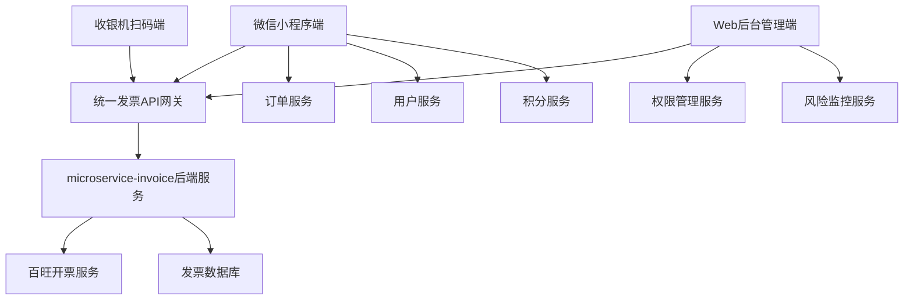
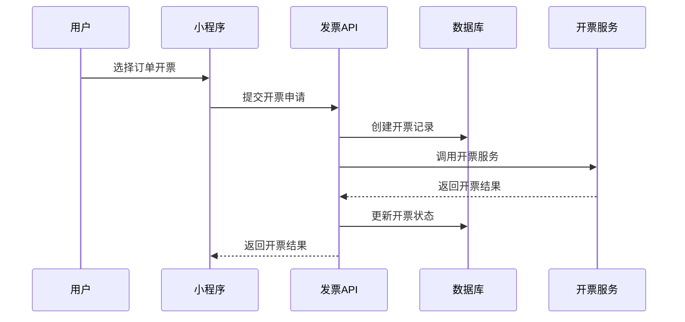

# 发票系统整体架构设计方案 v1.0

## 1. 项目概述

### 1.1 背景
基于现有的microservice-invoice后端发票系统，设计完整的前端集成方案，支持微信小程序用户自助开票、收银机扫码开票和web后台管理功能。

### 1.2 目标
- 实现微信小程序自助开票功能
- 支持收银机小票扫码开票
- 完善web后台发票管理功能
- 建立发票频率控制和风险预警机制

## 2. 整体架构设计

### 2.1 系统架构图

### 2.2 技术栈选择

#### 2.2.1 前端技术栈
- **微信小程序**: 原生小程序开发
- **Web管理端**: React + Ant Design (遵循现有设计规范)
- **状态管理**: 本地状态 + 接口调用
- **数据校验**: 前端表单校验 + 后端业务校验

#### 2.2.2 后端技术栈
- **核心服务**: Spring Boot (现有microservice-invoice)
- **数据库**: MySQL
- **开票服务**: 百旺金赋API
- **消息队列**: 支持异步开票处理

## 3. 发票业务类型分析

### 3.1 加油消费发票
- **数据源**: 油品销售订单
- **发票类型**: 数电普票/专票
- **税收分类编码**: 成品油相关编码
- **特点**: 金额相对固定，开票频率高

### 3.2 预付卡业务发票
- **充值发票**: 预付卡充值记录
- **消费发票**: 预付卡消费记录
- **特点**: 需要区分充值和消费两种场景

### 3.3 商品消费发票
- **便利店商品**: 非油品商品销售
- **数据源**: 商品销售订单
- **特点**: 商品种类多，税率可能不同

### 3.4 积分商城发票
- **纯积分兑换**: 无需开票
- **积分+现金**: 需要对现金部分开票
- **数据源**: 积分商城订单
- **特点**: 混合支付模式，计算复杂

## 4. 系统模块设计

### 4.1 微信小程序模块
- **发票首页**: 快捷入口和统计展示
- **自助开票**: 批量订单选择和开票申请
- **扫码开票**: 扫描小票二维码开票
- **开票记录**: 历史记录查询和下载
- **抬头管理**: 个人和企业抬头维护

### 4.2 Web后台管理模块
- **开票记录管理**: 全量数据查询和导出
- **手动开票**: 管理员代开票功能
- **发票红冲**: 红冲申请和审批流程
- **风险监控**: 异常预警和黑名单管理
- **统计分析**: 开票数据分析和报表
- **系统配置**: 油站配置和税率管理

### 4.3 收银机集成模块
- **小票二维码**: 生成包含订单信息的二维码
- **订单查询**: 支持通过二维码查询订单详情
- **状态同步**: 开票状态实时同步到收银系统

## 5. 数据流转设计

### 5.1 开票数据流

### 5.2 状态同步机制
- **实时状态更新**: 开票状态变化实时通知前端
- **异步处理**: 开票请求异步处理，避免前端长时间等待
- **状态回调**: 开票服务状态变化回调通知

## 6. 安全设计

### 6.1 权限控制
- **接口权限**: 基于角色的API访问控制
- **数据权限**: 用户只能查看自己的开票记录
- **操作权限**: 敏感操作需要管理员权限

### 6.2 数据安全
- **敏感信息加密**: 税号等敏感信息加密存储
- **操作日志**: 完整的操作审计日志
- **数据脱敏**: 显示时对敏感信息脱敏

### 6.3 业务安全
- **频率限制**: 多维度开票频率控制
- **风险预警**: 异常行为实时监控
- **黑名单机制**: 风险用户拉黑处理

## 7. 性能优化

### 7.1 前端优化
- **组件复用**: 通用组件抽取和复用
- **数据缓存**: 发票抬头等数据本地缓存
- **懒加载**: 大列表数据分页懒加载

### 7.2 后端优化
- **数据库优化**: 合理的索引和查询优化
- **缓存机制**: Redis缓存热点数据
- **异步处理**: 开票请求异步处理

### 7.3 接口优化
- **批量操作**: 支持批量开票和查询
- **数据压缩**: 大数据量传输压缩
- **CDN加速**: 发票PDF文件CDN加速

## 8. 监控运维

### 8.1 系统监控
- **性能监控**: 接口响应时间和成功率
- **业务监控**: 开票成功率和失败原因分析
- **异常监控**: 系统异常实时告警

### 8.2 日志管理
- **操作日志**: 用户操作完整记录
- **系统日志**: 系统运行状态日志
- **审计日志**: 敏感操作审计追踪

### 8.3 容灾备份
- **数据备份**: 定期数据备份和恢复测试
- **服务备份**: 关键服务多实例部署
- **故障切换**: 自动故障检测和切换

## 9. 部署方案

### 9.1 环境规划
- **开发环境**: 本地开发和单元测试
- **测试环境**: 集成测试和性能测试
- **预生产环境**: 灰度发布和压力测试
- **生产环境**: 正式生产环境

### 9.2 发布策略
- **灰度发布**: 分批次发布降低风险
- **回滚机制**: 快速回滚到上一版本
- **监控告警**: 发布过程实时监控

## 10. 项目计划

### 10.1 开发阶段划分

**第一阶段**: 基础开票功能 (2-3周)
- Web后台开票记录管理页面
- 微信小程序开票记录查询
- 发票抬头管理功能

**第二阶段**: 自助开票功能 (3-4周)
- 微信小程序批量选择开票
- 扫码开票功能
- 开票状态通知

**第三阶段**: 管理和风控功能 (2-3周)
- 发票红冲管理
- 开票频率控制
- 风险预警系统

### 10.2 关键里程碑
- **需求确认**: 1周
- **详细设计**: 1周
- **开发实现**: 8-10周
- **测试验证**: 2周
- **上线部署**: 1周

## 11. 风险评估

### 11.1 技术风险
- **第三方服务依赖**: 百旺开票服务稳定性
- **数据迁移风险**: 历史数据迁移和兼容性
- **性能风险**: 高并发场景下的系统性能

### 11.2 业务风险
- **合规风险**: 发票开具的法规合规性
- **安全风险**: 发票数据泄露和伪造
- **用户体验风险**: 操作复杂度和易用性

### 11.3 风险应对
- **技术风险**: 做好降级方案和容错处理
- **业务风险**: 严格按照税法规定实现
- **用户体验**: 充分的用户测试和反馈收集

---

**文档版本**: v1.0  
**创建日期**: 2025-08-27  
**创建人**: 孙杨竣@喂车