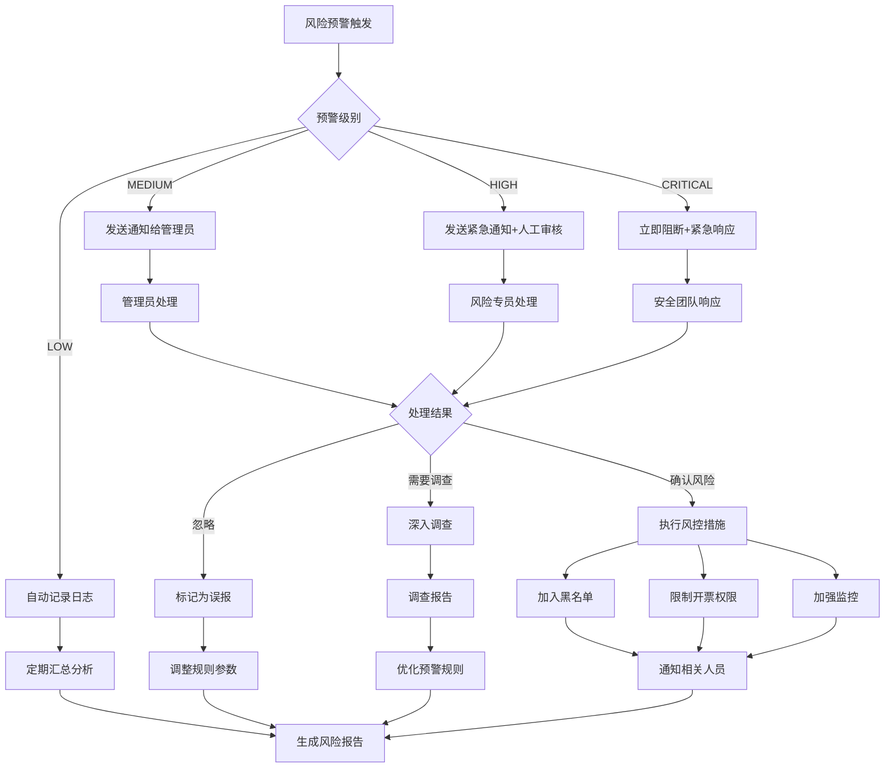

# 开票频率控制和风险预警机制设计 v1.0

## 1. 开票频率控制机制

### 1.1 频率控制规则配置

```typescript
// 频率控制规则接口
interface FrequencyControlRule {
  id: string;
  ruleName: string;
  ruleType: 'USER' | 'COMPANY' | 'PHONE' | 'IP';
  controlPeriod: 'HOUR' | 'DAY' | 'WEEK' | 'MONTH';
  limitCount: number;
  limitAmount?: number;  // 金额限制
  priority: number;      // 规则优先级
  isActive: boolean;
  description: string;
}

// 默认频率控制规则
const DEFAULT_FREQUENCY_RULES: FrequencyControlRule[] = [
  {
    id: 'USER_DAILY_COUNT',
    ruleName: '用户每日开票次数限制',
    ruleType: 'USER',
    controlPeriod: 'DAY',
    limitCount: 10,
    priority: 1,
    isActive: true,
    description: '单个用户每日最多开票10次'
  },
  {
    id: 'USER_HOURLY_COUNT',
    ruleName: '用户每小时开票次数限制',
    ruleType: 'USER',
    controlPeriod: 'HOUR',
    limitCount: 3,
    priority: 2,
    isActive: true,
    description: '单个用户每小时最多开票3次'
  },
  {
    id: 'COMPANY_DAILY_AMOUNT',
    ruleName: '企业每日开票金额限制',
    ruleType: 'COMPANY',
    controlPeriod: 'DAY',
    limitCount: 50,
    limitAmount: 100000,
    priority: 3,
    isActive: true,
    description: '同一企业抬头每日最多开票50次或总金额不超过10万元'
  },
  {
    id: 'PHONE_DAILY_COUNT',
    ruleName: '手机号每日开票次数限制',
    ruleType: 'PHONE',
    controlPeriod: 'DAY',
    limitCount: 15,
    priority: 4,
    isActive: true,
    description: '同一手机号每日最多开票15次'
  },
  {
    id: 'IP_HOURLY_COUNT',
    ruleName: 'IP地址每小时开票次数限制',
    ruleType: 'IP',
    controlPeriod: 'HOUR',
    limitCount: 20,
    priority: 5,
    isActive: true,
    description: '同一IP地址每小时最多开票20次'
  }
];
```

### 1.2 频率控制服务实现

```typescript
// 频率控制服务
class InvoiceFrequencyController {
  
  // 检查频率限制
  static async checkFrequencyLimit(invoiceRequest: InvoiceRequest): Promise<FrequencyCheckResult> {
    const { userId, buyerInfo, clientIp } = invoiceRequest;
    
    // 获取生效的控制规则
    const activeRules = await this.getActiveRules();
    const violations: RuleViolation[] = [];
    
    for (const rule of activeRules) {
      const checkResult = await this.checkSingleRule(rule, invoiceRequest);
      if (!checkResult.passed) {
        violations.push({
          ruleId: rule.id,
          ruleName: rule.ruleName,
          currentCount: checkResult.currentCount,
          limitCount: rule.limitCount,
          currentAmount: checkResult.currentAmount,
          limitAmount: rule.limitAmount,
          resetTime: checkResult.resetTime
        });
      }
    }
    
    return {
      passed: violations.length === 0,
      violations,
      allowRetryAfter: violations.length > 0 ? Math.min(...violations.map(v => v.resetTime)) : null
    };
  }
  
  // 检查单个规则
  static async checkSingleRule(rule: FrequencyControlRule, request: InvoiceRequest): Promise<SingleRuleCheckResult> {
    const controlKey = this.buildControlKey(rule, request);
    const period = this.getPeriodRange(rule.controlPeriod);
    
    // 查询当前周期内的开票统计
    const currentStats = await this.getCurrentPeriodStats(controlKey, period);
    
    // 检查次数限制
    if (currentStats.count >= rule.limitCount) {
      return {
        passed: false,
        currentCount: currentStats.count,
        currentAmount: currentStats.amount,
        resetTime: period.endTime
      };
    }
    
    // 检查金额限制
    if (rule.limitAmount && (currentStats.amount + request.amount) > rule.limitAmount) {
      return {
        passed: false,
        currentCount: currentStats.count,
        currentAmount: currentStats.amount,
        resetTime: period.endTime
      };
    }
    
    return {
      passed: true,
      currentCount: currentStats.count,
      currentAmount: currentStats.amount
    };
  }
  
  // 构建控制键
  static buildControlKey(rule: FrequencyControlRule, request: InvoiceRequest): string {
    switch (rule.ruleType) {
      case 'USER':
        return `user:${request.userId}`;
      case 'COMPANY':
        return `company:${request.buyerInfo.taxNumber || request.buyerInfo.name}`;
      case 'PHONE':
        return `phone:${request.buyerInfo.phone || request.userPhone}`;
      case 'IP':
        return `ip:${request.clientIp}`;
      default:
        throw new Error(`Unsupported rule type: ${rule.ruleType}`);
    }
  }
  
  // 记录开票统计
  static async recordInvoiceStats(invoiceRequest: InvoiceRequest): Promise<void> {
    const activeRules = await this.getActiveRules();
    
    for (const rule of activeRules) {
      const controlKey = this.buildControlKey(rule, invoiceRequest);
      const period = this.getPeriodRange(rule.controlPeriod);
      
      await this.updatePeriodStats(controlKey, rule.controlPeriod, period, {
        count: 1,
        amount: invoiceRequest.amount
      });
    }
  }
}
```

## 2. 风险预警机制设计

### 2.1 风险预警规则配置

```typescript
// 风险预警规则定义
interface RiskAlertRule {
  id: string;
  ruleName: string;
  alertType: 'FREQUENCY' | 'AMOUNT' | 'DUPLICATE' | 'TIME' | 'BEHAVIOR';
  alertLevel: 'LOW' | 'MEDIUM' | 'HIGH' | 'CRITICAL';
  triggerConditions: TriggerCondition[];
  alertActions: AlertAction[];
  cooldownPeriod: number;  // 冷却期(分钟)
  isActive: boolean;
  description: string;
}

// 触发条件
interface TriggerCondition {
  field: string;           // 检查字段
  operator: 'GT' | 'GTE' | 'LT' | 'LTE' | 'EQ' | 'NEQ' | 'IN' | 'LIKE';
  value: any;             // 比较值
  timeWindow?: number;    // 时间窗口(分钟)
}

// 预警动作
interface AlertAction {
  actionType: 'NOTIFY' | 'BLOCK' | 'MANUAL_REVIEW' | 'AUTO_BLACKLIST';
  actionConfig: any;      // 动作配置
}

// 默认风险预警规则
const DEFAULT_RISK_ALERT_RULES: RiskAlertRule[] = [
  {
    id: 'FREQUENT_INVOICE_SAME_HEADER',
    ruleName: '同一抬头频繁开票预警',
    alertType: 'FREQUENCY',
    alertLevel: 'MEDIUM',
    triggerConditions: [
      {
        field: 'buyerName',
        operator: 'EQ',
        value: 'SAME_VALUE',
        timeWindow: 60  // 1小时内
      },
      {
        field: 'invoiceCount',
        operator: 'GTE',
        value: 5
      }
    ],
    alertActions: [
      {
        actionType: 'NOTIFY',
        actionConfig: { notifyAdmins: true }
      },
      {
        actionType: 'MANUAL_REVIEW',
        actionConfig: { requireApproval: true }
      }
    ],
    cooldownPeriod: 30,
    isActive: true,
    description: '同一发票抬头1小时内开票超过5次'
  },
  {
    id: 'LARGE_AMOUNT_INVOICE',
    ruleName: '大额开票预警',
    alertType: 'AMOUNT',
    alertLevel: 'HIGH',
    triggerConditions: [
      {
        field: 'totalAmount',
        operator: 'GT',
        value: 50000  // 5万元
      }
    ],
    alertActions: [
      {
        actionType: 'NOTIFY',
        actionConfig: { notifyAdmins: true, notifyRiskTeam: true }
      },
      {
        actionType: 'MANUAL_REVIEW',
        actionConfig: { requireApproval: true }
      }
    ],
    cooldownPeriod: 0,
    isActive: true,
    description: '单次开票金额超过5万元'
  },
  {
    id: 'DUPLICATE_INVOICE_RISK',
    ruleName: '重复开票风险预警',
    alertType: 'DUPLICATE',
    alertLevel: 'HIGH',
    triggerConditions: [
      {
        field: 'orderCode',
        operator: 'EQ',
        value: 'SAME_VALUE'
      },
      {
        field: 'buyerName',
        operator: 'EQ',
        value: 'SAME_VALUE'
      },
      {
        field: 'invoiceCount',
        operator: 'GT',
        value: 1
      }
    ],
    alertActions: [
      {
        actionType: 'BLOCK',
        actionConfig: { blockReason: '疑似重复开票' }
      },
      {
        actionType: 'NOTIFY',
        actionConfig: { notifyAdmins: true }
      }
    ],
    cooldownPeriod: 60,
    isActive: true,
    description: '同一订单同一抬头重复开票'
  },
  {
    id: 'ABNORMAL_TIME_INVOICE',
    ruleName: '异常时间开票预警',
    alertType: 'TIME',
    alertLevel: 'MEDIUM',
    triggerConditions: [
      {
        field: 'invoiceTime',
        operator: 'LT',
        value: '06:00'
      },
      {
        field: 'invoiceTime',
        operator: 'GT',
        value: '23:00'
      }
    ],
    alertActions: [
      {
        actionType: 'NOTIFY',
        actionConfig: { notifyAdmins: true }
      }
    ],
    cooldownPeriod: 0,
    isActive: true,
    description: '非营业时间(23:00-06:00)开票'
  }
];
```

### 2.2 风险预警引擎实现

```typescript
// 风险预警引擎
class RiskAlertEngine {
  
  // 执行风险检查
  static async executeRiskCheck(invoiceRequest: InvoiceRequest): Promise<RiskCheckResult> {
    const activeRules = await this.getActiveAlertRules();
    const triggeredAlerts: TriggeredAlert[] = [];
    
    for (const rule of activeRules) {
      try {
        const checkResult = await this.checkSingleRule(rule, invoiceRequest);
        if (checkResult.triggered) {
          triggeredAlerts.push({
            ruleId: rule.id,
            ruleName: rule.ruleName,
            alertType: rule.alertType,
            alertLevel: rule.alertLevel,
            triggerData: checkResult.triggerData,
            recommendedActions: rule.alertActions
          });
        }
      } catch (error) {
        console.error(`Risk rule ${rule.id} check failed:`, error);
      }
    }
    
    // 按风险级别排序
    triggeredAlerts.sort((a, b) => {
      const levelOrder = { 'CRITICAL': 4, 'HIGH': 3, 'MEDIUM': 2, 'LOW': 1 };
      return levelOrder[b.alertLevel] - levelOrder[a.alertLevel];
    });
    
    return {
      hasRisk: triggeredAlerts.length > 0,
      riskLevel: triggeredAlerts.length > 0 ? triggeredAlerts[0].alertLevel : 'LOW',
      triggeredAlerts,
      recommendedAction: this.determineRecommendedAction(triggeredAlerts)
    };
  }
  
  // 检查单个风险规则
  static async checkSingleRule(rule: RiskAlertRule, request: InvoiceRequest): Promise<RuleCheckResult> {
    // 检查冷却期
    const isInCooldown = await this.isRuleInCooldown(rule.id, request);
    if (isInCooldown) {
      return { triggered: false, reason: 'COOLDOWN' };
    }
    
    // 收集检查数据
    const checkData = await this.collectCheckData(rule, request);
    
    // 评估触发条件
    let allConditionsMet = true;
    const triggerData: any = {};
    
    for (const condition of rule.triggerConditions) {
      const conditionMet = this.evaluateCondition(condition, checkData, request);
      if (!conditionMet) {
        allConditionsMet = false;
        break;
      }
      
      // 记录触发数据
      triggerData[condition.field] = checkData[condition.field];
    }
    
    if (allConditionsMet) {
      // 记录预警触发
      await this.recordAlertTrigger(rule.id, request, triggerData);
      
      return {
        triggered: true,
        triggerData,
        confidence: this.calculateConfidence(rule, triggerData)
      };
    }
    
    return { triggered: false };
  }
  
  // 执行预警动作
  static async executeAlertActions(triggeredAlerts: TriggeredAlert[], request: InvoiceRequest): Promise<ActionResult[]> {
    const actionResults: ActionResult[] = [];
    
    for (const alert of triggeredAlerts) {
      for (const action of alert.recommendedActions) {
        try {
          const result = await this.executeAction(action, alert, request);
          actionResults.push(result);
        } catch (error) {
          actionResults.push({
            actionType: action.actionType,
            success: false,
            error: error.message
          });
        }
      }
    }
    
    return actionResults;
  }
}
```

## 3. 风险预警监控看板

### 3.1 实时监控指标

```typescript
// 风险监控指标定义
interface RiskMonitorMetrics {
  // 实时预警统计
  realTimeAlerts: {
    totalAlerts: number;
    criticalAlerts: number;
    highRiskAlerts: number;
    mediumRiskAlerts: number;
    lowRiskAlerts: number;
  };
  
  // 预警趋势
  alertTrends: {
    hourlyAlerts: number[];
    dailyAlerts: number[];
    weeklyAlerts: number[];
  };
  
  // 风险类型分布
  riskTypeDistribution: {
    frequencyRisk: number;
    amountRisk: number;
    duplicateRisk: number;
    timeRisk: number;
    behaviorRisk: number;
  };
  
  // 处理效率
  processingEfficiency: {
    avgProcessingTime: number;  // 平均处理时间(分钟)
    processedCount: number;     // 已处理数量
    pendingCount: number;       // 待处理数量
    autoResolvedCount: number;  // 自动解决数量
  };
  
  // 黑名单统计
  blacklistStats: {
    totalCount: number;
    activeCount: number;
    todayAdded: number;
    topReasons: Array<{ reason: string; count: number }>;
  };
}
```

### 3.2 预警处理工作流



## 4. 实施配置

### 4.1 频率控制数据表

```sql
-- 发票频率控制表
CREATE TABLE invoice_frequency_control (
    id BIGINT PRIMARY KEY AUTO_INCREMENT,
    user_id BIGINT NOT NULL COMMENT '用户ID',
    control_type VARCHAR(20) NOT NULL COMMENT '控制类型',
    control_period VARCHAR(20) NOT NULL COMMENT '控制周期',
    period_start DATETIME NOT NULL COMMENT '周期开始时间',
    period_end DATETIME NOT NULL COMMENT '周期结束时间',
    current_count INT DEFAULT 0 COMMENT '当前次数',
    limit_count INT NOT NULL COMMENT '限制次数',
    created_time DATETIME DEFAULT CURRENT_TIMESTAMP,
    updated_time DATETIME DEFAULT CURRENT_TIMESTAMP ON UPDATE CURRENT_TIMESTAMP,
    
    UNIQUE KEY uk_user_period (user_id, control_type, period_start),
    INDEX idx_period (period_start, period_end)
) COMMENT '发票频率控制表';
```

### 4.2 风险预警配置管理

```typescript
// 风险预警配置管理服务
class RiskAlertConfigManager {
  
  // 获取所有预警规则
  static async getAllRules(): Promise<RiskAlertRule[]> {
    return await db.query('SELECT * FROM risk_alert_rules WHERE is_active = 1');
  }
  
  // 更新预警规则
  static async updateRule(ruleId: string, updates: Partial<RiskAlertRule>): Promise<void> {
    await db.update('risk_alert_rules', updates, { id: ruleId });
  }
  
  // 创建新的预警规则
  static async createRule(rule: RiskAlertRule): Promise<string> {
    const result = await db.insert('risk_alert_rules', rule);
    return result.insertId;
  }
  
  // 启用/禁用预警规则
  static async toggleRule(ruleId: string, isActive: boolean): Promise<void> {
    await db.update('risk_alert_rules', { is_active: isActive }, { id: ruleId });
  }
}
```

### 4.3 监控告警配置

```typescript
// 监控告警配置
const MONITOR_ALERT_CONFIG = {
  // 预警数量阈值
  alertCountThresholds: {
    hourly: 50,    // 每小时预警超过50次
    daily: 200,    // 每日预警超过200次
    weekly: 1000   // 每周预警超过1000次
  },
  
  // 处理时间阈值
  processingTimeThresholds: {
    high: 30,      // 高风险预警30分钟内处理
    medium: 120,   // 中风险预警2小时内处理
    low: 480       // 低风险预警8小时内处理
  },
  
  // 通知配置
  notificationConfig: {
    adminEmails: ['admin@example.com'],
    riskTeamEmails: ['risk@example.com'],
    webhookUrl: 'https://api.example.com/webhook/risk-alert'
  }
};
```

---

**文档版本**: v1.0  
**创建日期**: 2024-08-27  
**创建人**: AI助手  
**审核状态**: 待审核