# 【业务流程图】好友邀请营销系统模块v1.0

## 1. 好友邀请活动创建流程

### 1.1 完整创建流程图

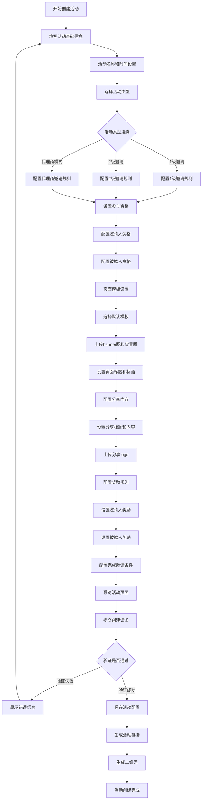

### 1.2 参与资格配置流程

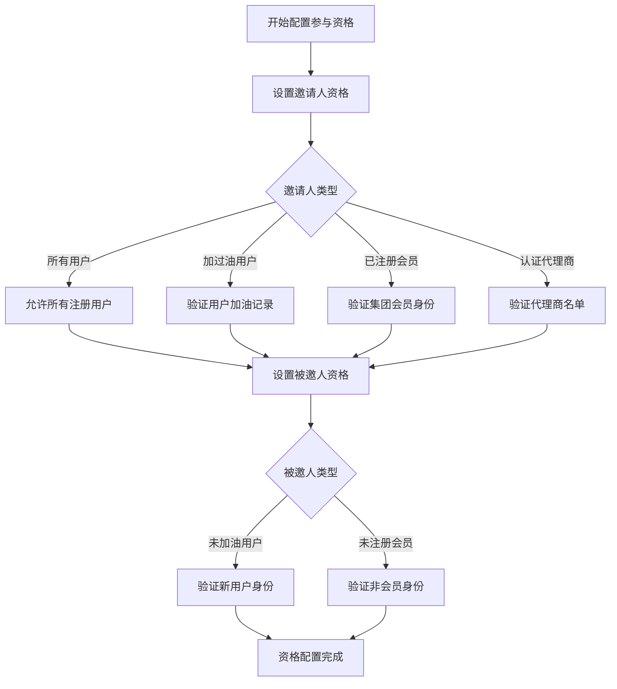

### 1.3 奖励规则配置流程

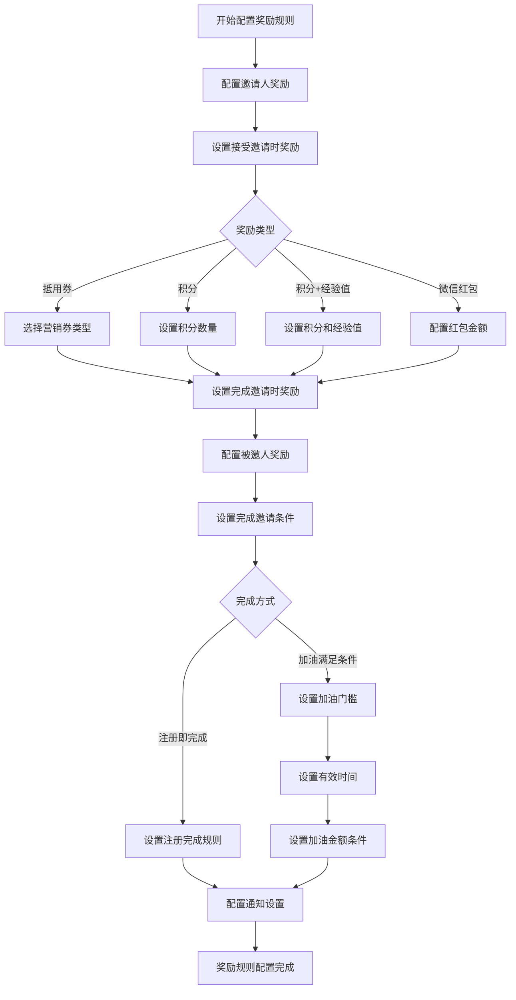

## 2. 用户邀请好友流程

### 2.1 邀请人发起邀请流程

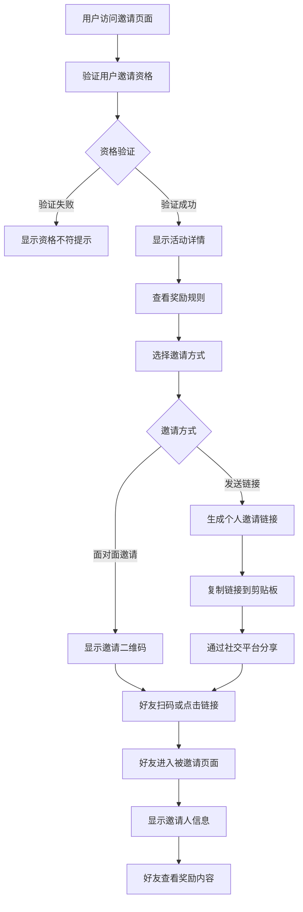

### 2.2 好友接受邀请流程

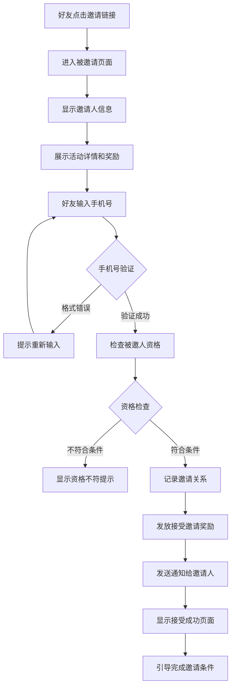

### 2.3 完成邀请条件流程

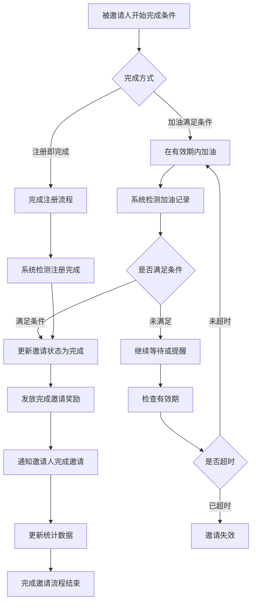

## 3. 活动管理流程

### 3.1 活动列表管理流程

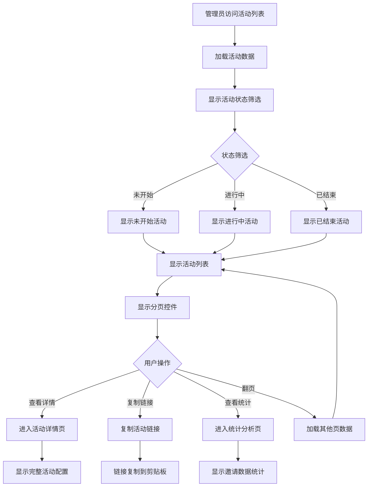

### 3.2 邀请详情统计流程

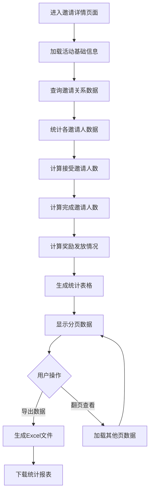

## 4. 邀请人名单管理流程

### 4.1 名单导入流程

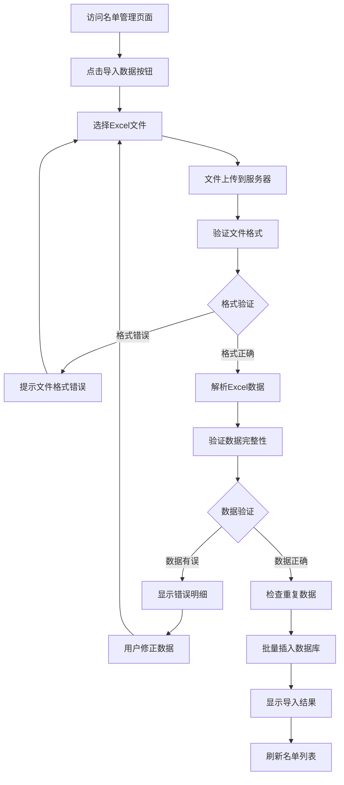

### 4.2 名单维护流程

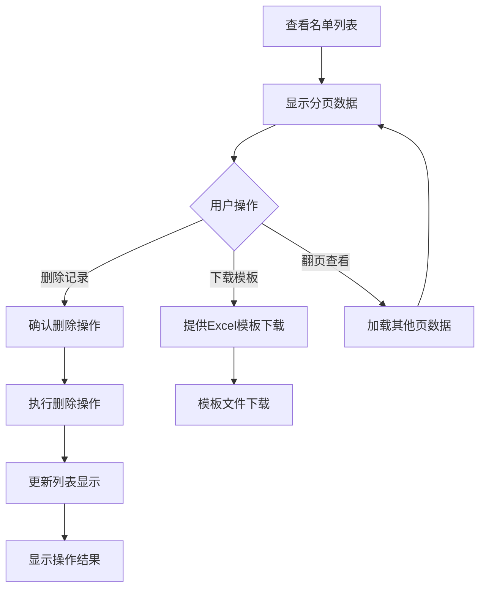

## 5. 系统交互流程

### 5.1 前后端数据交互流程

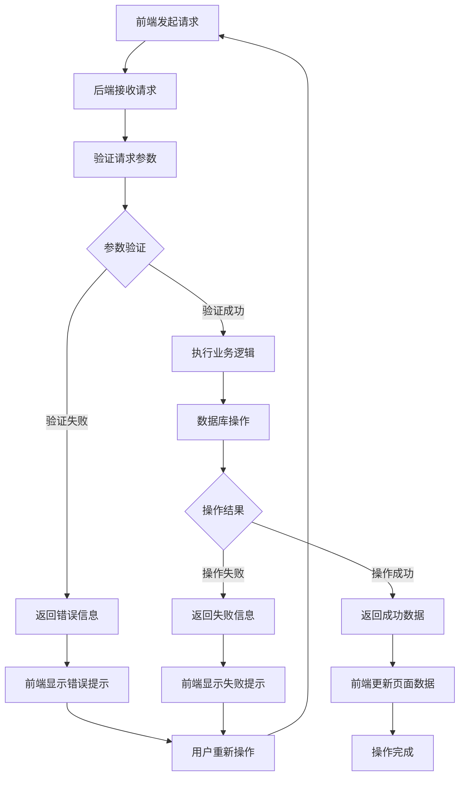

### 5.2 文件上传处理流程

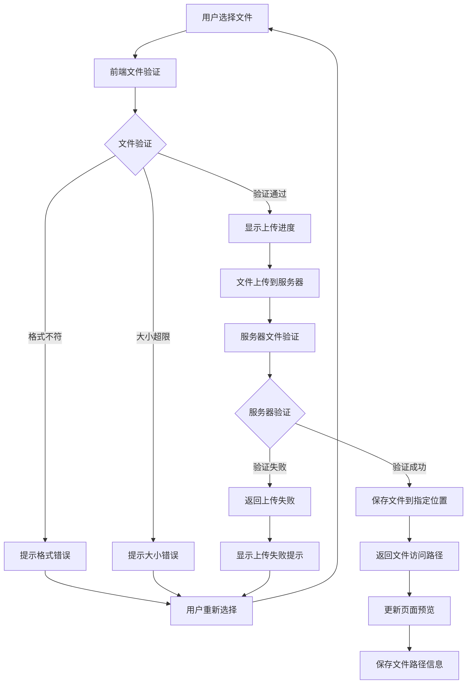

### 5.3 奖励发放流程

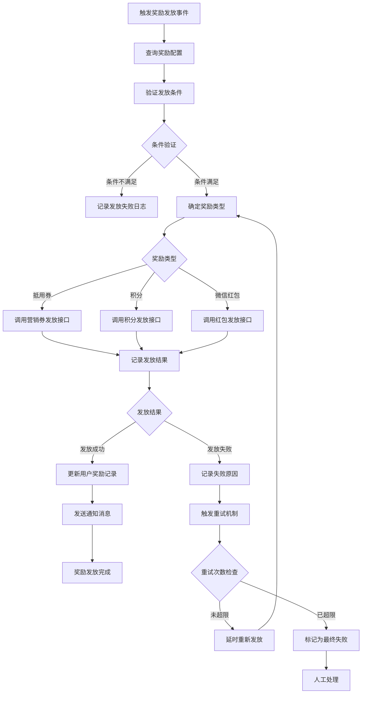

### 5.4 邀请关系追踪流程

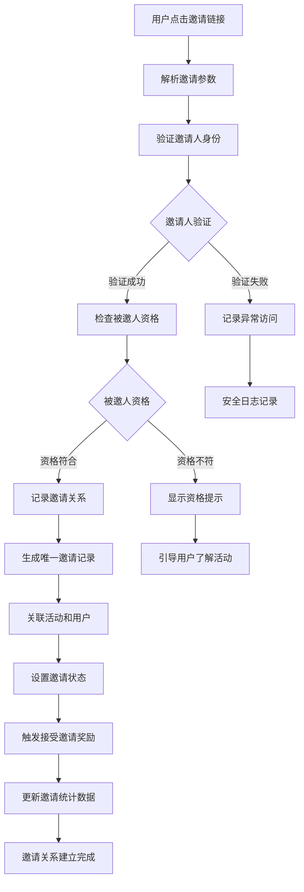