# 业务流程图文档 - 安全卫士系统模块

**版本号**: v1.1  
**日期**: 2025年8月21日

## 1. 系统总体业务流程

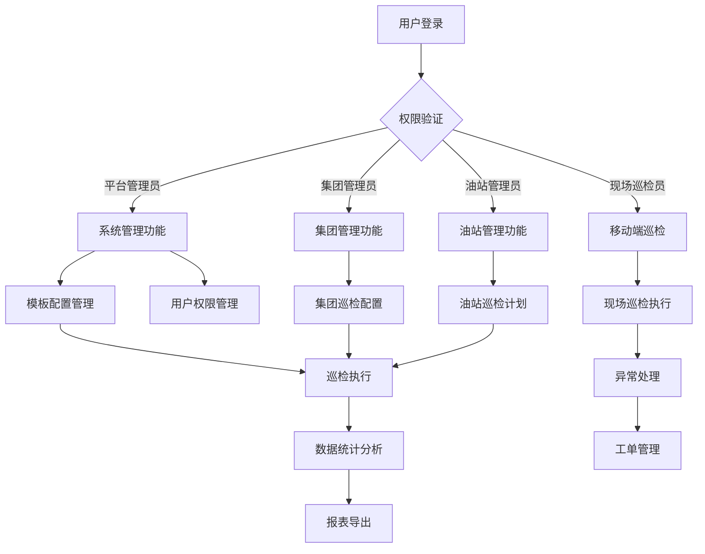

## 2. 用户认证与权限管理流程

### 2.1 登录认证流程

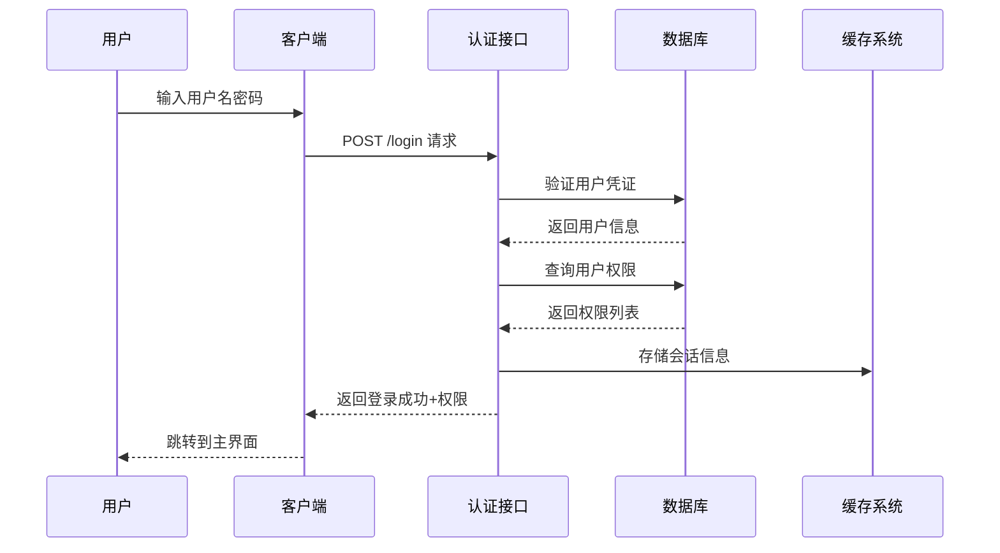

### 2.2 权限验证流程

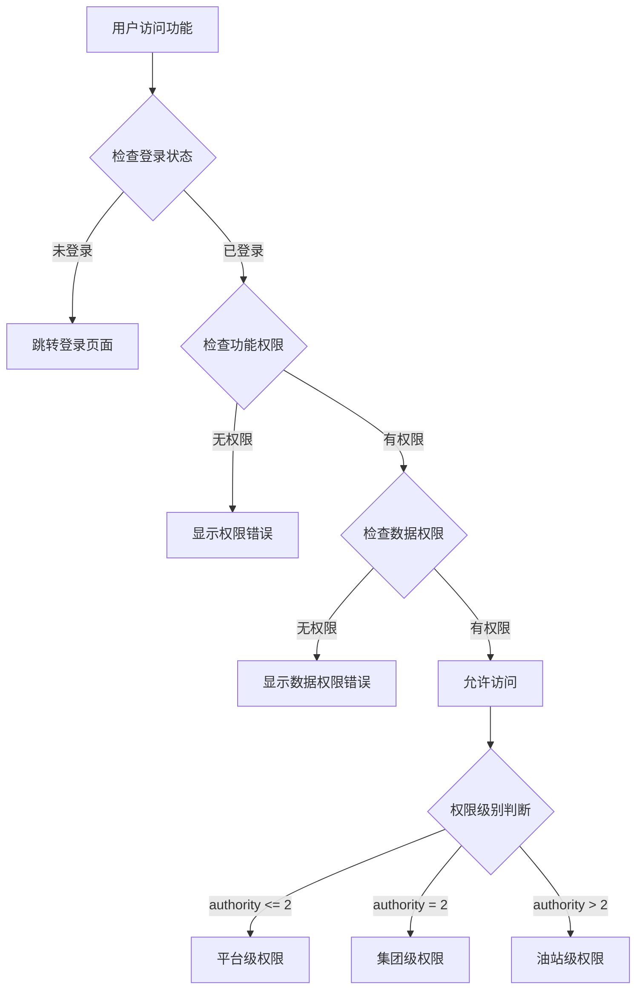

## 3. 巡检管理核心业务流程

### 3.1 巡检配置到执行完整流程

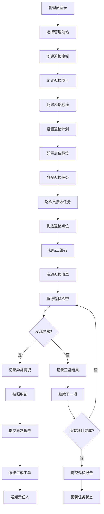

### 3.2 移动端巡检执行详细流程

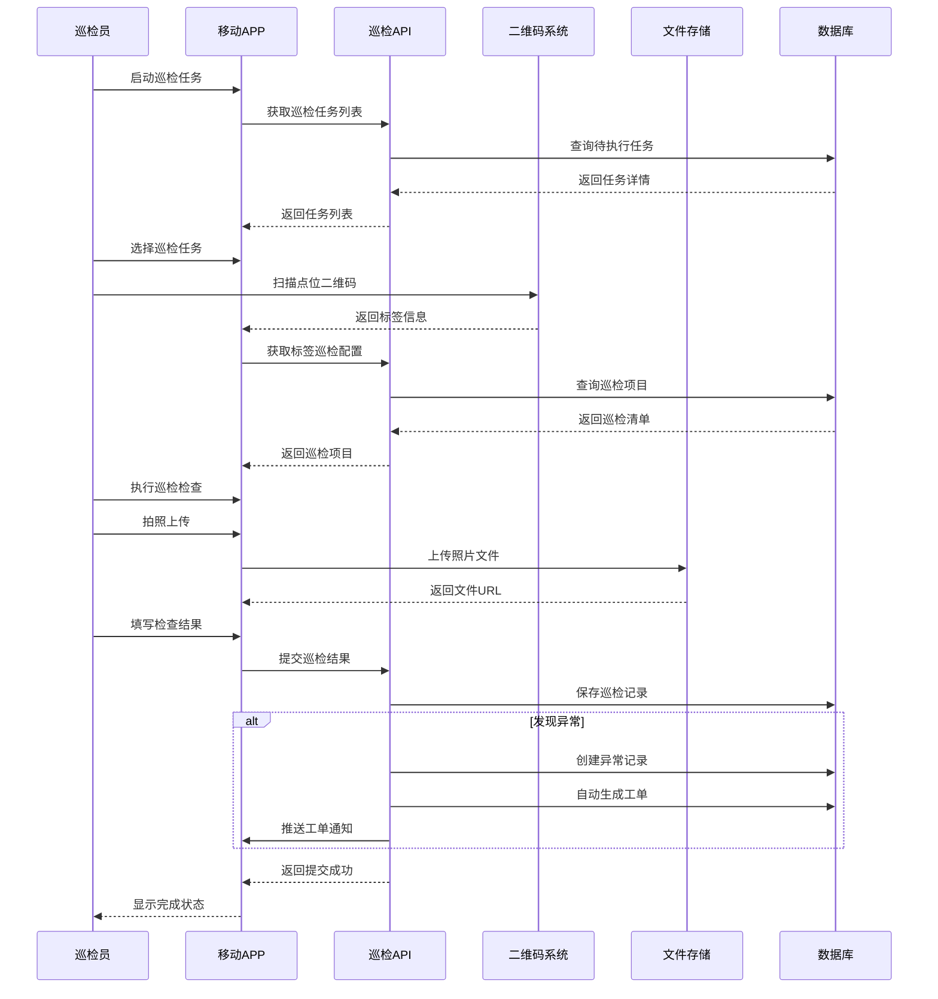

## 4. 异常工单管理流程

### 4.1 工单生命周期流程

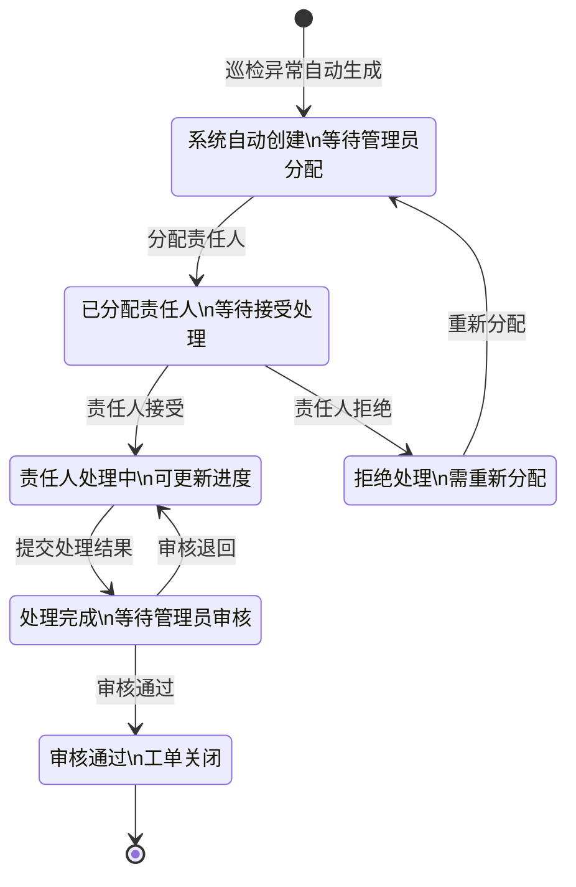

### 4.2 工单处理详细流程

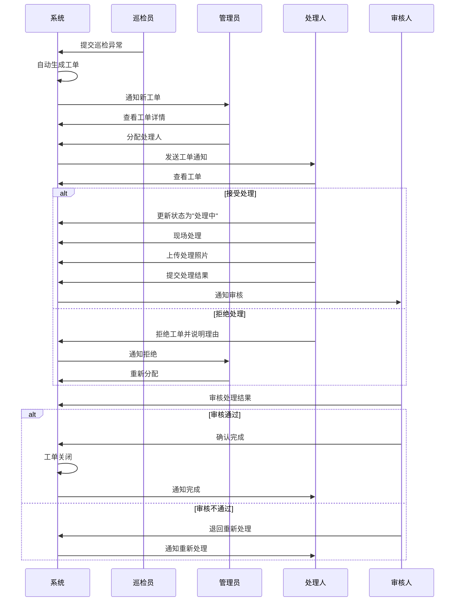

## 5. 配置管理流程

### 5.1 巡检模板配置流程

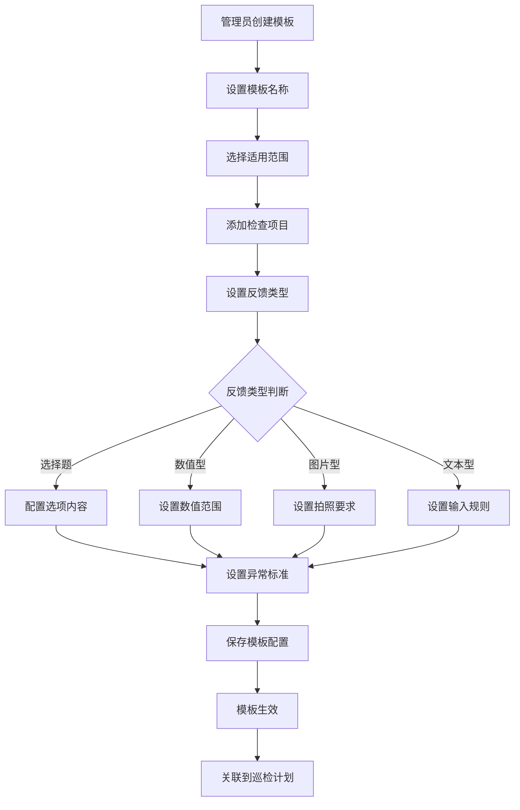

### 5.2 标签与点位配置流程

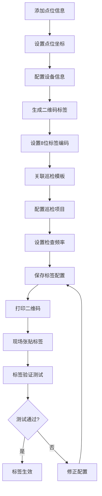

## 6. 数据管理与统计流程

### 6.1 数据统计分析流程

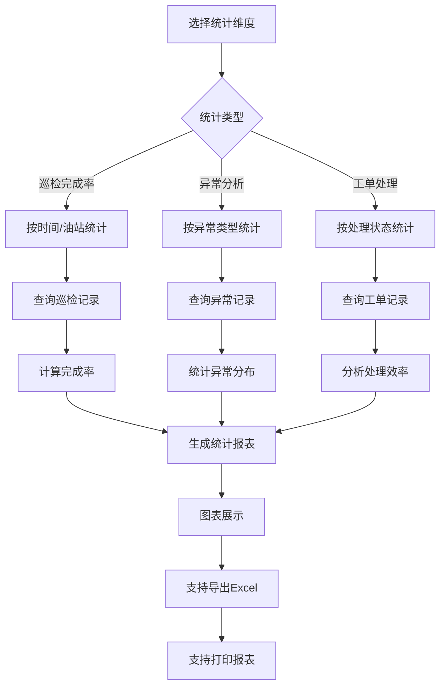

## 7. 系统集成与接口流程

### 7.1 第三方系统集成流程

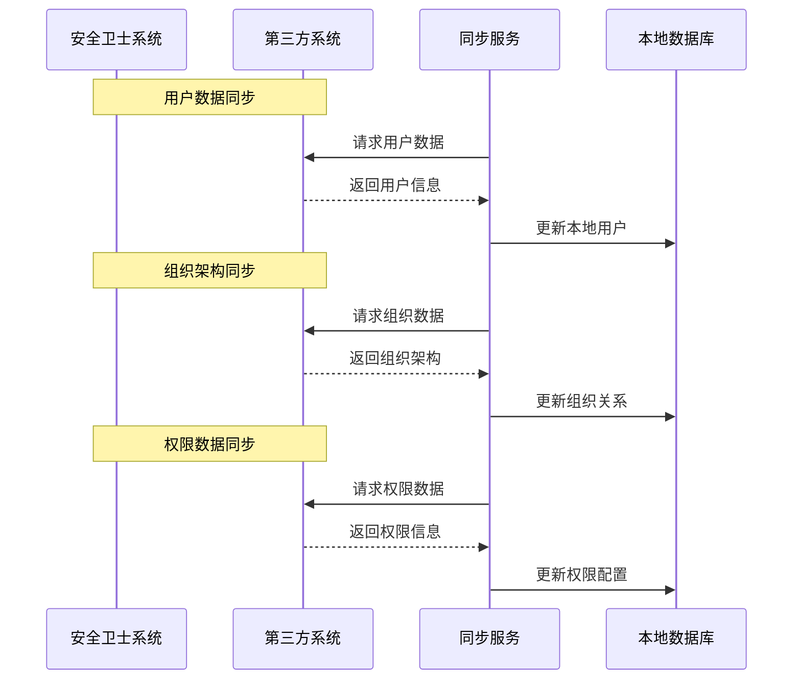

### 7.2 移动端与后台数据同步

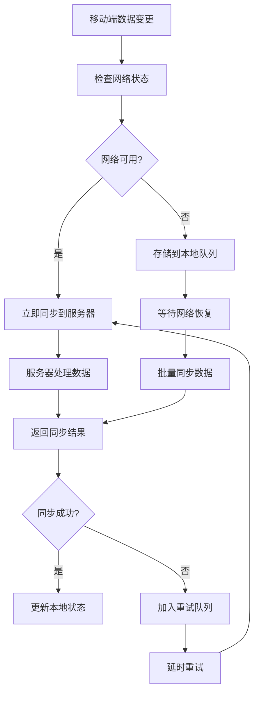

---

*文档版本：v1.1*  
*创建日期：2025年8月21日*  
*文档状态：已完成*