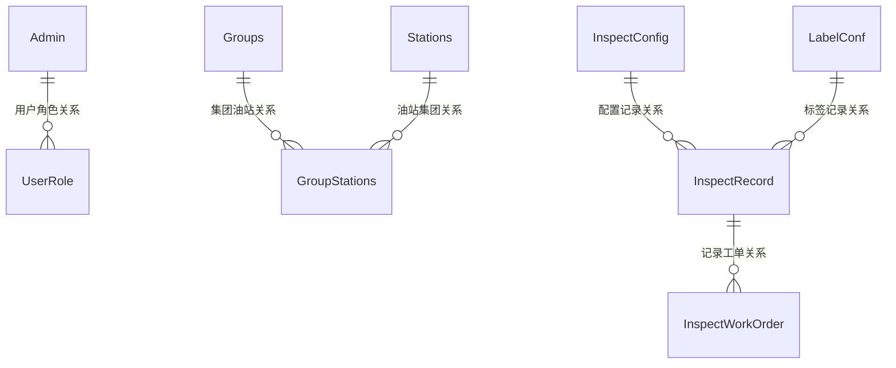
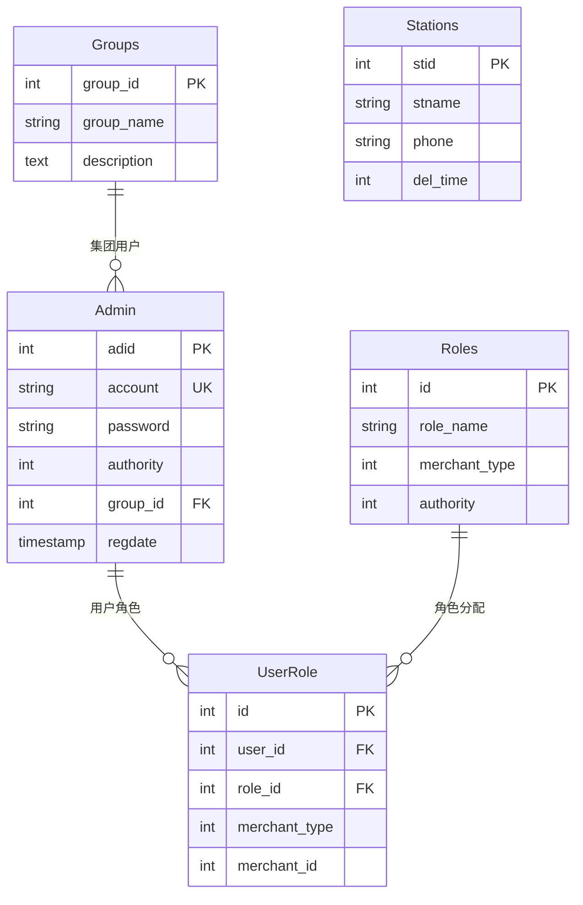
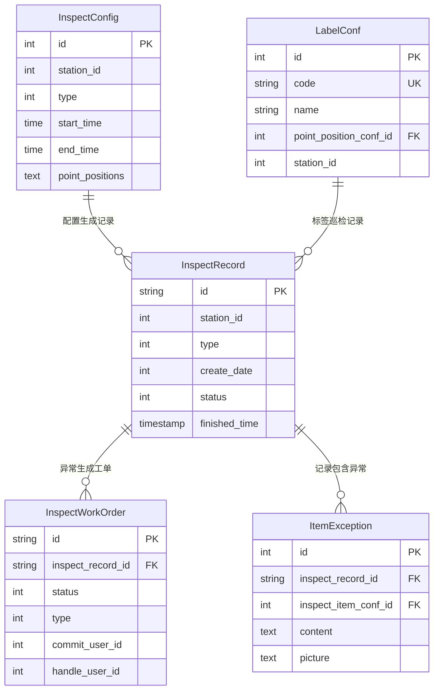

# 数据字典 - 安全卫士系统

**版本号**: v1.1  
**日期**: 2025年8月21日

## 1. 数据库架构概述

### 1.1 数据库分布
安全卫士系统采用双数据库架构：
- **主数据库 (mysql)**: 存储用户管理、组织架构、权限系统数据
- **安全卫士数据库 (security_guards)**: 存储巡检业务相关数据

### 1.2 命名规范
- **表名前缀**: 主数据库表使用 `wei_` 前缀
- **主键命名**: 大多使用表名简写 + `id` (如 `adid`, `stid`)
- **软删除**: 各表使用不同字段名（`is_delete`, `isvalid`, `del_time`）
- **时间字段**: 使用 `timestamp` 或 `int`(YYYYMMDD) 格式

### 1.3 数据关系总览



## 2. 用户管理数据表

### 2.1 管理员表 (wei_admin)

**表名**: `wei_admin`  
**用途**: 系统用户和管理员信息存储  
**主键**: `adid` (int, AUTO_INCREMENT)  
**软删除**: `isvalid` (1=有效, 0=删除)

| 字段名 | 数据类型 | 长度 | 允许空 | 默认值 | 索引 | 说明 |
|--------|----------|------|--------|--------|------|------|
| adid | INT | - | NO | AUTO_INCREMENT | PRIMARY | 管理员ID |
| account | VARCHAR | 255 | NO | - | UNIQUE | 登录账号 |
| password | VARCHAR | 255 | NO | - | - | 加密密码 |
| name | VARCHAR | 255 | YES | NULL | - | 显示姓名 |
| authority | INT | - | NO | 4 | INDEX | 权限级别 |
| group_id | INT | - | YES | NULL | INDEX | 所属集团ID |
| phone | VARCHAR | 20 | YES | NULL | - | 联系电话 |
| regdate | TIMESTAMP | - | NO | CURRENT_TIMESTAMP | - | 注册时间 |
| isvalid | TINYINT | 1 | NO | 1 | INDEX | 有效状态 |
| is_root | TINYINT | 1 | NO | 0 | - | 超级管理员标识 |
| informer | TINYINT | 1 | NO | 0 | - | 安全信息员标识 |

**业务规则**:
- 密码加密算法: `MD5(MD5(password + 'WECAR_LOGIN') + 'Wcc' + regdate)`
- 权限级别: 1=平台管理员, 2=集团管理员, 3-4=油站管理员
- 默认管理员账号格式: `admin@{domain}`

**索引设置**:
```sql
-- 主要索引
PRIMARY KEY (adid)
UNIQUE KEY idx_account (account)
KEY idx_authority (authority)
KEY idx_group (group_id)
KEY idx_valid (isvalid)
```

### 2.2 集团表 (wei_groups)

**表名**: `wei_groups`  
**用途**: 集团组织信息管理  
**主键**: `group_id` (int, AUTO_INCREMENT)

| 字段名 | 数据类型 | 长度 | 允许空 | 默认值 | 说明 |
|--------|----------|------|--------|--------|------|
| group_id | INT | - | NO | AUTO_INCREMENT | 集团ID |
| group_name | VARCHAR | 255 | NO | - | 集团名称 |
| description | TEXT | - | YES | NULL | 集团描述 |
| isvalid | TINYINT | 1 | NO | 1 | 有效状态 |

### 2.3 油站表 (wei_stations)

**表名**: `wei_stations`  
**用途**: 加油站基础信息管理  
**主键**: `stid` (int, AUTO_INCREMENT)

| 字段名 | 数据类型 | 长度 | 允许空 | 默认值 | 说明 |
|--------|----------|------|--------|--------|------|
| stid | INT | - | NO | AUTO_INCREMENT | 油站ID |
| stname | VARCHAR | 255 | NO | - | 油站名称 |
| phone | VARCHAR | 20 | YES | NULL | 联系电话 |
| province | VARCHAR | 50 | YES | NULL | 省份 |
| city | VARCHAR | 50 | YES | NULL | 城市 |
| area | VARCHAR | 50 | YES | NULL | 区县 |
| address | VARCHAR | 500 | YES | NULL | 详细地址 |
| del_time | INT | - | NO | 0 | 删除时间戳 |

### 2.4 集团油站关系表 (wei_group_stations)

**表名**: `wei_group_stations`  
**用途**: 集团和油站的多对多关系  
**主键**: `gs_id` (int, AUTO_INCREMENT)

| 字段名 | 数据类型 | 长度 | 允许空 | 默认值 | 说明 |
|--------|----------|------|--------|--------|------|
| gs_id | INT | - | NO | AUTO_INCREMENT | 关系ID |
| group_id | INT | - | NO | - | 集团ID |
| stid | INT | - | NO | - | 油站ID |
| isvalid | TINYINT | 1 | NO | 1 | 关系有效性 |

**外键约束**:
```sql
FOREIGN KEY (group_id) REFERENCES wei_groups(group_id)
FOREIGN KEY (stid) REFERENCES wei_stations(stid)
```

## 3. 权限管理数据表

### 3.1 角色表 (wei_roles)

**表名**: `wei_roles`  
**用途**: 系统角色定义  
**主键**: `id` (int, AUTO_INCREMENT)

| 字段名 | 数据类型 | 长度 | 允许空 | 默认值 | 说明 |
|--------|----------|------|--------|--------|------|
| id | INT | - | NO | AUTO_INCREMENT | 角色ID |
| role_name | VARCHAR | 255 | NO | - | 角色名称 |
| merchant_type | INT | - | NO | - | 商户类型 |
| merchant_id | INT | - | NO | - | 商户ID |
| application_id | INT | - | NO | - | 应用ID |
| authority | INT | - | NO | - | 权限级别 |
| is_delete | TINYINT | 1 | NO | 0 | 删除状态 |

**商户类型定义**:
- 0: 平台级
- 1: 油站级  
- 2: 集团级

### 3.2 用户角色关系表 (wei_user_role)

**表名**: `wei_user_role`  
**用途**: 用户和角色的关联关系

| 字段名 | 数据类型 | 长度 | 允许空 | 默认值 | 说明 |
|--------|----------|------|--------|--------|------|
| id | INT | - | NO | AUTO_INCREMENT | 关系ID |
| user_id | INT | - | NO | - | 用户ID |
| role_id | INT | - | NO | - | 角色ID |
| merchant_type | INT | - | NO | - | 商户类型 |
| merchant_id | INT | - | NO | - | 商户ID |
| group_id | INT | - | YES | NULL | 集团ID |

## 4. 巡检管理数据表

### 4.1 巡检配置表 (inspect_config)

**表名**: `inspect_config`  
**用途**: 油站巡检计划配置  
**主键**: `id` (int, AUTO_INCREMENT)  
**数据库**: security_guards

| 字段名 | 数据类型 | 长度 | 允许空 | 默认值 | 说明 |
|--------|----------|------|--------|--------|------|
| id | INT | - | NO | AUTO_INCREMENT | 配置ID |
| group_id | INT | - | NO | - | 集团ID |
| station_id | INT | - | NO | - | 油站ID |
| type | INT | - | NO | - | 巡检类型 |
| offset | INT | - | NO | 0 | 执行偏移 |
| start_time | TIME | - | YES | NULL | 开始时间 |
| end_time | TIME | - | YES | NULL | 结束时间 |
| label_number | INT | - | NO | 0 | 标签数量 |
| point_positions | TEXT | - | YES | NULL | 点位配置JSON |
| is_delete | TINYINT | 1 | NO | 0 | 删除状态 |
| create_time | TIMESTAMP | - | NO | CURRENT_TIMESTAMP | 创建时间 |

**巡检类型定义**:
- 1: 日巡检
- 2: 周巡检  
- 3: 月巡检

**point_positions JSON结构示例**:
```json
[
  {
    "id": "pos_001",
    "name": "加油机区域",
    "location": "A区01号",
    "label_conf": [
      {
        "id": "label_001",
        "code": "10000001",
        "name": "压力表检查",
        "inspect_item_conf": [
          {
            "id": "item_001",
            "name": "压力读数",
            "feedback_conf": [
              {
                "feedback_type": 1,
                "content": [
                  {"cnt": "正常", "is_exp": 0},
                  {"cnt": "异常", "is_exp": 1}
                ]
              }
            ]
          }
        ]
      }
    ]
  }
]
```

### 4.2 巡检记录表 (inspect_record)

**表名**: `inspect_record`  
**用途**: 巡检执行记录跟踪  
**主键**: `id` (varchar, 主键)

| 字段名 | 数据类型 | 长度 | 允许空 | 默认值 | 说明 |
|--------|----------|------|--------|--------|------|
| id | VARCHAR | 255 | NO | - | 记录ID |
| station_id | INT | - | NO | - | 油站ID |
| type | INT | - | NO | - | 巡检类型 |
| create_date | INT | - | NO | - | 创建日期YYYYMMDD |
| status | INT | - | NO | 1 | 巡检状态 |
| result_status | INT | - | NO | 0 | 结果状态 |
| start_time | TIMESTAMP | - | YES | NULL | 计划开始时间 |
| end_time | TIMESTAMP | - | YES | NULL | 计划结束时间 |
| finished_time | TIMESTAMP | - | YES | NULL | 实际完成时间 |
| latest_commit_time | TIMESTAMP | - | YES | NULL | 最新提交时间 |
| is_delete | TINYINT | 1 | NO | 0 | 删除状态 |

**状态定义**:
- status: 1=进行中, 2=已完成
- result_status: 0=正常, 1=有异常

### 4.3 巡检模板表 (inspect_template)

**表名**: `inspect_template`  
**用途**: 可复用巡检模板定义

| 字段名 | 数据类型 | 长度 | 允许空 | 默认值 | 说明 |
|--------|----------|------|--------|--------|------|
| id | INT | - | NO | AUTO_INCREMENT | 模板ID |
| name | VARCHAR | 255 | NO | - | 模板名称 |
| authority | INT | - | NO | - | 权限级别 |
| group_id | INT | - | NO | - | 所属集团 |
| feedback | TEXT | - | YES | NULL | 模板配置JSON |
| remark | TEXT | - | YES | NULL | 备注说明 |
| is_delete | TINYINT | 1 | NO | 0 | 删除状态 |
| create_time | TIMESTAMP | - | NO | CURRENT_TIMESTAMP | 创建时间 |

**模板权限级别**:
- 1: 平台级模板（所有集团可用）
- 2: 集团级模板（集团内可用）
- 3: 油站级模板（仅本站可用）

### 4.4 巡检项目配置表 (inspect_item_conf)

**表名**: `inspect_item_conf`  
**用途**: 具体巡检项目定义

| 字段名 | 数据类型 | 长度 | 允许空 | 默认值 | 说明 |
|--------|----------|------|--------|--------|------|
| id | INT | - | NO | AUTO_INCREMENT | 项目ID |
| name | VARCHAR | 255 | NO | - | 项目名称 |
| group_id | INT | - | NO | - | 所属集团 |
| station_id | INT | - | NO | - | 所属油站 |
| feedback | TEXT | - | YES | NULL | 反馈配置JSON |
| remark | TEXT | - | YES | NULL | 项目说明 |
| is_delete | TINYINT | 1 | NO | 0 | 删除状态 |

### 4.5 标签配置表 (label_conf)

**表名**: `label_conf`  
**用途**: 二维码标签管理

| 字段名 | 数据类型 | 长度 | 允许空 | 默认值 | 说明 |
|--------|----------|------|--------|--------|------|
| id | INT | - | NO | AUTO_INCREMENT | 标签ID |
| name | VARCHAR | 255 | NO | - | 标签名称 |
| code | VARCHAR | 50 | NO | - | 标签编码 |
| point_position_conf_id | INT | - | NO | - | 点位配置ID |
| group_id | INT | - | NO | - | 所属集团 |
| station_id | INT | - | NO | - | 所属油站 |
| is_delete | TINYINT | 1 | NO | 0 | 删除状态 |

**编码规则**:
- code字段存储8位数字编码，用于二维码生成
- 同一油站内编码唯一

### 4.6 点位配置表 (point_position_conf)

**表名**: `point_position_conf`  
**用途**: 巡检点位物理位置定义

| 字段名 | 数据类型 | 长度 | 允许空 | 默认值 | 说明 |
|--------|----------|------|--------|--------|------|
| id | INT | - | NO | AUTO_INCREMENT | 点位ID |
| name | VARCHAR | 255 | NO | - | 点位名称 |
| group_id | INT | - | NO | - | 所属集团 |
| station_id | INT | - | NO | - | 所属油站 |
| location_desc | TEXT | - | YES | NULL | 位置描述 |
| is_delete | TINYINT | 1 | NO | 0 | 删除状态 |

## 5. 工单管理数据表

### 5.1 巡检工单表 (inspect_work_order)

**表名**: `inspect_work_order`  
**用途**: 异常处理工单管理  
**主键**: `id` (varchar)

| 字段名 | 数据类型 | 长度 | 允许空 | 默认值 | 说明 |
|--------|----------|------|--------|--------|------|
| id | VARCHAR | 255 | NO | - | 工单ID |
| inspect_record_id | VARCHAR | 255 | NO | - | 关联巡检记录 |
| inspect_item_conf_id | INT | - | YES | NULL | 关联巡检项 |
| status | INT | - | NO | 1 | 工单状态 |
| type | INT | - | NO | 1 | 工单类型 |
| title | VARCHAR | 255 | YES | NULL | 工单标题 |
| content | TEXT | - | YES | NULL | 工单内容 |
| picture | TEXT | - | YES | NULL | 相关图片JSON |
| commit_user_id | INT | - | NO | - | 提交人ID |
| commit_user_name | VARCHAR | 100 | NO | - | 提交人姓名 |
| handle_user_id | INT | - | YES | NULL | 处理人ID |
| handle_user_name | VARCHAR | 100 | YES | NULL | 处理人姓名 |
| overdue_time | TIMESTAMP | - | YES | NULL | 截止时间 |
| current_process_id | INT | - | YES | NULL | 当前流程ID |
| create_time | TIMESTAMP | - | NO | CURRENT_TIMESTAMP | 创建时间 |
| is_delete | TINYINT | 1 | NO | 0 | 删除状态 |

**工单状态流转**:
- 1: 已创建（待分配）
- 2: 已分配（待处理）  
- 3: 处理中
- 4: 待审核
- 5: 已完成
- 6: 已拒绝

### 5.2 工单处理流程表 (work_order_handle_process)

**表名**: `work_order_handle_process`  
**用途**: 工单多级审批流程管理

| 字段名 | 数据类型 | 长度 | 允许空 | 默认值 | 说明 |
|--------|----------|------|--------|--------|------|
| id | INT | - | NO | AUTO_INCREMENT | 流程ID |
| work_order_id | VARCHAR | 255 | NO | - | 工单ID |
| adid | INT | - | NO | - | 处理人ID |
| type | INT | - | NO | - | 处理类型 |
| index | INT | - | NO | - | 流程序号 |
| status | INT | - | NO | 0 | 处理状态 |
| remark | TEXT | - | YES | NULL | 处理备注 |
| handle_time | TIMESTAMP | - | YES | NULL | 处理时间 |

**处理类型定义**:
- 1: 处理环节
- 2: 审批环节

## 6. 异常管理数据表

### 6.1 记录异常表 (record_exception)

**表名**: `record_exception`  
**用途**: 巡检记录级异常信息

| 字段名 | 数据类型 | 长度 | 允许空 | 默认值 | 说明 |
|--------|----------|------|--------|--------|------|
| id | INT | - | NO | AUTO_INCREMENT | 异常ID |
| inspect_record_id | VARCHAR | 255 | NO | - | 巡检记录ID |
| type | INT | - | NO | - | 异常类型 |
| content | TEXT | - | YES | NULL | 异常描述 |
| picture | TEXT | - | YES | NULL | 异常图片JSON |
| commit_user_id | INT | - | NO | - | 提交人ID |
| commit_user_name | VARCHAR | 100 | NO | - | 提交人姓名 |
| is_delete | TINYINT | 1 | NO | 0 | 删除状态 |

### 6.2 项目异常表 (item_exception)

**表名**: `item_exception`  
**用途**: 巡检项目级异常信息

| 字段名 | 数据类型 | 长度 | 允许空 | 默认值 | 说明 |
|--------|----------|------|--------|--------|------|
| id | INT | - | NO | AUTO_INCREMENT | 异常ID |
| inspect_record_id | VARCHAR | 255 | NO | - | 巡检记录ID |
| inspect_item_conf_id | INT | - | NO | - | 巡检项ID |
| result | VARCHAR | 500 | YES | NULL | 异常结果 |
| content | TEXT | - | YES | NULL | 异常内容 |
| picture | TEXT | - | YES | NULL | 异常图片 |

### 6.3 标签异常表 (label_exception)

**表名**: `label_exception`  
**用途**: 标签级异常信息

| 字段名 | 数据类型 | 长度 | 允许空 | 默认值 | 说明 |
|--------|----------|------|--------|--------|------|
| id | INT | - | NO | AUTO_INCREMENT | 异常ID |
| inspect_record_id | VARCHAR | 255 | NO | - | 巡检记录ID |
| label_conf_id | INT | - | NO | - | 标签配置ID |
| content | TEXT | - | YES | NULL | 异常描述 |
| picture | TEXT | - | YES | NULL | 异常图片 |

## 8. 辅助数据表

### 8.1 提交用户表 (commit_user)

**表名**: `commit_user`  
**用途**: 移动端巡检用户管理

| 字段名 | 数据类型 | 长度 | 允许空 | 默认值 | 说明 |
|--------|----------|------|--------|--------|------|
| id | INT | - | NO | AUTO_INCREMENT | 用户ID |
| name | VARCHAR | 100 | NO | - | 用户姓名 |
| station_id | INT | - | NO | - | 所属油站 |
| is_delete | TINYINT | 1 | NO | 0 | 删除状态 |

### 8.2 巡检台账表 (inspect_standing_book)

**表名**: `inspect_standing_book`  
**用途**: 巡检台账记录管理

| 字段名 | 数据类型 | 长度 | 允许空 | 默认值 | 说明 |
|--------|----------|------|--------|--------|------|
| id | INT | - | NO | AUTO_INCREMENT | 台账ID |
| station_id | INT | - | NO | - | 油站ID |
| type | VARCHAR | 100 | YES | NULL | 记录类型 |
| content | TEXT | - | YES | NULL | 记录内容 |
| operator_id | INT | - | YES | NULL | 操作员ID |
| operator_name | VARCHAR | 100 | YES | NULL | 操作员姓名 |
| record_time | TIMESTAMP | - | NO | CURRENT_TIMESTAMP | 记录时间 |
| is_delete | TINYINT | 1 | NO | 0 | 删除状态 |

### 8.3 油站巡检配置表 (station_inspect_conf)

**表名**: `station_inspect_conf`  
**用途**: 油站级别的巡检配置扩展

| 字段名 | 数据类型 | 长度 | 允许空 | 默认值 | 说明 |
|--------|----------|------|--------|--------|------|
| id | INT | - | NO | AUTO_INCREMENT | 配置ID |
| station_id | INT | - | NO | - | 油站ID |
| inspect_date | INT | - | NO | - | 巡检日期 |
| type | INT | - | NO | - | 巡检类型 |
| point_positions | TEXT | - | YES | NULL | 点位配置 |
| is_delete | TINYINT | 1 | NO | 0 | 删除状态 |

## 9. 数据关系图

### 9.1 用户权限关系



### 9.2 巡检业务关系



### 

## 10. 数据约束与业务规则

### 10.1 字段约束

**唯一性约束**:
- `wei_admin.account`: 登录账号唯一
- `label_conf.code`: 同一油站标签编码唯一
- `inspect_record.id`: 巡检记录ID唯一

**外键约束**:
- 所有 `station_id` 字段引用 `wei_stations.stid`
- 所有 `group_id` 字段引用 `wei_groups.group_id`
- 工单相关表通过 `inspect_record_id` 关联巡检记录

**数据格式约束**:
- 时间字段: `create_date` 使用 YYYYMMDD 整数格式
- JSON字段: `point_positions`, `feedback`, `picture` 等存储JSON字符串
- 状态字段: 使用整数编码，0/1 表示软删除状态

### 10.2 业务规则

**权限层级规则**:
1. 平台用户 (authority ≤ 2): 可查看所有数据，创建权限受限
2. 集团用户 (authority = 2): 管理所属集团的所有油站
3. 油站用户 (authority > 2): 仅管理所属油站数据

**巡检周期规则**:
- 日巡检: 每天生成一次巡检记录
- 周巡检: 根据 offset 字段确定星期几执行
- 月巡检: 根据 offset 字段确定每月几号执行

**工单处理规则**:
- 异常发现后自动生成工单
- 支持多级审批流程
- 工单状态严格按照流程流转

**数据软删除规则**:
- 主数据库各表使用不同软删除字段
- SafeGuard数据库统一使用 `is_delete` 字段
- 软删除数据在查询时需要显式过滤

### 10.3 性能考虑

**索引建议**:
```sql
-- 高频查询字段
CREATE INDEX idx_station_type_date ON inspect_record(station_id, type, create_date);
CREATE INDEX idx_work_order_status ON inspect_work_order(status, create_time);
CREATE INDEX idx_label_station_code ON label_conf(station_id, code);

-- 外键关联字段
CREATE INDEX idx_user_role_user ON wei_user_role(user_id);
CREATE INDEX idx_group_station ON wei_group_stations(group_id, stid);
```

**分区建议**:
- `inspect_record` 表按 `create_date` 进行月度分区
- `item_exception` 表按创建时间进行季度分区
- 历史数据定期归档到历史库

---

*文档版本：v1.1*  
*创建日期：2025年8月21日*  
*文档状态：已完成*