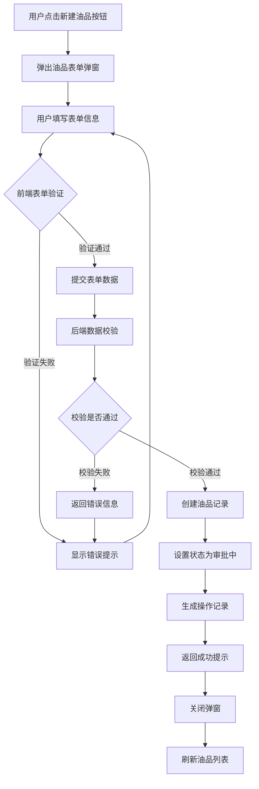
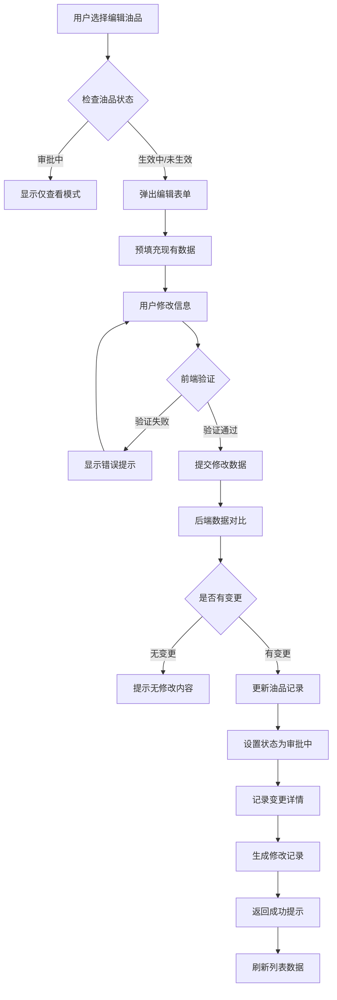
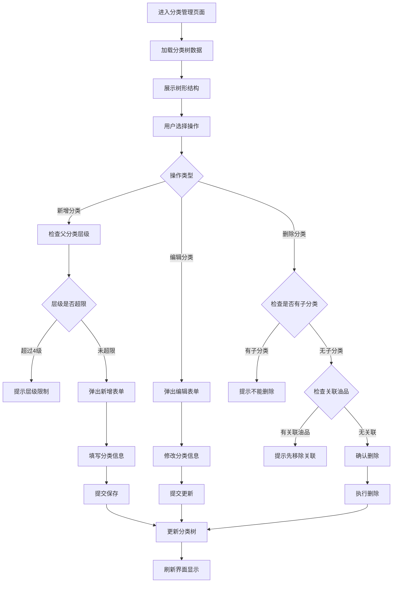
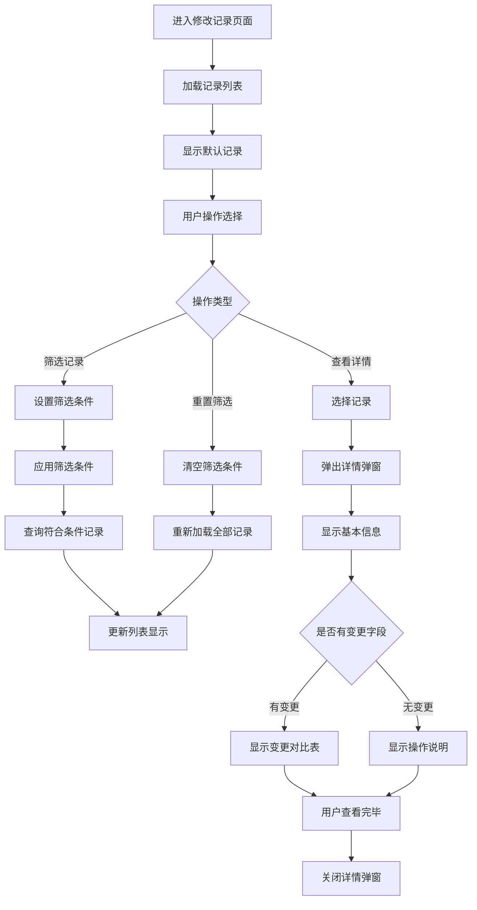
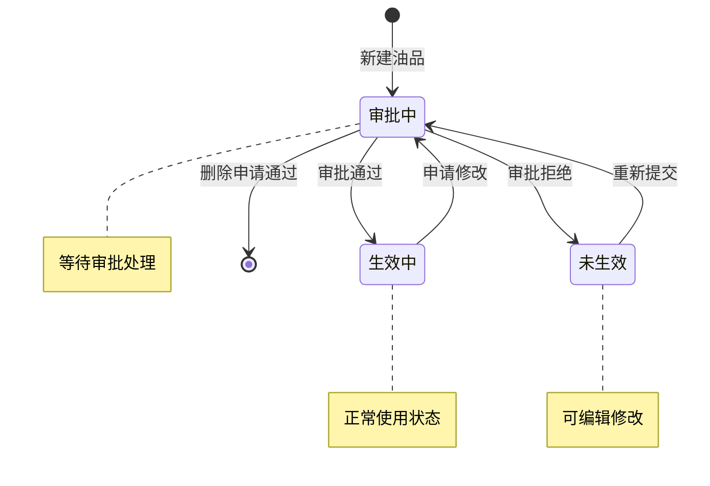
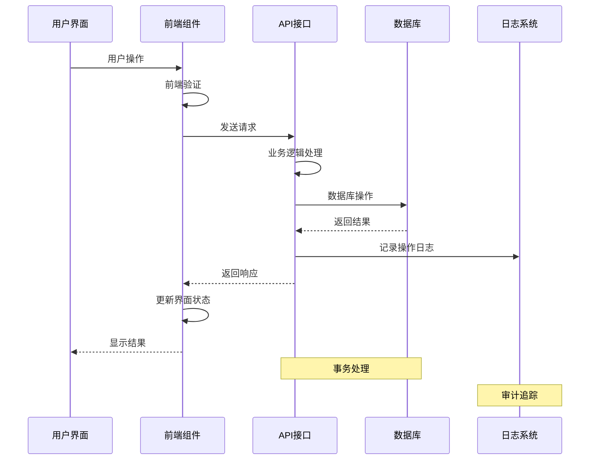

# 业务流程图文档 - 油品主数据管理系统

## 文档概述

本文档描述了油品主数据管理系统的核心业务流程，通过流程图清晰展示各功能模块的操作步骤和数据流转。

---

## 1. 油品信息新建流程

### 1.1 流程描述
用户通过系统界面新建油品信息的完整流程，包括表单填写、数据验证、审批提交等环节。

### 1.2 流程图

### 1.3 关键节点说明
- **表单验证**：包括必填项检查、格式验证、业务规则校验
- **后端校验**：数据唯一性校验、业务逻辑验证
- **状态管理**：新建记录默认为"审批中"状态

---

## 2. 油品信息编辑流程

### 2.1 流程描述
对现有油品信息进行修改的业务流程，包括状态检查、数据变更、审批处理等步骤。

### 2.2 流程图

### 2.3 关键节点说明
- **状态检查**：只有"生效中"和"未生效"状态的记录才能编辑
- **数据对比**：系统自动对比修改前后的数据差异
- **变更记录**：详细记录每个字段的变更内容

---

## 3. 油品分类管理流程

### 3.1 流程描述
管理油品分类体系的业务流程，支持分类的新增、编辑、删除和层级调整。

### 3.2 流程图

### 3.3 关键节点说明
- **层级控制**：最多支持4级分类层次
- **关联检查**：删除前检查是否有关联的油品或子分类
- **数据完整性**：确保分类树的层次结构完整

---

## 4. 修改记录查询流程

### 4.1 流程描述
查询和查看油品相关操作记录的业务流程，支持多条件筛选和详情查看。

### 4.2 流程图

### 4.3 关键节点说明
- **筛选功能**：支持按油品名称、操作类型、状态、操作人、时间范围筛选
- **详情展示**：完整显示操作记录和字段变更对比
- **数据追溯**：提供完整的操作历史追踪能力

---

## 5. 状态流转流程

### 5.1 流程描述
油品记录在系统中的状态变化流程，体现审批机制和生命周期管理。

### 5.2 流程图

### 5.3 状态说明
- **审批中**：新建或修改后等待审批的状态
- **生效中**：审批通过，正式生效的状态
- **未生效**：审批拒绝或草稿状态，可继续编辑

---

## 6. 数据同步流程

### 6.1 流程描述
系统各模块间数据同步和一致性保证的流程。

### 6.2 流程图

### 6.3 关键说明
- **事务处理**：确保数据操作的原子性
- **日志记录**：所有操作都会记录到修改记录表
- **状态同步**：前端界面与后端数据保持一致

---

**文档版本：** v1.1 
**创建日期：** 2025年7月  
**最后更新：** 2025年7月 