# 油品供货商和询价管理业务流程图文档 v1.0

**文档版本：** v1.0  
**创建日期：** 2025年7月18日  
**文档状态：** 初版

## 1. 文档概述

本文档描述了油品供货商和询价管理系统的核心业务流程，包括询价发布、供应商报价、中标确认等关键业务环节的流程图和说明。

## 2. 核心业务流程

### 2.1 油品询价发布流程

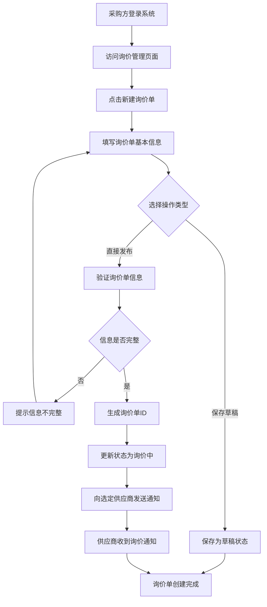

**流程说明：**
- **触发条件：** 采购方需要采购油品时
- **参与角色：** 采购方、系统、供应商
- **关键节点：** 询价单信息验证、供应商通知发送
- **异常处理：** 信息不完整时返回编辑页面

### 2.2 供应商报价流程

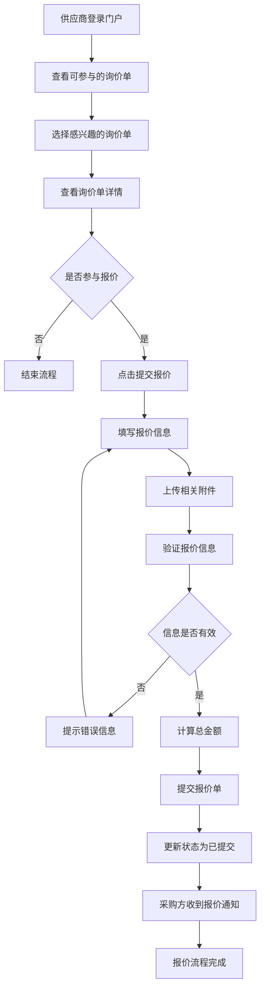

**流程说明：**
- **触发条件：** 供应商收到询价通知或主动查看询价单
- **参与角色：** 供应商、系统、采购方
- **关键节点：** 报价信息验证、总金额计算
- **异常处理：** 报价信息无效时返回编辑页面

### 2.3 询价评估和中标确认流程

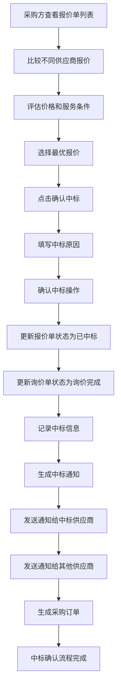

**流程说明：**
- **触发条件：** 询价截止时间到达或采购方主动结束询价
- **参与角色：** 采购方、系统、中标供应商、其他供应商
- **关键节点：** 报价比较评估、中标确认、通知发送
- **异常处理：** 无有效报价时重新发布询价

### 2.4 供应商管理流程

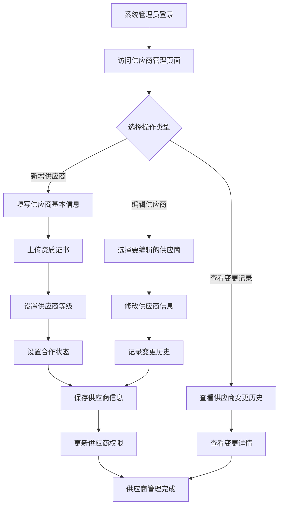

**流程说明：**
- **触发条件：** 新增供应商、供应商信息变更、查看变更历史
- **参与角色：** 系统管理员、系统
- **关键节点：** 资质验证、等级设置、变更记录
- **异常处理：** 资质不完整时拒绝保存

### 2.5 采购订单创建流程

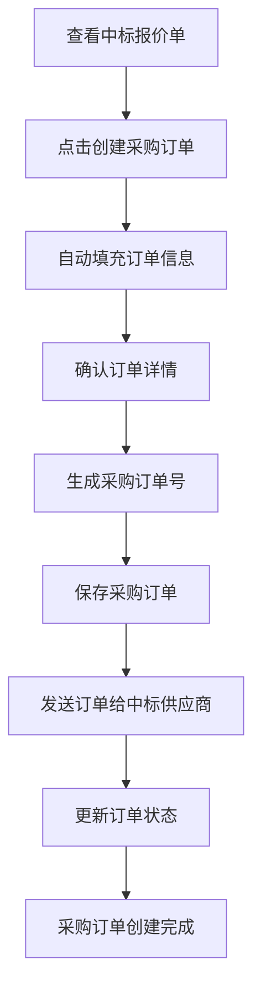

**流程说明：**
- **触发条件：** 中标确认完成后
- **参与角色：** 采购方、系统、中标供应商
- **关键节点：** 订单信息自动填充、订单号生成
- **异常处理：** 订单信息有误时返回编辑

### 2.6 消息通知流程

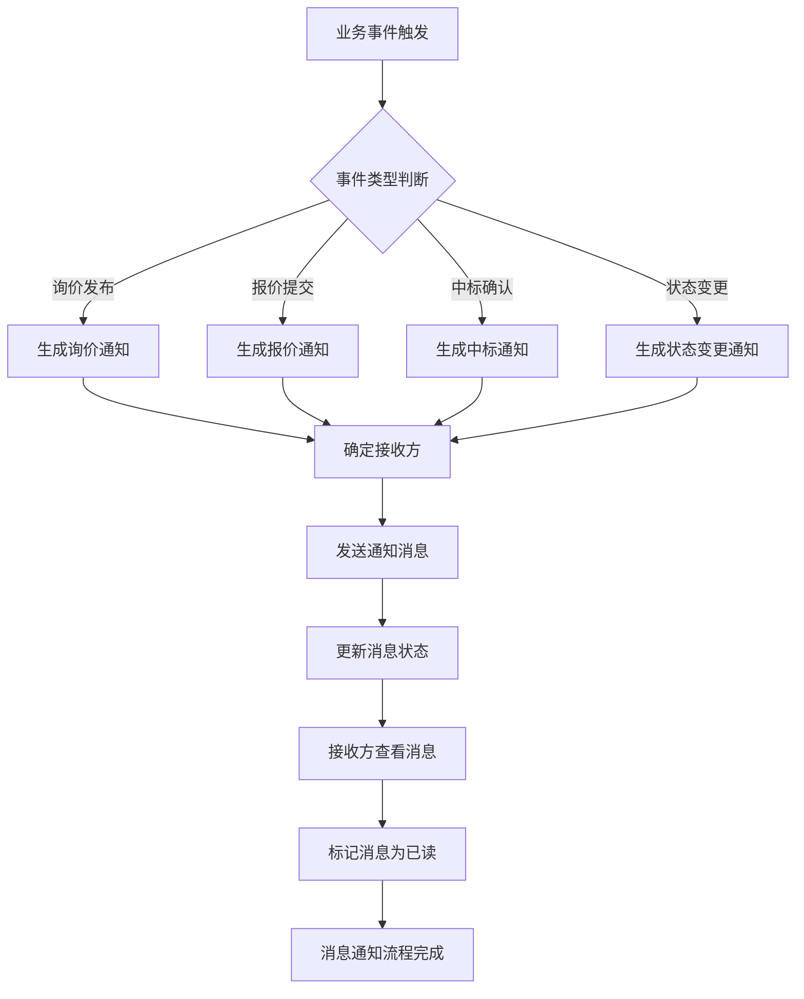

**流程说明：**
- **触发条件：** 各种业务事件的发生
- **参与角色：** 系统、消息接收方
- **关键节点：** 消息生成、发送、状态更新
- **异常处理：** 发送失败时重试机制

## 3. 状态流转图

### 3.1 询价单状态流转

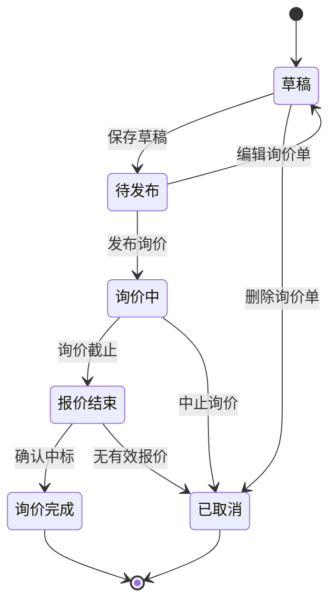

### 3.2 报价单状态流转

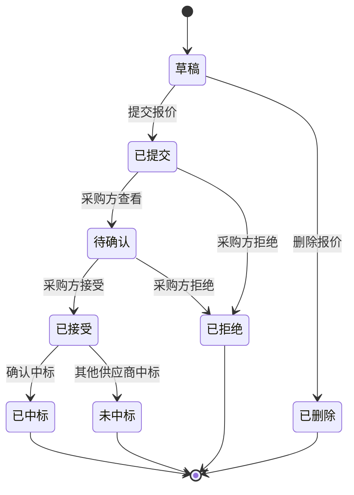

### 3.3 供应商状态流转

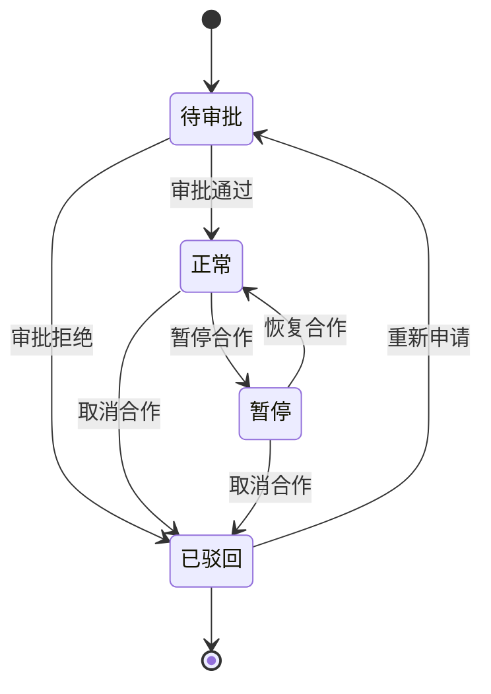

## 4. 数据流转图

### 4.1 询价数据流转

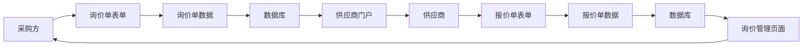

### 4.2 供应商数据流转

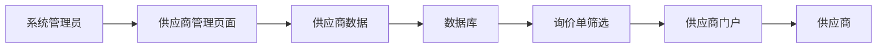

## 5. 异常处理流程

### 5.1 询价单异常处理

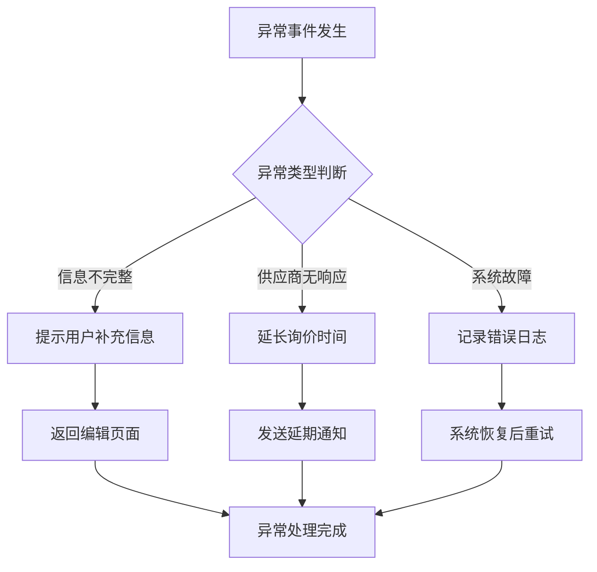

### 5.2 报价单异常处理

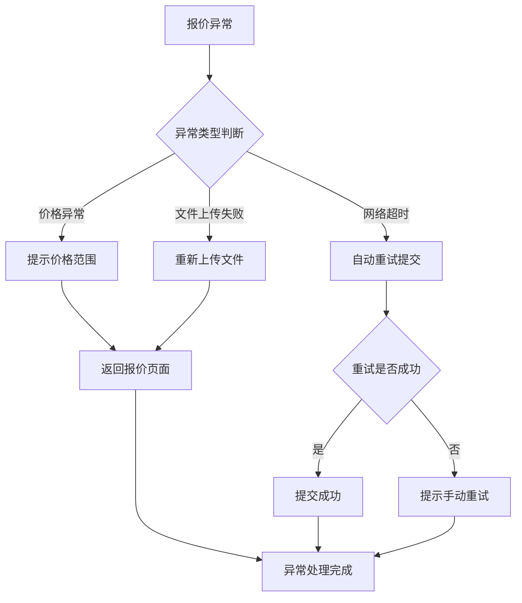

## 6. 流程优化建议

1. **自动化程度提升：** 在询价截止后自动发送提醒通知
2. **审批流程简化：** 对于小额询价单可以设置快速审批通道
3. **数据分析增强：** 增加报价趋势分析和供应商绩效评估
4. **移动端支持：** 开发移动端应用，支持移动办公
5. **集成能力扩展：** 与ERP系统集成，实现数据同步

## 7. 文档维护

- **版本控制：** 每次流程变更需要更新版本号
- **评审机制：** 流程变更需要经过业务部门和技术部门评审
- **培训计划：** 新流程上线前需要组织用户培训
- **监控指标：** 建立流程执行效率和质量监控指标 