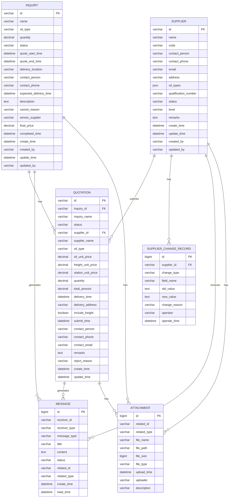

# 油品供货商和询价管理数据字典文档 v1.0

**文档版本：** v1.0  
**创建日期：** 2025年7月18日  
**文档状态：** 初版

## 1. 文档概述

本文档定义了油品供货商和询价管理系统中所有数据实体的详细结构，包括字段名称、数据类型、约束条件、业务规则等信息，为系统开发和数据维护提供标准参考。

## 2. 数据实体总览

| 实体名称 | 表名 | 中文名称 | 主要用途 |
|---------|------|---------|----------|
| Inquiry | inquiry | 询价单 | 存储油品询价的基本信息 |
| Quotation | quotation | 报价单 | 存储供应商提交的报价信息 |
| Supplier | supplier | 供应商 | 存储供应商的基本信息和资质 |
| SupplierChangeRecord | supplier_change_record | 供应商变更记录 | 记录供应商信息的变更历史 |
| Message | message | 消息通知 | 存储系统消息和通知 |
| Attachment | attachment | 附件文件 | 存储上传的文件信息 |
| DeliveryLocation | delivery_location | 交货地点 | 存储预定义的交货地点信息 |

## 3. 详细数据实体定义

### 3.1 询价单 (Inquiry)

**表名：** inquiry  
**描述：** 存储油品询价的基本信息，包括询价要求、时间安排、状态等

| 字段名 | 中文名称 | 数据类型 | 长度 | 是否必填 | 默认值 | 约束条件 | 业务规则 |
|--------|----------|----------|------|----------|--------|----------|----------|
| id | 询价单ID | VARCHAR | 20 | 是 | - | 主键 | 格式：INQ + YYYYMMDD + 3位序号 |
| name | 询价单名称 | VARCHAR | 200 | 是 | - | 非空 | 不能重复 |
| oil_type | 油品类型 | VARCHAR | 50 | 是 | - | 非空 | 枚举值：92#汽油、95#汽油、98#汽油、0#柴油、尿素 |
| quantity | 预计采购数量 | DECIMAL | 12,2 | 是 | - | > 0 | 单位：吨，支持小数点后2位 |
| status | 状态 | VARCHAR | 20 | 是 | '草稿' | 非空 | 枚举值：草稿、待发布、询价中、已取消、报价结束、询价完成 |
| quote_start_time | 报价开始时间 | DATETIME | - | 是 | - | 非空 | 格式：YYYY-MM-DD HH:mm:ss |
| quote_end_time | 报价结束时间 | DATETIME | - | 是 | - | 非空 | 必须大于开始时间 |
| delivery_location | 交货地点 | VARCHAR | 500 | 是 | - | 非空 | 详细地址信息 |
| contact_person | 联系人 | VARCHAR | 50 | 是 | - | 非空 | 采购方联系人姓名 |
| contact_phone | 联系电话 | VARCHAR | 20 | 是 | - | 非空 | 手机号格式验证 |
| expected_delivery_time | 预期交货时间 | DATETIME | - | 否 | - | - | 格式：YYYY-MM-DD HH:mm:ss |
| description | 询价描述 | TEXT | - | 否 | - | - | 详细说明询价要求 |
| cancel_reason | 取消原因 | VARCHAR | 500 | 否 | - | - | 取消时必填 |
| winner_supplier | 中标供应商 | VARCHAR | 100 | 否 | - | - | 询价完成时填写 |
| final_price | 最终价格 | DECIMAL | 10,2 | 否 | - | >= 0 | 单位：元/吨 |
| completed_time | 完成时间 | DATETIME | - | 否 | - | - | 询价完成时自动记录 |
| create_time | 创建时间 | DATETIME | - | 是 | CURRENT_TIMESTAMP | 非空 | 系统自动生成 |
| created_by | 创建人 | VARCHAR | 50 | 是 | - | 非空 | 当前登录用户 |
| update_time | 更新时间 | DATETIME | - | 是 | CURRENT_TIMESTAMP | 非空 | 系统自动更新 |
| updated_by | 更新人 | VARCHAR | 50 | 是 | - | 非空 | 当前登录用户 |

**索引：**
- 主键：id
- 唯一索引：name
- 普通索引：status, oil_type, create_time, quote_end_time

**业务规则：**
1. 询价单ID自动生成，格式为：INQ + 年月日 + 3位序号
2. 报价结束时间必须大于报价开始时间
3. 询价单发布后，核心信息（油品类型、数量等）不可修改
4. 状态变更需要记录操作日志

### 3.2 报价单 (Quotation)

**表名：** quotation  
**描述：** 存储供应商针对询价单提交的报价信息

| 字段名 | 中文名称 | 数据类型 | 长度 | 是否必填 | 默认值 | 约束条件 | 业务规则 |
|--------|----------|----------|------|----------|--------|----------|----------|
| id | 报价单ID | VARCHAR | 20 | 是 | - | 主键 | 格式：QUO + YYYYMMDD + 3位序号 |
| inquiry_id | 询价单ID | VARCHAR | 20 | 是 | - | 外键 | 关联inquiry表 |
| inquiry_name | 询价单名称 | VARCHAR | 200 | 是 | - | 非空 | 冗余字段，便于查询 |
| status | 状态 | VARCHAR | 20 | 是 | '草稿' | 非空 | 枚举值：草稿、已提交、待确认、已接受、已拒绝、已中标、未中标 |
| supplier_id | 供应商ID | VARCHAR | 20 | 是 | - | 外键 | 关联supplier表 |
| supplier_name | 供应商名称 | VARCHAR | 100 | 是 | - | 非空 | 冗余字段，便于查询 |
| oil_type | 油品类型 | VARCHAR | 50 | 是 | - | 非空 | 与询价单一致 |
| oil_unit_price | 油品单价 | DECIMAL | 10,2 | 是 | - | > 0 | 单位：元/吨 |
| freight_unit_price | 运费单价 | DECIMAL | 10,2 | 否 | 0 | >= 0 | 单位：元/吨 |
| station_unit_price | 到站单价 | DECIMAL | 10,2 | 是 | - | > 0 | 单位：元/吨，含运费 |
| quantity | 数量 | DECIMAL | 12,2 | 是 | - | > 0 | 单位：吨，与询价单一致 |
| total_amount | 总金额 | DECIMAL | 15,2 | 是 | - | > 0 | 单位：元，自动计算 |
| delivery_time | 交货时间 | DATETIME | - | 是 | - | 非空 | 格式：YYYY-MM-DD HH:mm:ss |
| delivery_address | 交货地点 | VARCHAR | 500 | 是 | - | 非空 | 详细地址信息 |
| include_freight | 是否包含运费 | BOOLEAN | - | 是 | true | 非空 | true/false |
| submit_time | 提交时间 | DATETIME | - | 是 | CURRENT_TIMESTAMP | 非空 | 系统自动生成 |
| contact_person | 联系人 | VARCHAR | 50 | 是 | - | 非空 | 供应商联系人 |
| contact_phone | 联系电话 | VARCHAR | 20 | 是 | - | 非空 | 手机号格式验证 |
| contact_email | 联系邮箱 | VARCHAR | 100 | 是 | - | 非空 | 邮箱格式验证 |
| remarks | 备注 | TEXT | - | 否 | - | - | 供应商备注信息 |
| reject_reason | 拒绝原因 | VARCHAR | 500 | 否 | - | - | 拒绝时必填 |
| create_time | 创建时间 | DATETIME | - | 是 | CURRENT_TIMESTAMP | 非空 | 系统自动生成 |
| update_time | 更新时间 | DATETIME | - | 是 | CURRENT_TIMESTAMP | 非空 | 系统自动更新 |

**索引：**
- 主键：id
- 外键：inquiry_id, supplier_id
- 普通索引：status, supplier_id, inquiry_id, submit_time

**业务规则：**
1. 报价单ID自动生成，格式为：QUO + 年月日 + 3位序号
2. 到站单价 = 油品单价 + 运费单价（如果包含运费）
3. 总金额 = 到站单价 × 数量
4. 报价单提交后，价格信息不可修改
5. 每个供应商对同一询价单只能提交一份报价

### 3.3 供应商 (Supplier)

**表名：** supplier  
**描述：** 存储供应商的基本信息、资质信息和联系方式

| 字段名 | 中文名称 | 数据类型 | 长度 | 是否必填 | 默认值 | 约束条件 | 业务规则 |
|--------|----------|----------|------|----------|--------|----------|----------|
| id | 供应商ID | VARCHAR | 20 | 是 | - | 主键 | 格式：OS + 3位序号 |
| name | 供应商名称 | VARCHAR | 100 | 是 | - | 非空 | 企业全称 |
| code | 供应商代码 | VARCHAR | 50 | 是 | - | 唯一 | 企业内部编码 |
| contact_person | 联系人 | VARCHAR | 50 | 是 | - | 非空 | 主要联系人姓名 |
| contact_phone | 联系电话 | VARCHAR | 20 | 是 | - | 非空 | 手机号格式验证 |
| email | 邮箱 | VARCHAR | 100 | 是 | - | 非空 | 邮箱格式验证 |
| address | 地址 | VARCHAR | 500 | 是 | - | 非空 | 企业注册地址 |
| oil_types | 油品类型 | JSON | - | 是 | - | 非空 | 支持的油品类型数组 |
| qualification_number | 资质证书号 | VARCHAR | 100 | 是 | - | 非空 | 经营许可证号 |
| status | 状态 | VARCHAR | 20 | 是 | '待审批' | 非空 | 枚举值：待审批、正常、暂停、已驳回 |
| level | 等级 | VARCHAR | 10 | 是 | 'B' | 非空 | 枚举值：A、B、C |
| remarks | 备注 | TEXT | - | 否 | - | - | 备注信息 |
| create_time | 创建时间 | DATETIME | - | 是 | CURRENT_TIMESTAMP | 非空 | 系统自动生成 |
| update_time | 更新时间 | DATETIME | - | 是 | CURRENT_TIMESTAMP | 非空 | 系统自动更新 |
| created_by | 创建人 | VARCHAR | 50 | 是 | - | 非空 | 当前登录用户 |
| updated_by | 更新人 | VARCHAR | 50 | 是 | - | 非空 | 当前登录用户 |

**索引：**
- 主键：id
- 唯一索引：code
- 普通索引：status, level, create_time

**业务规则：**
1. 供应商ID自动生成，格式为：OS + 3位序号
2. 供应商代码必须唯一
3. 状态为"正常"的供应商才能参与询价
4. 油品类型以JSON数组格式存储

### 3.4 供应商变更记录 (SupplierChangeRecord)

**表名：** supplier_change_record  
**描述：** 记录供应商信息的变更历史，便于审计和追溯

| 字段名 | 中文名称 | 数据类型 | 长度 | 是否必填 | 默认值 | 约束条件 | 业务规则 |
|--------|----------|----------|------|----------|--------|----------|----------|
| id | 记录ID | BIGINT | - | 是 | - | 主键，自增 | 系统自动生成 |
| supplier_id | 供应商ID | VARCHAR | 20 | 是 | - | 外键 | 关联supplier表 |
| change_type | 变更类型 | VARCHAR | 50 | 是 | - | 非空 | 枚举值：新增、修改、状态变更、删除 |
| field_name | 变更字段 | VARCHAR | 100 | 是 | - | 非空 | 具体变更的字段名 |
| old_value | 变更前值 | TEXT | - | 否 | - | - | 变更前的数据 |
| new_value | 变更后值 | TEXT | - | 否 | - | - | 变更后的数据 |
| change_reason | 变更原因 | VARCHAR | 500 | 否 | - | - | 变更原因说明 |
| operator | 操作人 | VARCHAR | 50 | 是 | - | 非空 | 执行变更的用户 |
| operate_time | 操作时间 | DATETIME | - | 是 | CURRENT_TIMESTAMP | 非空 | 系统自动生成 |

**索引：**
- 主键：id
- 外键：supplier_id
- 普通索引：supplier_id, change_type, operate_time

**业务规则：**
1. 每次供应商信息变更都会自动记录
2. 变更前值和变更后值以JSON格式存储
3. 操作时间精确到秒

### 3.5 消息通知 (Message)

**表名：** message  
**描述：** 存储系统消息和通知，支持消息状态管理

| 字段名 | 中文名称 | 数据类型 | 长度 | 是否必填 | 默认值 | 约束条件 | 业务规则 |
|--------|----------|----------|------|----------|--------|----------|----------|
| id | 消息ID | BIGINT | - | 是 | - | 主键，自增 | 系统自动生成 |
| receiver_id | 接收方ID | VARCHAR | 20 | 是 | - | 非空 | 用户ID或供应商ID |
| receiver_type | 接收方类型 | VARCHAR | 20 | 是 | - | 非空 | 枚举值：user、supplier |
| message_type | 消息类型 | VARCHAR | 50 | 是 | - | 非空 | 枚举值：询价通知、报价通知、中标通知、状态变更 |
| title | 消息标题 | VARCHAR | 200 | 是 | - | 非空 | 消息标题 |
| content | 消息内容 | TEXT | - | 是 | - | 非空 | 消息详细内容 |
| status | 状态 | VARCHAR | 20 | 是 | '未读' | 非空 | 枚举值：未读、已读、已删除 |
| related_id | 关联ID | VARCHAR | 20 | 否 | - | - | 关联的业务对象ID |
| related_type | 关联类型 | VARCHAR | 50 | 否 | - | - | 关联的业务对象类型 |
| create_time | 创建时间 | DATETIME | - | 是 | CURRENT_TIMESTAMP | 非空 | 系统自动生成 |
| read_time | 阅读时间 | DATETIME | - | 否 | - | - | 用户阅读时记录 |

**索引：**
- 主键：id
- 普通索引：receiver_id, receiver_type, message_type, status, create_time

**业务规则：**
1. 消息ID自动生成
2. 消息创建时状态默认为"未读"
3. 用户阅读消息时自动更新状态和阅读时间
4. 支持消息的软删除

### 3.6 附件文件 (Attachment)

**表名：** attachment  
**描述：** 存储上传的文件信息，支持多种业务对象的文件关联

| 字段名 | 中文名称 | 数据类型 | 长度 | 是否必填 | 默认值 | 约束条件 | 业务规则 |
|--------|----------|----------|------|----------|--------|----------|----------|
| id | 文件ID | BIGINT | - | 是 | - | 主键，自增 | 系统自动生成 |
| related_id | 关联对象ID | VARCHAR | 20 | 是 | - | 非空 | 关联的业务对象ID |
| related_type | 关联对象类型 | VARCHAR | 50 | 是 | - | 非空 | 枚举值：inquiry、quotation、supplier |
| file_name | 文件名 | VARCHAR | 200 | 是 | - | 非空 | 原始文件名 |
| file_path | 文件路径 | VARCHAR | 500 | 是 | - | 非空 | 服务器存储路径 |
| file_size | 文件大小 | BIGINT | - | 是 | - | > 0 | 单位：字节 |
| file_type | 文件类型 | VARCHAR | 50 | 是 | - | 非空 | MIME类型 |
| upload_time | 上传时间 | DATETIME | - | 是 | CURRENT_TIMESTAMP | 非空 | 系统自动生成 |
| uploader | 上传人 | VARCHAR | 50 | 是 | - | 非空 | 当前登录用户 |
| description | 文件描述 | VARCHAR | 500 | 否 | - | - | 文件说明 |

**索引：**
- 主键：id
- 普通索引：related_id, related_type, upload_time

**业务规则：**
1. 文件ID自动生成
2. 文件大小必须大于0
3. 支持的文件类型：PDF、DOC、DOCX、XLS、XLSX、JPG、PNG
4. 单个文件大小限制：10MB

### 3.7 交货地点 (DeliveryLocation)

**表名：** delivery_location  
**描述：** 存储预定义的交货地点信息，便于询价单创建时选择

| 字段名 | 中文名称 | 数据类型 | 长度 | 是否必填 | 默认值 | 约束条件 | 业务规则 |
|--------|----------|----------|------|----------|--------|----------|----------|
| id | 地点ID | BIGINT | - | 是 | - | 主键，自增 | 系统自动生成 |
| name | 地点名称 | VARCHAR | 200 | 是 | - | 非空 | 地点简称 |
| full_address | 完整地址 | VARCHAR | 500 | 是 | - | 非空 | 详细地址信息 |
| province | 省份 | VARCHAR | 50 | 是 | - | 非空 | 省份名称 |
| city | 城市 | VARCHAR | 50 | 是 | - | 非空 | 城市名称 |
| district | 区县 | VARCHAR | 50 | 否 | - | - | 区县名称 |
| contact_person | 联系人 | VARCHAR | 50 | 否 | - | - | 地点联系人 |
| contact_phone | 联系电话 | VARCHAR | 20 | 否 | - | - | 联系电话 |
| status | 状态 | VARCHAR | 20 | 是 | '启用' | 非空 | 枚举值：启用、禁用 |
| create_time | 创建时间 | DATETIME | - | 是 | CURRENT_TIMESTAMP | 非空 | 系统自动生成 |
| update_time | 更新时间 | DATETIME | - | 是 | CURRENT_TIMESTAMP | 非空 | 系统自动更新 |

**索引：**
- 主键：id
- 普通索引：status, province, city

**业务规则：**
1. 地点ID自动生成
2. 状态为"启用"的地点才能在询价单中选择
3. 地址信息按省市区层级组织

## 4. 数据字典

### 4.1 状态枚举值

#### 询价单状态 (inquiry.status)
| 值 | 中文名称 | 说明 |
|---|----------|------|
| 草稿 | 草稿 | 询价单刚创建，未发布 |
| 待发布 | 待发布 | 询价单已保存，等待发布 |
| 询价中 | 询价中 | 询价单已发布，供应商可报价 |
| 已取消 | 已取消 | 询价单被取消 |
| 报价结束 | 报价结束 | 报价时间已截止 |
| 询价完成 | 询价完成 | 已确认中标供应商 |

#### 报价单状态 (quotation.status)
| 值 | 中文名称 | 说明 |
|---|----------|------|
| 草稿 | 草稿 | 报价单刚创建，未提交 |
| 已提交 | 已提交 | 报价单已提交给采购方 |
| 待确认 | 待确认 | 采购方正在评估 |
| 已接受 | 已接受 | 采购方已接受报价 |
| 已拒绝 | 已拒绝 | 采购方拒绝报价 |
| 已中标 | 已中标 | 该报价被确认为中标 |
| 未中标 | 未中标 | 其他供应商中标 |

#### 供应商状态 (supplier.status)
| 值 | 中文名称 | 说明 |
|---|----------|------|
| 待审批 | 待审批 | 新供应商，等待审批 |
| 正常 | 正常 | 供应商正常合作 |
| 暂停 | 暂停 | 供应商暂停合作 |
| 已驳回 | 已驳回 | 供应商申请被驳回 |

#### 供应商等级 (supplier.level)
| 值 | 中文名称 | 说明 |
|---|----------|------|
| A | A级 | 一级供应商，优先合作 |
| B | B级 | 二级供应商，正常合作 |
| C | C级 | 三级供应商，限制合作 |

### 4.2 油品类型枚举值

| 值 | 中文名称 | 说明 |
|---|----------|------|
| 92#汽油 | 92#汽油 | 92号汽油 |
| 95#汽油 | 95#汽油 | 95号汽油 |
| 98#汽油 | 98#汽油 | 98号汽油 |
| 0#柴油 | 0#柴油 | 0号柴油 |
| 尿素 | 尿素 | 车用尿素 |

### 4.3 消息类型枚举值

| 值 | 中文名称 | 说明 |
|---|----------|------|
| 询价通知 | 询价通知 | 新询价单发布通知 |
| 报价通知 | 报价通知 | 收到新报价通知 |
| 中标通知 | 中标通知 | 中标结果通知 |
| 状态变更 | 状态变更 | 业务状态变更通知 |

## 5. 数据关系图

## 6. 数据维护规则

### 6.1 数据完整性规则
1. **主键约束：** 所有表必须有主键，主键值唯一且非空
2. **外键约束：** 引用其他表的数据必须存在
3. **非空约束：** 必填字段不能为空
4. **唯一约束：** 供应商代码、询价单名称等字段必须唯一

### 6.2 数据一致性规则
1. **状态一致性：** 业务对象状态变更必须符合预定义的状态流转规则
2. **时间一致性：** 报价结束时间必须大于开始时间
3. **价格一致性：** 到站单价必须等于油品单价加运费单价
4. **数量一致性：** 报价数量必须与询价数量一致

### 6.3 数据安全规则
1. **访问控制：** 不同角色用户只能访问授权的数据
2. **操作日志：** 重要数据变更必须记录操作日志
3. **数据备份：** 定期备份重要数据
4. **敏感信息保护：** 联系方式等敏感信息需要加密存储

## 7. 数据迁移和初始化

### 7.1 初始化数据
- 系统部署时需要初始化基础数据，如交货地点、油品类型等
- 供应商数据可以从现有系统导入
- 历史询价和报价数据需要迁移

### 7.2 数据清理规则
- 已删除的询价单和报价单保留30天
- 过期的消息通知保留90天
- 未使用的附件文件保留7天

## 8. 文档维护

- **版本控制：** 数据结构变更需要更新版本号
- **变更记录：** 记录每次数据结构的变更内容
- **影响评估：** 数据结构变更需要评估对现有功能的影响
- **测试验证：** 数据结构变更后需要进行充分测试 