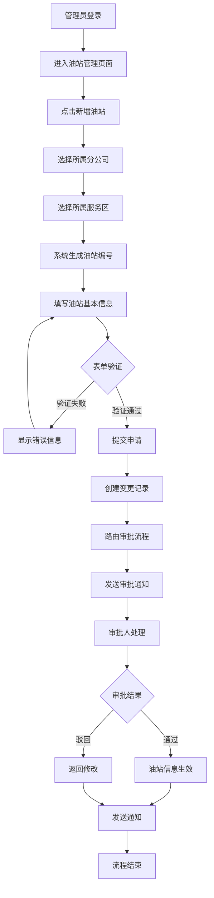
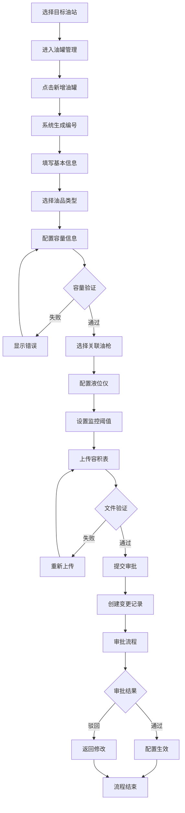
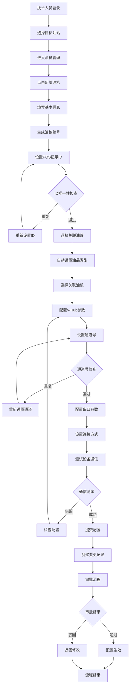
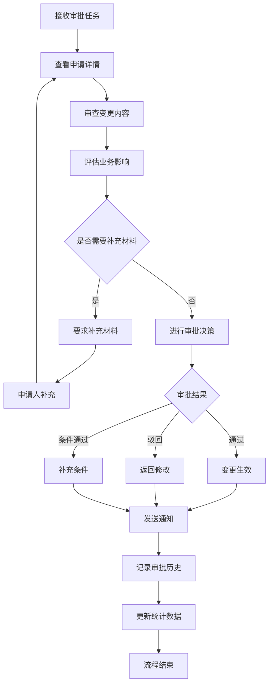

# 业务流程图 - 油站、油罐和油枪管理系统

**文档版本：** v1.1  
**日期：** 2025年7月16日  
**创建人：** 孙杨竣@喂车科技  
1. 业务流程概述

本文档描述油站、油罐和油枪管理系统的核心业务流程，包括设备的新增、修改、删除和审批等关键业务环节。系统支持完整的设备生命周期管理，确保所有操作的合规性和可追溯性。

---

## 2. 核心业务流程

### 2.1 油站管理流程

#### 2.1.1 油站新增流程

**流程描述：** 管理员新增加油站的完整业务流程

**参与角色：** 分公司管理员、审批人员、系统管理员

**前置条件：** 
- 用户具有油站管理权限
- 组织结构数据已配置
- 分公司和服务区信息完整

**流程步骤：**

1. **发起申请**
   - 管理员登录系统，进入油站管理页面
   - 点击"新增油站"按钮，打开油站信息表单
   - 选择所属分公司，系统自动加载对应服务区列表

2. **信息填写**
   - 选择所属服务区，系统自动生成油站编号
   - 填写油站基本信息：名称、地址、坐标、联系人等
   - 设置油站配置：类型、法人主体、油品类型等
   - 系统自动校验数据格式和完整性

3. **提交审批**
   - 表单验证通过后，用户点击提交
   - 系统创建变更记录，状态为"待审批"
   - 根据审批配置，自动路由到相应审批人
   - 发送审批通知给审批人员

4. **审批处理**
   - 审批人登录系统，查看待审批列表
   - 点击查看油站申请详情
   - 根据业务规则和公司政策进行审批决策
   - 填写审批意见，选择审批结果（通过/驳回）

5. **结果处理**
   - 审批通过：油站信息正式生效，状态更新为"已审批"
   - 审批驳回：返回申请人修改，说明驳回原因
   - 系统发送审批结果通知给申请人
   - 更新相关统计数据和业务报表

**流程图：**

#### 2.1.2 油站修改流程

**流程描述：** 修改已存在油站信息的业务流程

**流程步骤：**

1. **查询定位** - 通过筛选条件找到目标油站
2. **信息修改** - 编辑油站信息，系统记录变更差异
3. **提交审批** - 创建修改记录，进入审批流程
4. **审批处理** - 审批人审核变更内容
5. **结果生效** - 审批通过后更新油站信息

#### 2.1.3 油站删除流程

**流程描述：** 删除油站及相关设备的业务流程

**流程步骤：**

1. **删除检查** - 验证油站下是否有关联设备
2. **关联处理** - 处理或转移关联的油罐、油枪等设备
3. **删除确认** - 二次确认删除操作
4. **审批流程** - 删除操作进入高级审批流程
5. **执行删除** - 审批通过后执行删除操作

### 2.2 油罐管理流程

#### 2.2.1 油罐新增流程

**流程描述：** 为油站新增油罐设备的业务流程

**参与角色：** 设备管理员、技术人员、审批人员

**前置条件：**
- 目标油站已存在且状态正常
- 用户具有设备管理权限
- 油品主数据已配置

**流程步骤：**

1. **设备规划**
   - 设备管理员选择目标油站
   - 进入油罐管理页面，查看现有油罐配置
   - 点击"新增油罐"，系统生成油罐编号

2. **基础配置**
   - 填写油罐名称和基本信息
   - 选择油品类型，系统自动设置默认密度
   - 配置油罐容量（最大容量、设计容量）
   - 系统验证容量参数的合理性

3. **关联配置**
   - 选择关联的油枪设备
   - 建立油罐与油枪的多对多关联关系
   - 验证关联关系的业务逻辑

4. **设备配置**
   - 配置液位仪接口类型（串口/网口）
   - 设置通信参数（波特率、品牌等）
   - 配置监控阈值（液位告警、偏差值等）

5. **文档上传**
   - 上传油罐容积表文件（Excel格式）
   - 系统验证文件格式和内容结构
   - 解析容积表数据并存储

6. **提交审批**
   - 配置完成后提交审批
   - 系统创建变更记录
   - 进入设备变更审批流程

**流程图：**

#### 2.2.2 油罐维护流程

**流程描述：** 油罐设备维护和参数调整的业务流程

**流程步骤：**

1. **维护计划** - 制定设备维护计划
2. **状态变更** - 将油罐状态设置为"维护中"
3. **参数调整** - 调整阈值参数或更换设备
4. **测试验证** - 验证设备功能和参数设置
5. **恢复运行** - 维护完成后恢复正常状态

### 2.3 油枪管理流程

#### 2.3.1 油枪新增流程

**流程描述：** 新增油枪设备并配置V-Hub集线器的业务流程

**参与角色：** 技术维护人员、设备管理员、审批人员

**前置条件：**
- 目标油站和油罐已配置
- 加油机设备已安装
- 用户具有设备配置权限

**流程步骤：**

1. **设备准备**
   - 技术人员选择目标油站
   - 查看现有油枪配置和可用设备
   - 确认加油机设备安装状态

2. **基础配置**
   - 创建新油枪，填写基本信息
   - 系统自动生成油枪编号
   - 设置POS显示ID，验证唯一性

3. **关联配置**
   - 选择关联的油罐设备
   - 系统自动设置油品类型
   - 选择关联的加油机设备
   - 验证设备关联关系

4. **V-Hub配置**
   - 配置集线器通道号（验证唯一性）
   - 设置主板编号和串口参数
   - 选择连接方式（直连/侦听）
   - 配置泵码数百万位数值

5. **状态设置**
   - 设置油枪初始状态
   - 记录安装日期和维护信息
   - 配置设备监控参数

6. **测试验证**
   - 测试油枪与集线器通信
   - 验证POS系统显示
   - 确认设备功能正常

7. **提交生效**
   - 提交配置申请
   - 进入设备变更审批流程
   - 审批通过后配置正式生效

**流程图：**

#### 2.3.2 油枪变更流程

**流程描述：** 修改油枪配置或更换设备的业务流程

**流程步骤：**

1. **变更申请** - 提出油枪变更需求
2. **影响分析** - 分析变更对业务的影响
3. **变更实施** - 执行配置变更或设备更换
4. **功能测试** - 验证变更后的设备功能
5. **变更确认** - 确认变更结果并更新记录

### 2.4 审批管理流程

#### 2.4.1 统一审批流程

**流程描述：** 所有设备变更的统一审批处理流程

**参与角色：** 审批管理员、相关业务人员

**流程步骤：**

1. **审批接收**
   - 系统自动推送待审批事项
   - 审批人接收审批通知
   - 查看审批任务列表

2. **审批审查**
   - 查看变更申请详情
   - 对比变更前后的差异
   - 评估变更的合理性和风险

3. **审批决策**
   - 根据业务规则进行审批
   - 填写审批意见和建议
   - 选择审批结果（通过/驳回/条件通过）

4. **结果处理**
   - 审批结果自动通知申请人
   - 通过的申请自动执行后续流程
   - 驳回的申请返回修改

5. **记录归档**
   - 记录完整的审批历史
   - 生成审批报告
   - 更新相关统计数据

**审批流程图：**

---

## 3. 异常处理流程

### 3.1 数据验证失败处理

**场景：** 用户输入的数据不符合业务规则或格式要求

**处理流程：**
1. 系统实时验证用户输入
2. 显示具体的错误信息和修改建议
3. 阻止表单提交，要求用户修正
4. 记录验证失败的日志信息

### 3.2 设备关联冲突处理

**场景：** 设备关联关系存在冲突或循环依赖

**处理流程：**
1. 检测关联关系的逻辑冲突
2. 提示用户具体的冲突内容
3. 提供解决冲突的操作建议
4. 用户确认后执行冲突解决方案

### 3.3 审批超时处理

**场景：** 审批申请长时间未处理

**处理流程：**
1. 系统定时检查审批任务状态
2. 超时任务自动发送催办通知
3. 记录超时情况和处理结果
4. 必要时启动审批升级机制

---

## 4. 流程优化建议

### 4.1 自动化改进
- 增加更多的自动验证规则
- 实现智能审批路由
- 提供批量操作功能
- 集成设备监控数据

### 4.2 用户体验优化
- 简化操作步骤
- 提供向导式配置
- 增加操作预览功能
- 优化错误提示信息

### 4.3 业务流程优化
- 建立设备变更影响评估机制
- 优化审批流程，减少审批层级
- 增加变更回滚功能
- 完善设备生命周期管理

---

**文档状态：** 草稿  
**下一步行动：** 与业务人员确认流程细节 