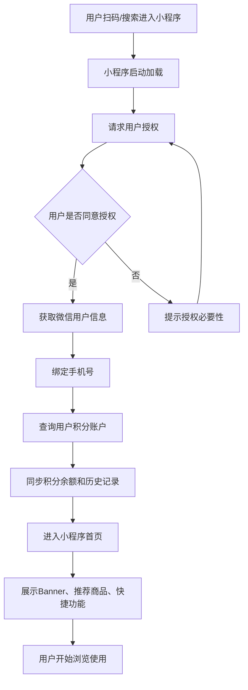
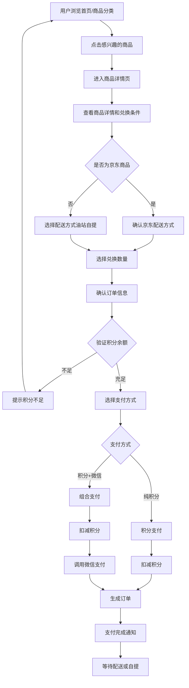
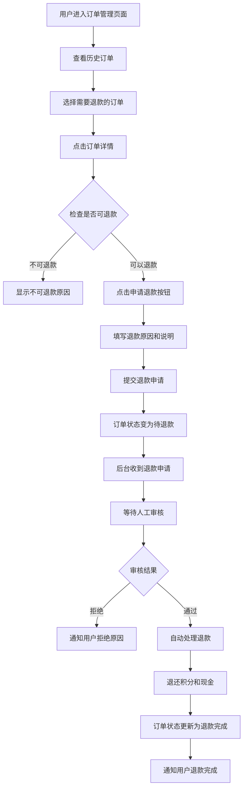
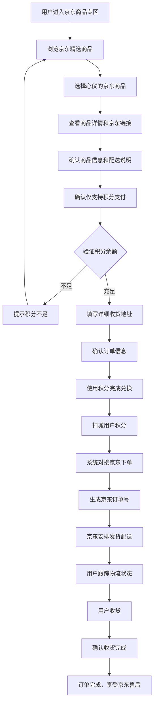

# 商业需求文档 (BRD) - 江西高速积分商城微信小程序

## 1. 项目概述 (Project Overview)

### 1.1 项目背景与痛点 (Background and Pain Points)
江西高速积分商城微信小程序是配套管理后台的用户端应用，旨在解决以下用户痛点和市场需求：
* **积分兑换不便**：用户无法随时随地查看和使用积分，缺乏便捷的移动端兑换渠道
* **商品信息获取困难**：用户难以及时了解积分商城的最新商品和优惠活动
* **订单管理分散**：用户的积分兑换记录和订单状态无法统一查看和管理
* **用户体验不佳**：缺乏流畅的移动端购物体验，影响用户的积分使用积极性

### 1.2 项目目标与价值 (Project Goals and Value Proposition)
* **主要目标：** 构建一个便捷易用的微信小程序积分商城，为用户提供随时随地的积分兑换服务，提升用户体验和积分使用率，形成完整的积分生态闭环
* **核心价值：** 
  - 提供便捷的移动端积分兑换体验
  - 增强用户与品牌的互动频次和黏性
  - 实现积分价值的最大化变现
  - 提升客户满意度和服务便民性
  - 促进线上线下业务融合发展

### 1.3 项目范围 (Project Scope)
* **核心功能模块：** 首页展示、商品浏览、积分兑换、订单管理、个人中心
* **本次迭代：** 完整的微信小程序积分商城功能，支持多种支付方式、京东商品兑换、实时订单跟踪等

## 2. 用户分析 (User Analysis)

### 2.1 目标用户群体 (Target Audience)
* **主要用户**：江西高速加油站的注册会员用户
  - 个人车主：日常通勤、长途驾驶的私家车主
  - 企业用户：物流公司、运输企业的司机和管理员
  - 高频用户：经常在江西高速路段行驶的用户
* **用户特征：** 
  - 年龄范围：25-50岁，具有一定的消费能力
  - 拥有一定的积分余额（通过加油、购物等获得）
  - 熟悉微信小程序操作，接受移动支付
  - 对实用性商品和优惠服务有较强需求

### 2.2 用户场景 (User Scenarios)
* **场景一：日常积分兑换**
  用户王先生积攒了1500积分，在等车间隙打开小程序，浏览商品→选择洗车服务（200积分）→选择就近的加油站→确认兑换→获得兑换码→到站出示兑换码享受服务

* **场景二：组合支付购买**
  用户李女士看中机油保养套餐（400积分+60元），操作流程：进入商品详情→确认价格和服务内容→使用400积分+微信支付60元→选择服务站点→完成支付→到站享受服务

* **场景三：京东商品配送**
  用户张总经理需要采购办公用品，流程：浏览京东商品专区→选择商品套装→使用800积分兑换→填写公司收货地址→确认订单→等待京东配送→收货确认

* **场景四：活动参与**
  春节期间商城推出积分翻倍活动，用户陈先生：收到活动推送→进入活动页面→了解活动规则→参与商品兑换→享受积分优惠→分享给朋友

## 3. 产品需求 (Product Requirements)

### 3.1 功能需求 (Functional Requirements)

#### **模块一：首页展示模块**
* **FR1.1 首页Banner轮播**
  * **描述：** 展示积分商城的推广Banner，支持活动宣传和商品推荐
  * **输入：** 用户打开小程序首页
  * **处理逻辑：** 从后台获取有效的Banner数据，按权重排序展示，支持点击跳转到活动页面或商品详情
  * **输出/预期结果：** 轮播Banner展示，平滑切换效果，点击响应跳转

* **FR1.2 快捷功能入口**
  * **描述：** 提供常用功能的快速入口，提升用户操作效率
  * **输入：** 用户浏览首页
  * **处理逻辑：** 展示积分查询、商品分类、订单查询、我的积分等快捷入口
  * **输出/预期结果：** 图标式快捷入口，一键跳转对应功能页面

* **FR1.3 推荐商品展示**
  * **描述：** 基于用户偏好和商品热度推荐相关商品
  * **输入：** 用户积分余额、历史兑换记录
  * **处理逻辑：** 展示热门商品、个人推荐商品、限时优惠商品等分类
  * **输出/预期结果：** 商品卡片展示，包含图片、价格、积分等信息

#### **模块二：商品浏览模块**
* **FR2.1 商品分类浏览**
  * **描述：** 按分类展示积分商城的所有商品，支持筛选和搜索
  * **输入：** 分类选择、搜索关键词、筛选条件
  * **处理逻辑：** 支持按分类（汽车服务、日用百货、数码电器、代金券、京东商品）筛选，价格排序，库存过滤
  * **输出/预期结果：** 商品列表展示，支持上拉加载更多，筛选条件标签显示

* **FR2.2 商品详情查看**
  * **描述：** 展示商品的详细信息，包括图片、描述、价格、库存等
  * **输入：** 商品ID，用户当前位置（可选）
  * **处理逻辑：** 获取商品详细信息，展示多张图片，显示支付方式，检查库存状态，推荐相关商品
  * **输出/预期结果：** 商品详情页面，图片轮播，价格信息，立即兑换按钮

* **FR2.3 京东商品标识**
  * **描述：** 特殊标识京东商品，提供京东品质保障说明
  * **输入：** 京东商品数据
  * **处理逻辑：** 显示京东官方标识，配送方式说明，售后服务保障
  * **输出/预期结果：** 京东商品专属标识，配送信息展示，品质保障说明

#### **模块三：积分兑换模块**
* **FR3.1 积分兑换流程**
  * **描述：** 完整的积分兑换流程，支持多种支付方式
  * **输入：** 商品选择、数量、配送信息、支付方式选择
  * **处理逻辑：** 验证积分余额，检查库存，计算总价，创建订单，调用支付接口，更新积分余额
  * **输出/预期结果：** 订单生成成功，积分扣减，支付确认，订单详情展示

* **FR3.2 积分使用规则检查**
  * **描述：** 根据后台配置的规则限制积分使用
  * **输入：** 用户积分余额、单次使用积分数量、每日已使用积分
  * **处理逻辑：** 检查每日积分使用上限、每单最大积分使用量，显示规则说明
  * **输出/预期结果：** 积分使用限制提示，规则说明展示，超限时的错误提示

* **FR3.3 组合支付处理**
  * **描述：** 支持积分+微信支付的组合支付模式
  * **输入：** 积分使用数量、微信支付金额
  * **处理逻辑：** 分步骤处理支付，先扣减积分，再调用微信支付，确保原子性
  * **输出/预期结果：** 分步支付界面，支付状态实时更新，支付完成确认

#### **模块四：订单管理模块**
* **FR4.1 订单列表查看**
  * **描述：** 展示用户的所有积分兑换订单，支持状态筛选
  * **输入：** 用户ID、订单状态筛选条件、时间范围
  * **处理逻辑：** 获取用户订单列表，按时间倒序排列，支持状态分类查看
  * **输出/预期结果：** 订单列表展示，状态标签，订单摘要信息

* **FR4.2 订单详情查看**
  * **描述：** 展示订单的详细信息，包括商品、支付、配送等
  * **输入：** 订单号
  * **处理逻辑：** 获取订单完整信息，展示商品明细、支付详情、配送状态、操作按钮
  * **输出/预期结果：** 订单详情页面，完整信息展示，相关操作按钮

* **FR4.3 订单状态跟踪**
  * **描述：** 实时跟踪订单状态，提供物流信息
  * **输入：** 订单号、配送方式
  * **处理逻辑：** 京东商品对接物流接口，自提商品显示提货信息，状态变更推送通知
  * **输出/预期结果：** 订单状态时间轴，物流跟踪信息，状态变更提醒

* **FR4.4 退款申请功能**
  * **描述：** 支持用户主动申请退款，提交退款原因
  * **输入：** 订单号、退款原因、退款说明
  * **处理逻辑：** 检查订单状态，提交退款申请，更新订单状态为"待退款"，通知后台审核
  * **输出/预期结果：** 退款申请提交成功，状态更新，审核进度通知

#### **模块五：个人中心模块**
* **FR5.1 积分账户管理**
  * **描述：** 展示用户的积分余额、获取记录、使用记录
  * **输入：** 用户ID
  * **处理逻辑：** 获取积分账户信息，展示积分变动记录，计算积分有效期
  * **输出/预期结果：** 积分余额显示，积分明细列表，有效期提醒

* **FR5.2 个人信息管理**
  * **描述：** 管理用户的个人信息和收货地址
  * **输入：** 用户基本信息、收货地址信息
  * **处理逻辑：** 信息修改验证，收货地址增删改查，默认地址设置
  * **输出/预期结果：** 个人信息页面，地址管理页面，信息更新确认

* **FR5.3 消息通知中心**
  * **描述：** 接收和查看系统通知、订单状态更新、活动推送
  * **输入：** 通知消息
  * **处理逻辑：** 接收推送消息，分类显示，标记已读/未读，消息跳转
  * **输出/预期结果：** 消息列表，未读标识，消息详情页面

### 3.2 数据需求 (Data Requirements)

#### **数据实体一：用户信息 (User)**
* **属性：** 用户ID、微信OpenID、昵称、头像、手机号、积分余额、会员等级、注册时间、最后登录时间
* **来源：** 微信授权获取、用户主动填写、系统记录
* **存储：** 本地缓存用户基本信息，敏感信息存储在后端

#### **数据实体二：商品信息 (Product)**
* **属性：** 商品ID、名称、分类、图片列表、价格信息、库存状态、支付方式、促销标签、商品描述、京东商品标识
* **来源：** 从后台API获取，实时同步库存状态
* **存储：** 本地缓存商品列表，定时更新商品信息

#### **数据实体三：订单信息 (Order)**
* **属性：** 订单号、商品信息、支付详情、配送信息、订单状态、创建时间、支付时间、完成时间、退款信息
* **来源：** 用户下单生成，系统状态更新
* **存储：** 后端存储完整订单信息，本地缓存订单列表

#### **数据实体四：积分记录 (PointsRecord)**
* **属性：** 记录ID、变动类型（获取/使用）、积分数量、变动原因、关联订单、变动时间、余额
* **来源：** 系统自动记录积分变动
* **存储：** 后端存储完整记录，本地缓存近期记录

#### **数据实体五：收货地址 (Address)**
* **属性：** 地址ID、收货人姓名、手机号、省市区、详细地址、邮编、是否默认地址
* **来源：** 用户主动添加和编辑
* **存储：** 后端存储，本地缓存常用地址

### 3.3 非功能需求 (Non-functional Requirements)

* **性能：** 
  - 小程序启动时间不超过3秒
  - 页面切换响应时间不超过1秒
  - 商品列表支持分页加载，每页20条记录
  - 图片懒加载，优化网络流量使用

* **可用性：** 
  - 简洁直观的用户界面设计
  - 支持微信小程序原生手势操作
  - 提供明确的操作反馈和加载状态
  - 错误处理友好，提供重试机制

* **安全性：** 
  - 使用微信小程序安全机制
  - 敏感信息加密传输
  - 支付过程安全校验
  - 用户隐私信息保护

* **兼容性：** 
  - 支持微信小程序最新版本规范
  - 适配不同尺寸的手机屏幕
  - 兼容iOS和Android系统
  - 支持微信小程序的分享功能

## 4. 核心业务流程 (Core Business Flows)

### **流程一：用户首次使用流程**

1. 用户扫码或搜索进入小程序 (微信小程序启动)
2. 小程序请求用户授权 (获取微信用户信息授权)
3. 用户同意授权，绑定手机号 (完成用户身份验证)
4. 系统查询用户积分账户 (同步积分余额和历史记录)
5. 进入小程序首页 (展示Banner、推荐商品、快捷功能)
6. 用户浏览商品和功能介绍 (熟悉小程序操作)

### **流程二：积分兑换商品流程**

1. 用户浏览首页或商品分类 (查看可兑换商品)
2. 点击感兴趣的商品 (进入商品详情页)
3. 查看商品详情和兑换条件 (确认积分价格、库存状态)
4. 选择兑换数量和配送方式 (油站自提或京东配送)
5. 确认订单信息 (验证积分余额和使用限制)
6. 选择支付方式 (纯积分或积分+微信支付)
7. 完成支付流程 (扣减积分，微信支付，生成订单)
8. 收到兑换成功通知 (订单确认，等待配送或自提)

### **流程三：退款申请流程**

1. 用户进入订单管理页面 (查看历史订单)
2. 选择需要退款的订单 (点击订单详情)
3. 点击"申请退款"按钮 (确认可退款条件)
4. 填写退款原因和说明 (提供退款依据)
5. 提交退款申请 (订单状态变为"待退款")
6. 等待后台审核 (收到审核进度通知)
7. 审核通过后自动退款 (积分和现金分别退还)
8. 收到退款完成通知 (订单状态更新为"退款完成")

### **流程四：京东商品兑换流程**

1. 用户进入京东商品专区 (浏览京东精选商品)
2. 选择心仪的京东商品 (查看商品详情和京东链接)
3. 确认商品信息和配送说明 (京东配送，品质保障)
4. 使用积分完成兑换 (仅支持积分支付)
5. 填写详细收货地址 (确保配送信息准确)
6. 系统对接京东下单 (生成京东订单号)
7. 京东安排发货配送 (跟踪物流状态)
8. 用户收货确认 (订单完成，享受京东售后)

## 5. 假设与约束 (Assumptions and Constraints)

### **技术假设：**
* 基于uni-app跨平台开发框架
* 支持微信小程序、H5、App等多端部署
* 用户已安装微信APP且版本支持小程序
* 后端提供稳定的API服务接口
* 京东商品通过API对接或跳转处理
* 支持微信支付SDK集成

### **功能约束：**
* 受微信小程序平台功能限制
* 京东商品兑换后的售后服务由京东处理
* 积分使用规则与后台配置完全同步
* 部分复杂操作可能需要跳转H5页面
* 文件上传和下载功能受小程序限制

### **数据约束：**
* 本地存储空间限制为10MB
* 图片大小限制，确保加载速度
* 用户信息获取依赖微信授权
* 网络请求受小程序域名白名单限制

### **业务约束：**
* 只有注册会员才能使用积分兑换功能
* 部分商品可能存在地域配送限制
* 退款处理时间依赖后台审核流程
* 积分有效期限制需要明确提示用户

### **uni-app开发约束：**
* 需要考虑多端兼容性，确保在不同平台表现一致
* 使用uni-app提供的组件和API，避免平台特有功能
* 页面布局需要适配不同屏幕尺寸和设备类型
* 网络请求需要统一封装，处理不同平台的差异
* 支付功能需要分平台处理（微信小程序、H5、App）

### **用户体验约束：**
* 需要保持与管理后台的数据一致性
* 支付流程需要符合微信小程序规范
* 页面加载速度要满足用户期望
* 需要处理网络异常和离线场景
* 必须提供清晰的操作引导和帮助说明 