# 【业务流程图】红包营销系统模块v1.0

## 1. 红包活动创建流程

### 1.1 完整创建流程图

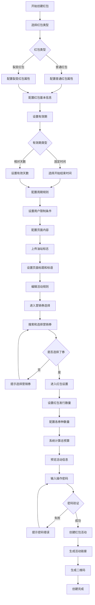

### 1.2 红包类型配置流程

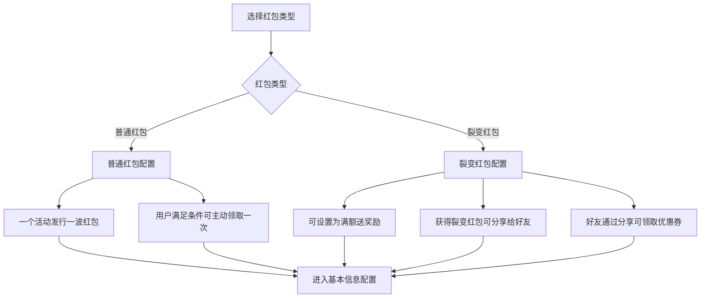

### 1.3 用户限制条件配置流程

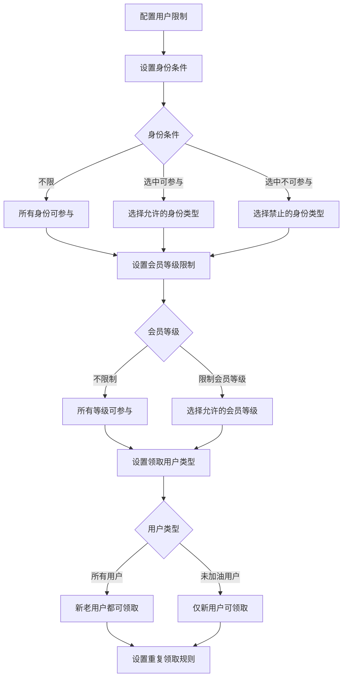

## 2. 红包活动管理流程

### 2.1 红包记录查看流程

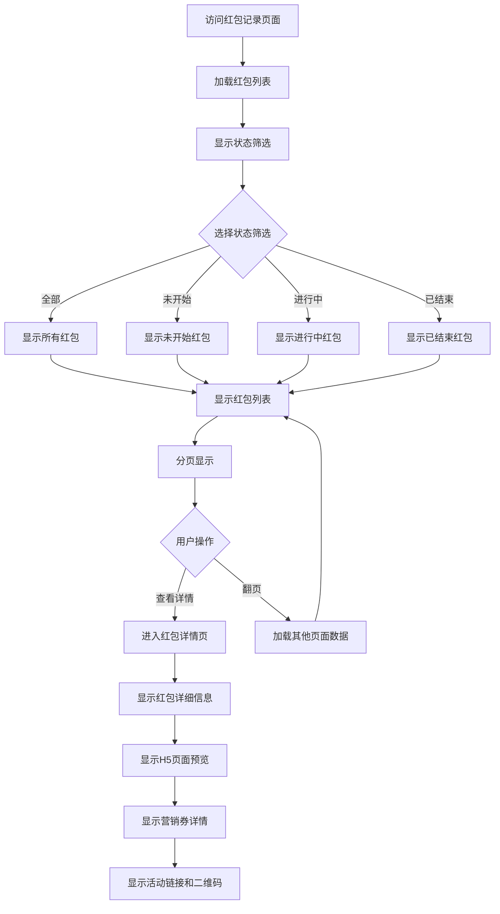

### 2.2 红包活动操作流程

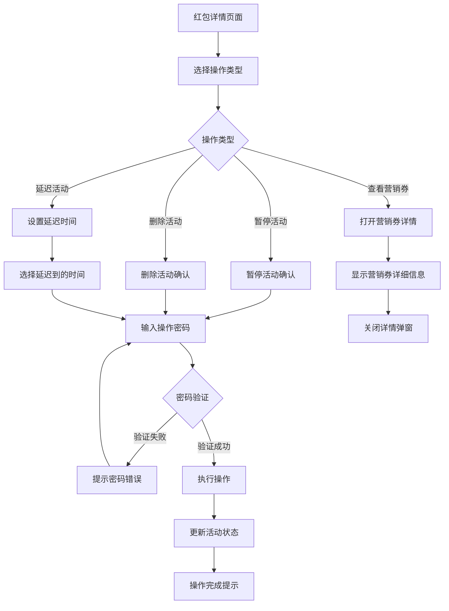

## 3. 红包统计分析流程

### 3.1 数据统计查看流程

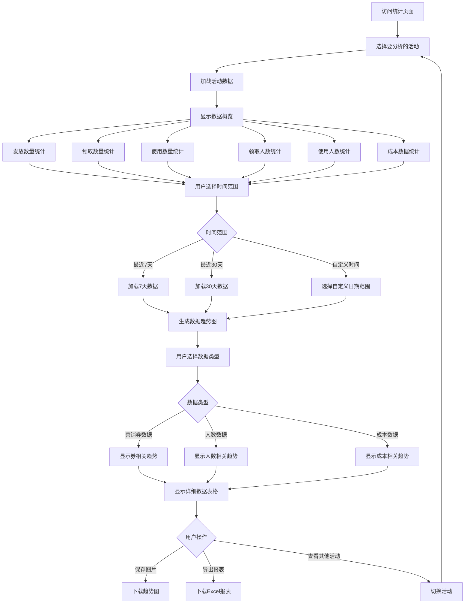

### 3.2 集团数据和各站数据切换流程

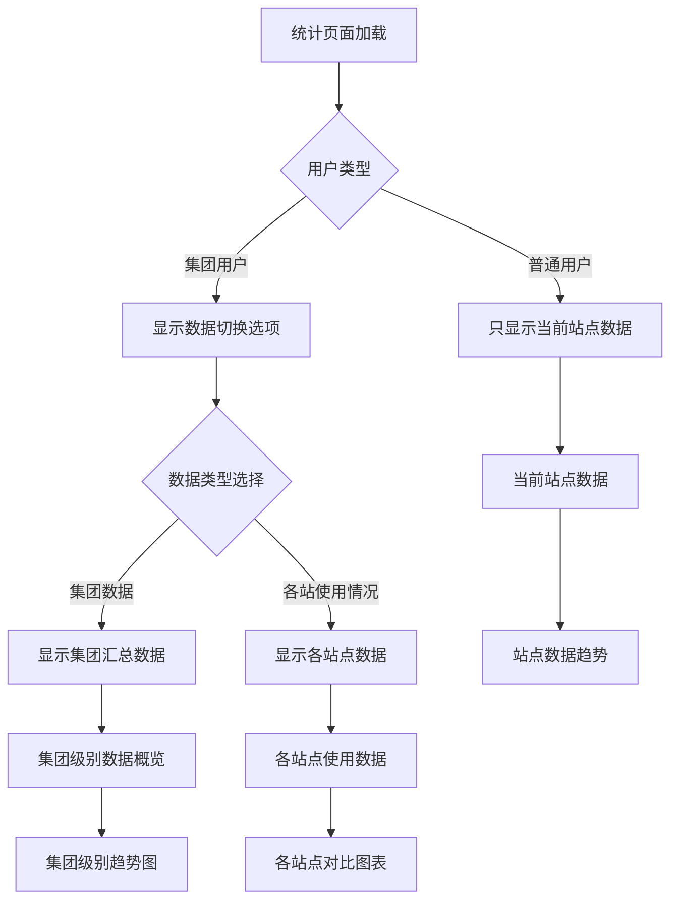

## 4. 营销券选择和配置流程

### 4.1 营销券选择流程

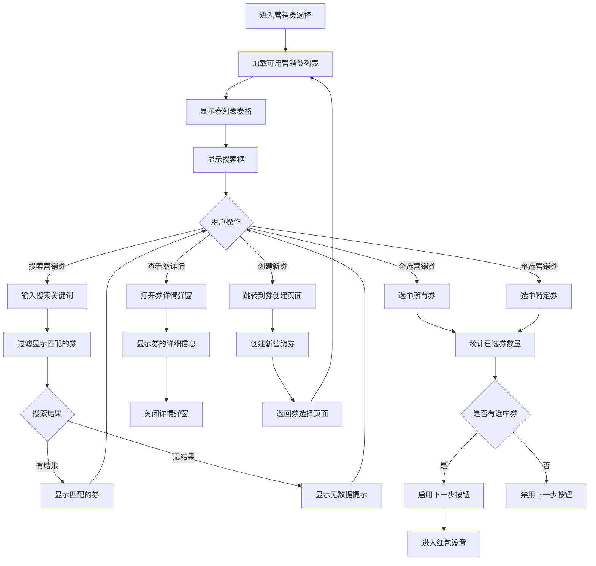

### 4.2 红包数量和预算配置流程

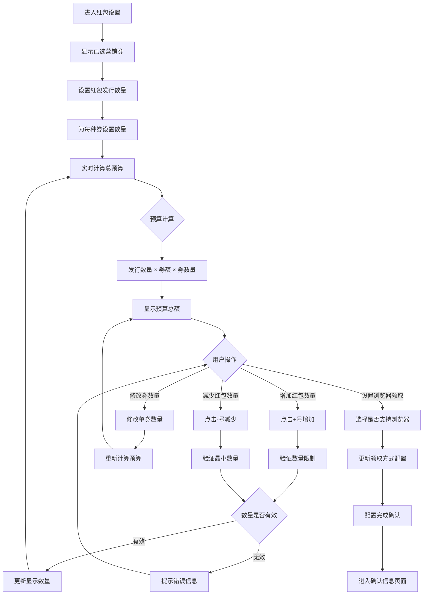

## 5. 系统交互流程

### 5.1 前后端数据交互流程

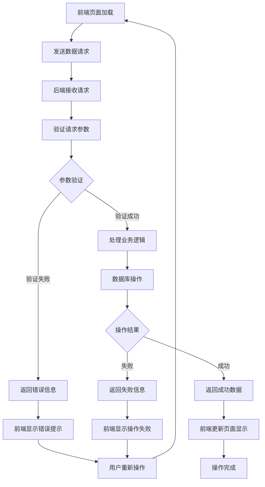

### 5.2 文件上传处理流程

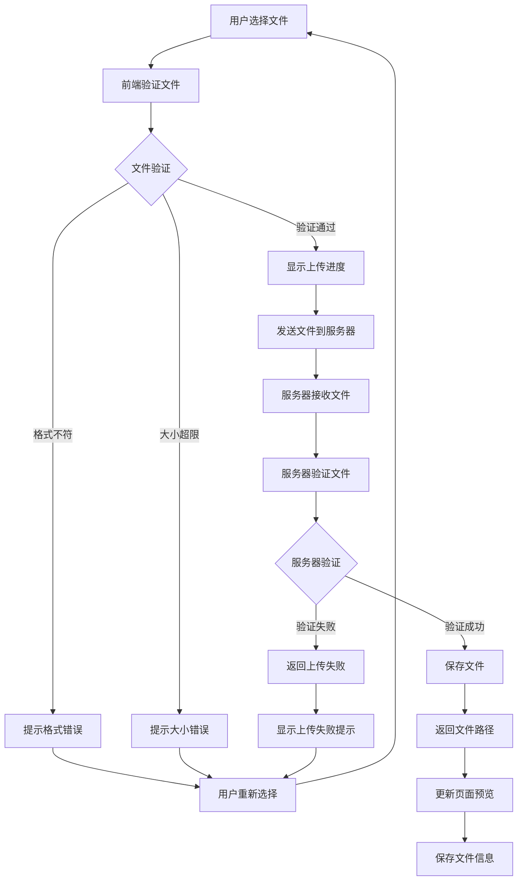