# 业务流程图文档 - 组织结构和角色设计模块

**文档版本：** v1.0  
**创建日期：** 2025年7月8日  
**文档类型：** 业务流程图文档  

## 1. 文档概述

本文档描述了组织结构和角色设计模块的核心业务流程，包括组织架构管理、人员管理、角色配置等主要功能的业务流程图。

## 2. 主要业务流程

### 2.1 组织架构管理主流程

#### 2.1.1 组织架构创建流程

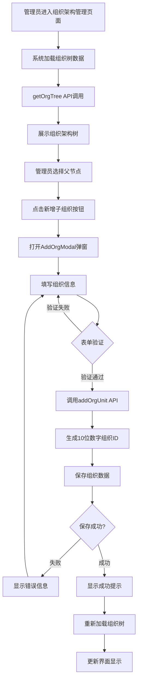

#### 2.1.2 组织信息编辑流程

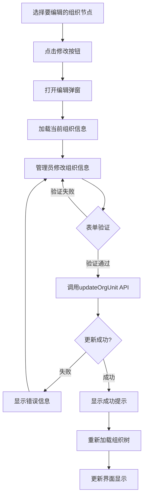

#### 2.1.3 组织删除流程

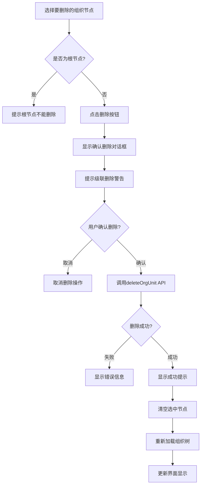

### 2.2 人员管理流程

#### 2.2.1 用户添加流程

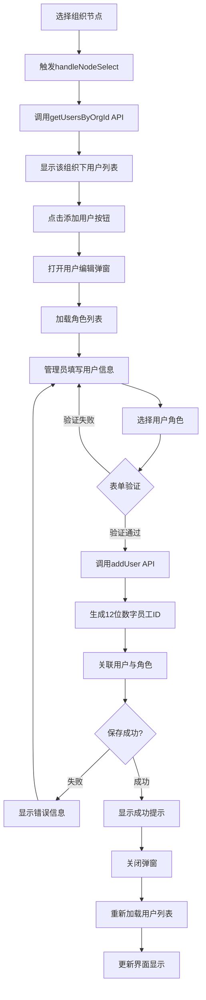

#### 2.2.2 用户编辑流程

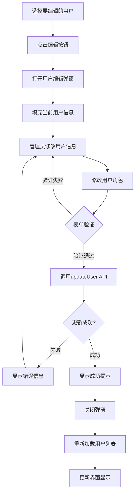

#### 2.2.3 用户删除流程

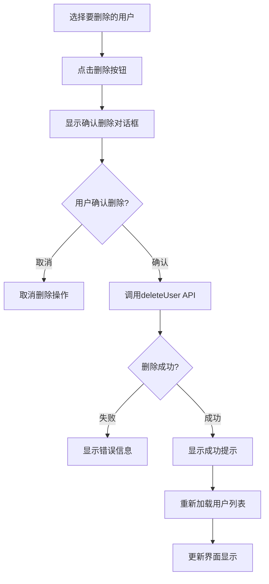

### 2.3 角色配置流程

#### 2.3.1 角色创建流程

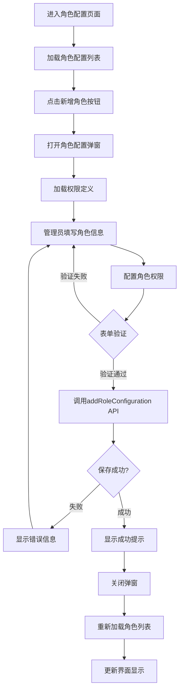

#### 2.3.2 角色复制流程

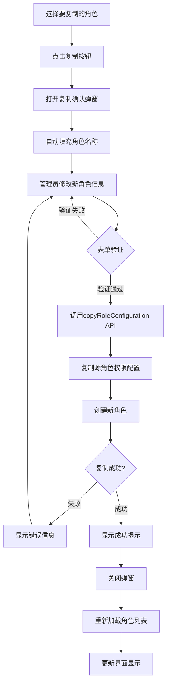

#### 2.3.3 角色删除流程

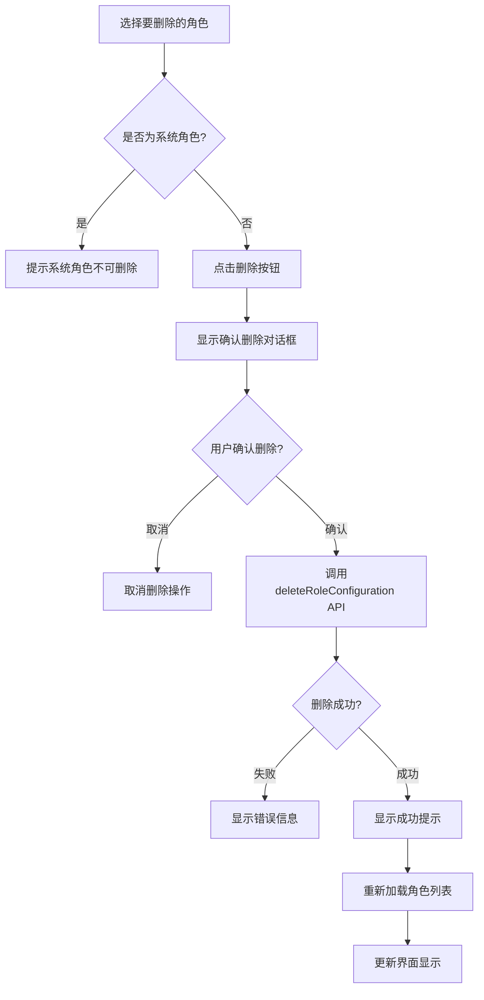

### 2.4 系统整体交互流程

#### 2.4.1 模块间协作流程

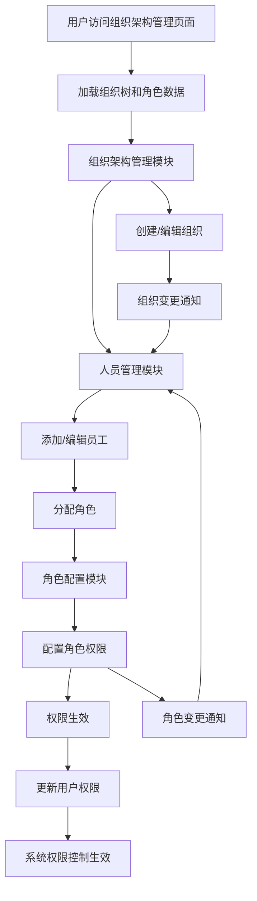

## 3. 异常处理流程

### 3.1 网络异常处理

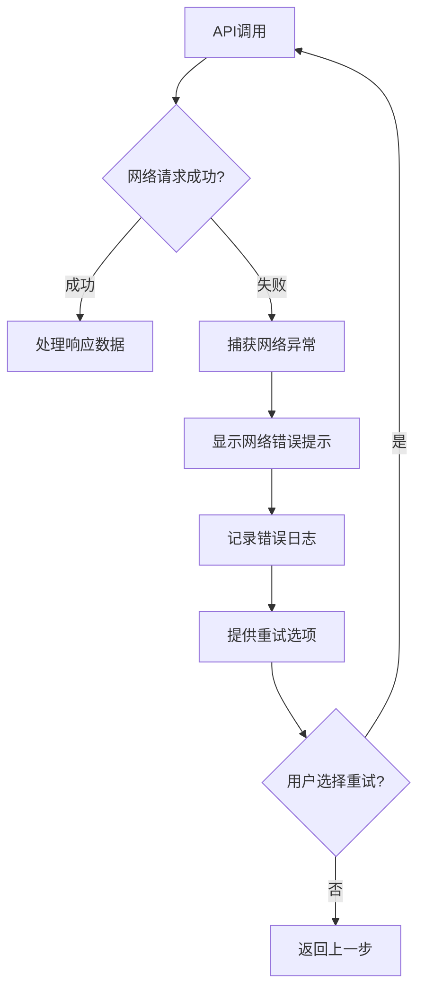

### 3.2 数据验证异常处理

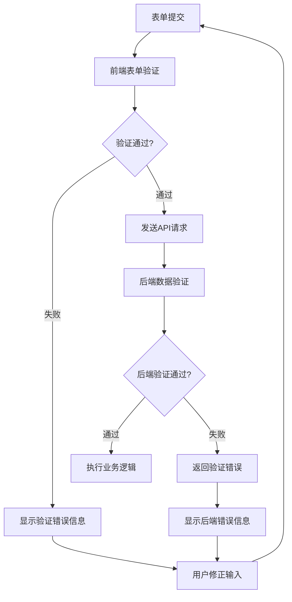

## 4. 流程优化建议

### 4.1 性能优化
- 组织树数据采用懒加载策略，大型组织架构分批加载
- 用户列表实现虚拟滚动，支持大量用户数据展示
- 角色权限配置采用缓存机制，减少重复加载

### 4.2 用户体验优化
- 添加操作确认步骤，防止误操作
- 提供批量操作功能，提高操作效率
- 增加操作历史记录，支持操作回滚

### 4.3 安全性优化
- 敏感操作增加二次验证
- 操作日志记录，便于审计追踪
- 权限变更实时生效验证

---

**文档状态：** 已完成  
**审核人：** 待定  
**批准人：** 待定 