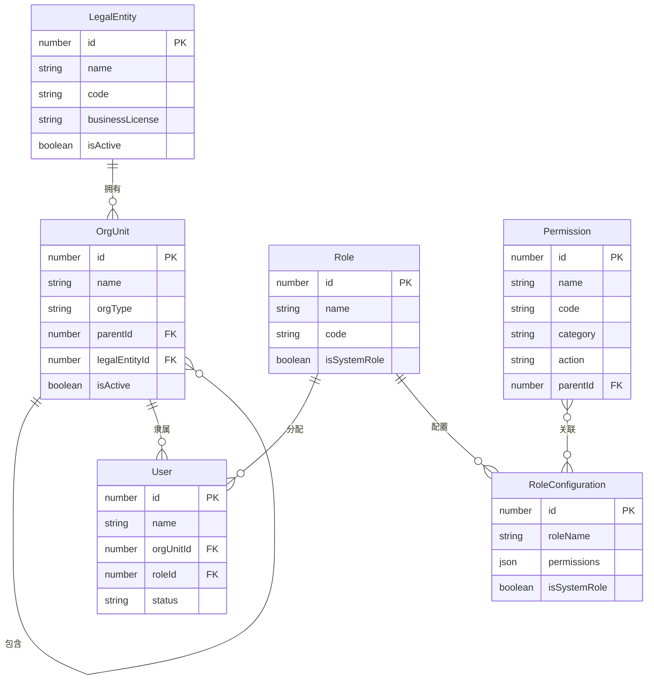

# 数据字典文档 - 组织结构和角色设计模块

**文档版本：** v1.0  
**创建日期：** 2025年7月8日  
**文档类型：** 数据字典文档  

## 1. 文档概述

本文档定义了组织结构和角色设计模块中涉及的所有数据实体、字段定义、数据类型、约束条件以及业务规则。

## 2. 数据实体总览

| 实体名称 | 中文名称 | 说明 | 主要用途 |
|---------|---------|------|----------|
| OrgUnit | 组织单元 | 组织架构树的基本节点 | 组织架构管理 |
| User | 用户 | 系统用户/员工信息 | 人员管理 |
| Role | 角色 | 系统角色定义 | 角色分配 |
| RoleConfiguration | 角色配置 | 角色权限配置 | 权限管理 |
| LegalEntity | 法人主体 | 企业法人主体信息 | 法人管理 |
| Permission | 权限 | 系统权限定义 | 权限控制 |

## 3. 详细数据字典

### 3.1 组织单元表 (OrgUnit)

**表说明：** 存储企业组织架构的树形结构数据

| 字段名 | 中文名 | 数据类型 | 长度 | 必填 | 默认值 | 说明 | 示例值 |
|--------|--------|----------|------|------|--------|------|--------|
| id | 组织ID | NUMBER | 10 | 是 | 系统生成 | 10位数字组织唯一标识 | 1234567890 |
| name | 组织名称 | VARCHAR | 100 | 是 | - | 组织单元名称 | "华东分公司" |
| orgType | 组织类型 | VARCHAR | 50 | 是 | - | 组织类型枚举值 | "CITY_BRANCH" |
| parentId | 上级组织ID | NUMBER | 10 | 否 | null | 上级组织的ID，根节点为null | 1234567889 |
| parentName | 上级组织名称 | VARCHAR | 100 | 否 | - | 上级组织名称，冗余字段便于显示 | "集团总部" |
| legalEntityId | 法人主体ID | NUMBER | 10 | 是 | - | 关联的法人主体ID | 1001 |
| createTime | 创建时间 | DATETIME | - | 是 | 当前时间 | 组织创建时间 | "2025-07-08T10:30:00" |
| updateTime | 更新时间 | DATETIME | - | 否 | - | 最后更新时间 | "2025-07-08T15:45:00" |
| isActive | 是否启用 | BOOLEAN | - | 是 | true | 组织是否启用 | true |
| sortOrder | 排序序号 | NUMBER | 5 | 否 | 0 | 同级组织排序序号 | 10 |

**组织类型枚举值：**
- `HEADQUARTER`: 集团总部
- `CITY_BRANCH`: 分公司  
- `DEPARTMENT`: 部门
- `SERVICE_AREA`: 服务区
- `GAS_STATION`: 加油站

**业务规则：**
- 组织ID由系统自动生成，保证唯一性
- 根组织的parentId为null
- 删除组织时需要级联删除所有子组织和相关用户
- 组织名称在同一层级下不能重复

### 3.2 用户表 (User)

**表说明：** 存储系统用户基本信息和组织关联关系

| 字段名 | 中文名 | 数据类型 | 长度 | 必填 | 默认值 | 说明 | 示例值 |
|--------|--------|----------|------|------|--------|------|--------|
| id | 用户ID | NUMBER | 12 | 是 | 系统生成 | 12位数字员工唯一标识 | 123456789012 |
| name | 姓名 | VARCHAR | 50 | 是 | - | 用户真实姓名 | "张三" |
| username | 用户名 | VARCHAR | 50 | 否 | - | 登录用户名 | "zhangsan" |
| email | 邮箱 | VARCHAR | 100 | 否 | - | 用户邮箱地址 | "zhangsan@company.com" |
| phone | 手机号 | VARCHAR | 20 | 否 | - | 用户手机号码 | "13800138000" |
| orgUnitId | 所属组织ID | NUMBER | 10 | 是 | - | 用户所属组织单元ID | 1234567890 |
| roleId | 角色ID | NUMBER | 10 | 是 | - | 用户角色ID | 2001 |
| employeeNo | 员工编号 | VARCHAR | 20 | 否 | - | 企业内部员工编号 | "EMP001" |
| position | 职位 | VARCHAR | 50 | 否 | - | 用户职位 | "销售经理" |
| status | 状态 | VARCHAR | 20 | 是 | "ACTIVE" | 用户状态 | "ACTIVE" |
| createTime | 创建时间 | DATETIME | - | 是 | 当前时间 | 用户创建时间 | "2025-07-08T10:30:00" |
| updateTime | 更新时间 | DATETIME | - | 否 | - | 最后更新时间 | "2025-07-08T15:45:00" |

**用户状态枚举值：**
- `ACTIVE`: 活跃
- `INACTIVE`: 非活跃
- `SUSPENDED`: 暂停
- `DELETED`: 已删除

**业务规则：**
- 用户ID由系统自动生成，保证唯一性
- 用户名在系统内全局唯一
- 用户必须关联到具体的组织单元
- 用户必须分配角色才能使用系统功能

### 3.3 角色表 (Role)

**表说明：** 存储系统基础角色定义

| 字段名 | 中文名 | 数据类型 | 长度 | 必填 | 默认值 | 说明 | 示例值 |
|--------|--------|----------|------|------|--------|------|--------|
| id | 角色ID | NUMBER | 10 | 是 | 系统生成 | 角色唯一标识 | 2001 |
| name | 角色名称 | VARCHAR | 50 | 是 | - | 角色显示名称 | "销售经理" |
| code | 角色代码 | VARCHAR | 50 | 是 | - | 角色系统代码 | "SALES_MANAGER" |
| description | 角色描述 | VARCHAR | 200 | 否 | - | 角色功能描述 | "负责区域销售管理工作" |
| category | 角色分类 | VARCHAR | 50 | 否 | - | 角色分类 | "MANAGEMENT" |
| isSystemRole | 是否系统角色 | BOOLEAN | - | 是 | false | 是否为系统预定义角色 | false |
| createTime | 创建时间 | DATETIME | - | 是 | 当前时间 | 角色创建时间 | "2025-07-08T10:30:00" |
| updateTime | 更新时间 | DATETIME | - | 否 | - | 最后更新时间 | "2025-07-08T15:45:00" |

**角色分类枚举值：**
- `MANAGEMENT`: 管理类
- `OPERATION`: 操作类
- `SUPPORT`: 支持类
- `ADMIN`: 管理员类

**业务规则：**
- 角色代码在系统内全局唯一
- 系统角色不允许删除
- 角色名称不能重复

### 3.4 角色配置表 (RoleConfiguration)

**表说明：** 存储角色的详细权限配置信息

| 字段名 | 中文名 | 数据类型 | 长度 | 必填 | 默认值 | 说明 | 示例值 |
|--------|--------|----------|------|------|--------|------|--------|
| id | 配置ID | NUMBER | 10 | 是 | 系统生成 | 角色配置唯一标识 | 3001 |
| roleName | 角色名称 | VARCHAR | 50 | 是 | - | 配置的角色名称 | "区域销售经理" |
| description | 描述 | VARCHAR | 500 | 否 | - | 角色配置描述 | "负责指定区域的销售管理" |
| permissions | 权限配置 | JSON | - | 是 | {} | JSON格式的权限配置 | {"read": true, "write": false} |
| isSystemRole | 是否系统角色 | BOOLEAN | - | 是 | false | 是否为系统预定义角色 | false |
| orgScope | 组织权限范围 | JSON | - | 否 | null | 可管理的组织范围 | [1234567890, 1234567891] |
| dataScope | 数据权限范围 | VARCHAR | 50 | 否 | - | 数据访问范围 | "DEPARTMENT" |
| createTime | 创建时间 | DATETIME | - | 是 | 当前时间 | 配置创建时间 | "2025-07-08T10:30:00" |
| updateTime | 更新时间 | DATETIME | - | 否 | - | 最后更新时间 | "2025-07-08T15:45:00" |
| createBy | 创建人 | NUMBER | 12 | 是 | - | 创建人用户ID | 123456789012 |
| updateBy | 更新人 | NUMBER | 12 | 否 | - | 最后更新人用户ID | 123456789012 |

**数据权限范围枚举值：**
- `ALL`: 全部数据
- `COMPANY`: 公司级数据
- `DEPARTMENT`: 部门级数据
- `PERSONAL`: 个人数据

**业务规则：**
- 权限配置采用JSON格式存储，便于扩展
- 组织权限范围定义角色可管理的组织单元
- 系统角色配置不允许删除

### 3.5 法人主体表 (LegalEntity)

**表说明：** 存储企业法人主体信息

| 字段名 | 中文名 | 数据类型 | 长度 | 必填 | 默认值 | 说明 | 示例值 |
|--------|--------|----------|------|------|--------|------|--------|
| id | 法人主体ID | NUMBER | 10 | 是 | 系统生成 | 法人主体唯一标识 | 1001 |
| name | 法人主体名称 | VARCHAR | 200 | 是 | - | 法人主体全称 | "XX能源有限公司" |
| shortName | 简称 | VARCHAR | 50 | 否 | - | 法人主体简称 | "XX能源" |
| code | 法人代码 | VARCHAR | 50 | 是 | - | 法人主体代码 | "LE001" |
| businessLicense | 营业执照号 | VARCHAR | 50 | 否 | - | 营业执照注册号 | "91110000123456789X" |
| legalRepresentative | 法定代表人 | VARCHAR | 50 | 否 | - | 法定代表人姓名 | "李四" |
| registeredAddress | 注册地址 | VARCHAR | 500 | 否 | - | 法人主体注册地址 | "北京市朝阳区XX路XX号" |
| isActive | 是否启用 | BOOLEAN | - | 是 | true | 法人主体是否启用 | true |
| createTime | 创建时间 | DATETIME | - | 是 | 当前时间 | 创建时间 | "2025-07-08T10:30:00" |
| updateTime | 更新时间 | DATETIME | - | 否 | - | 最后更新时间 | "2025-07-08T15:45:00" |

**业务规则：**
- 法人主体代码在系统内全局唯一
- 营业执照号在系统内全局唯一
- 法人主体与组织单元为一对多关系

### 3.6 权限表 (Permission)

**表说明：** 存储系统权限定义

| 字段名 | 中文名 | 数据类型 | 长度 | 必填 | 默认值 | 说明 | 示例值 |
|--------|--------|----------|------|------|--------|------|--------|
| id | 权限ID | NUMBER | 10 | 是 | 系统生成 | 权限唯一标识 | 4001 |
| name | 权限名称 | VARCHAR | 100 | 是 | - | 权限显示名称 | "组织架构查看" |
| code | 权限代码 | VARCHAR | 100 | 是 | - | 权限系统代码 | "ORG_VIEW" |
| description | 权限描述 | VARCHAR | 200 | 否 | - | 权限功能描述 | "允许查看组织架构信息" |
| category | 权限分类 | VARCHAR | 50 | 是 | - | 权限所属模块 | "ORGANIZATION" |
| resource | 资源路径 | VARCHAR | 200 | 否 | - | 权限对应的资源路径 | "/api/organization/view" |
| action | 操作类型 | VARCHAR | 50 | 是 | - | 权限操作类型 | "READ" |
| parentId | 上级权限ID | NUMBER | 10 | 否 | null | 上级权限ID，用于权限树结构 | 4000 |
| isSystemPermission | 是否系统权限 | BOOLEAN | - | 是 | true | 是否为系统预定义权限 | true |
| sortOrder | 排序序号 | NUMBER | 5 | 否 | 0 | 权限排序序号 | 10 |
| createTime | 创建时间 | DATETIME | - | 是 | 当前时间 | 权限创建时间 | "2025-07-08T10:30:00" |

**权限分类枚举值：**
- `ORGANIZATION`: 组织架构
- `USER`: 用户管理
- `ROLE`: 角色管理
- `SYSTEM`: 系统管理

**操作类型枚举值：**
- `CREATE`: 创建
- `READ`: 读取
- `UPDATE`: 更新
- `DELETE`: 删除
- `EXECUTE`: 执行

**业务规则：**
- 权限代码在系统内全局唯一
- 系统权限不允许删除
- 权限支持树形结构，便于权限分组管理

## 4. 数据关系图

### 4.1 实体关系图

### 4.2 关系说明

1. **法人主体与组织单元**：一对多关系，一个法人主体可以拥有多个组织单元
2. **组织单元自关联**：组织单元支持树形结构，父子关系通过parentId建立
3. **组织单元与用户**：一对多关系，一个组织单元可以有多个用户
4. **角色与用户**：一对多关系，一个角色可以分配给多个用户
5. **角色与角色配置**：一对多关系，一个角色可以有多个配置版本
6. **权限与角色配置**：多对多关系，通过JSON字段存储权限配置
7. **权限自关联**：权限支持树形结构，便于权限分组管理

## 5. 数据约束和索引

### 5.1 主键约束
- 所有表的id字段为主键，使用数字类型自增长

### 5.2 外键约束
- `OrgUnit.parentId` → `OrgUnit.id`
- `OrgUnit.legalEntityId` → `LegalEntity.id`
- `User.orgUnitId` → `OrgUnit.id`
- `User.roleId` → `Role.id`
- `Permission.parentId` → `Permission.id`

### 5.3 唯一性约束
- `OrgUnit.id`: 组织ID唯一
- `User.id`: 用户ID唯一
- `User.username`: 用户名唯一（如果启用）
- `Role.code`: 角色代码唯一
- `LegalEntity.code`: 法人主体代码唯一
- `LegalEntity.businessLicense`: 营业执照号唯一
- `Permission.code`: 权限代码唯一

### 5.4 索引建议
- `OrgUnit.parentId`: 普通索引，用于组织树查询
- `User.orgUnitId`: 普通索引，用于按组织查询用户
- `User.roleId`: 普通索引，用于按角色查询用户
- `Permission.parentId`: 普通索引，用于权限树查询
- `Permission.category`: 普通索引，用于按分类查询权限

## 6. 数据初始化

### 6.1 系统基础数据
- 预置系统角色（超级管理员、组织管理员等）
- 预置系统权限（各模块的基础权限）
- 预置根组织节点（集团总部）

### 6.2 演示数据
- 模拟的法人主体数据
- 模拟的组织架构数据
- 模拟的用户和角色数据

---

**文档状态：** 已完成  
**审核人：** 待定  
**批准人：** 待定 