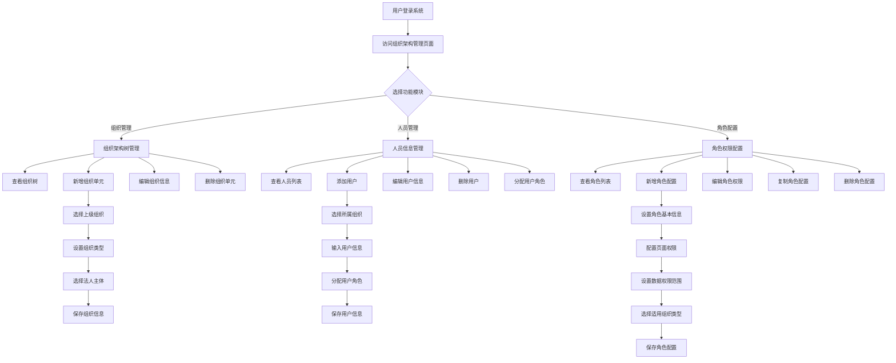
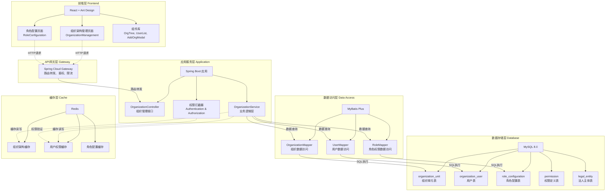

# 商业需求文档 (BRD) - 组织架构管理系统

**文档版本：** V1.1  

**创建日期：** 2025-06-30  

**最后更新：** 2025-06-30 
**文档状态：** 待审核 

## 1. 项目概述 (Project Overview)

### 1.1 项目背景与痛点 (Background and Pain Points)
基于前端代码分析，该项目试图解决企业组织架构管理中的以下痛点：
* **组织架构管理复杂**：企业存在多层级、多类型的组织结构（总部、部门、分公司、服务区、加油站），缺乏统一的数字化管理平台
* **人员权限分配混乱**：不同组织层级的人员角色权限配置复杂，缺乏精细化的权限管理机制
* **数据访问权限模糊**：员工对数据的访问范围不清晰，存在数据安全隐患
* **角色配置效率低**：新增角色或调整权限时需要大量手工配置，效率低下
* **组织变更响应慢**：组织架构调整时，人员和权限的重新分配过程繁琐

### 1.2 项目目标与价值 (Project Goals and Value Proposition)
* **主要目标：** 构建一个统一的企业组织架构管理平台，实现组织结构可视化管理、人员精细化配置、角色权限自动化分配
* **核心价值：** 
  - 提升组织管理效率，减少人工配置成本
  - 增强数据安全性，实现精细化权限控制
  - 支持组织架构快速调整，提高业务响应速度
  - 为企业数字化转型提供基础支撑

### 1.3 项目范围 (Project Scope)
* **核心功能模块：** 
  - 组织架构树管理模块：可视化展示、新增、编辑、删除组织单元
  - 用户信息管理模块：用户信息维护、组织关联、角色分配
  - 角色权限配置模块：角色定义、权限配置、角色复制、适用范围设定
  - 权限管理模块：页面权限、操作权限、数据权限的统一管理
* **本次迭代：** 基于当前代码逻辑的完整功能范围，包含组织管理、用户管理、角色配置三大核心模块

## 2. 用户分析 (User Analysis)

### 2.1 目标用户群体 (Target Audience)
根据代码功能分析，主要目标用户包括：
* **系统管理员**：负责整体系统配置和维护
* **组织管理员**：负责企业组织架构规划和人员配置
* **部门经理/分公司经理**：管理本部门/分公司的人员和权限
* **HR人员**：负责人员信息维护和角色分配
* **普通员工**：查看个人相关信息和权限范围内的数据

**用户特征：** 具备基本的企业管理软件使用经验，对组织架构和权限管理有一定认知

### 2.2 用户场景 (User Scenarios)
* **场景1：新建分公司**
  - 组织管理员需要在系统中新增一个分公司组织单元
  - 操作步骤：1. 访问组织架构页面 → 2. 选择上级组织（总公司） → 3. 点击"新增组织单元" → 4. 填写组织信息（名称、类型、法人主体） → 5. 提交保存
  - 对应代码：`AddOrgModal.jsx`组件和`addOrgUnit`接口

* **场景2：员工入职**
  - HR人员为新入职员工创建账户并分配到对应组织
  - 操作步骤：1. 选择员工所属组织 → 2. 点击"添加用户" → 3. 填写用户基本信息 → 4. 选择对应角色 → 5. 保存用户信息
  - 对应代码：用户管理弹窗和`addUser`接口

* **场景3：角色权限配置**
  - 组织管理员为新设立的加油站站长角色配置专属权限
  - 操作步骤：1. 进入角色配置页面 → 2. 点击"新增角色" → 3. 设置角色基本信息 → 4. 配置页面权限和操作权限 → 5. 设置数据权限范围 → 6. 选择适用组织类型 → 7. 保存配置
  - 对应代码：`RoleConfigModal`组件和角色配置相关接口

## 3. 产品需求 (Product Requirements)

### 3.1 功能需求 (Functional Requirements)

#### **模块一：组织架构管理模块**
* **FR1.1 组织树展示**
  - **描述：** 以树形结构可视化展示企业完整组织架构，支持不同组织类型的图标区分
  - **输入：** 组织架构数据
  - **处理逻辑：** 从`organizationData.orgTreeData`获取数据，通过`OrgTree.jsx`组件递归渲染树形结构，根据`orgType`显示对应图标
  - **输出：** 可展开收缩的组织架构树，支持节点选择

* **FR1.2 组织详情查看**
  - **描述：** 用户选择组织节点后展示该组织的详细信息
  - **输入：** 选中的组织节点ID
  - **处理逻辑：** 调用`getOrgDetailsById`接口获取组织详情，通过`OrgDetails.jsx`组件展示
  - **输出：** 组织基本信息、上级组织、法人主体等详细信息

* **FR1.3 新增组织单元**
  - **描述：** 在现有组织下创建子组织单元，支持组织类型层级限制
  - **输入：** 组织名称、组织类型、法人主体、上级组织
  - **处理逻辑：** `AddOrgModal.jsx`根据父组织类型过滤可选的子组织类型，调用`addOrgUnit`接口保存
  - **输出：** 新创建的组织单元，更新组织树显示

#### **模块二：用户信息管理模块**
* **FR2.1 用户列表展示**
  - **描述：** 根据选中的组织显示该组织下的所有用户信息
  - **输入：** 组织ID
  - **处理逻辑：** 调用`getUsersByOrgId`接口获取用户列表，通过`UserList.jsx`组件展示
  - **输出：** 用户列表（姓名、角色、操作按钮）

* **FR2.2 用户信息维护**
  - **描述：** 支持新增、编辑、删除用户信息，包括用户与组织、角色的关联
  - **输入：** 用户姓名、所属组织、分配角色
  - **处理逻辑：** 通过用户管理弹窗收集信息，调用`addUser`、`updateUser`、`deleteUser`接口
  - **输出：** 更新后的用户信息，刷新用户列表

#### **模块三：角色权限配置模块**
* **FR3.1 角色配置管理**
  - **描述：** 管理系统中的所有角色配置，支持查看、新增、编辑、删除、复制操作
  - **输入：** 角色名称、描述、权限配置、适用组织类型
  - **处理逻辑：** `RoleConfiguration.jsx`页面展示角色列表，通过相应接口进行CRUD操作
  - **输出：** 角色配置列表，支持系统角色保护机制

* **FR3.2 权限精细化配置**
  - **描述：** 为角色配置页面权限、操作权限和数据权限，支持权限继承和覆盖
  - **输入：** 页面操作权限选择、数据权限范围设定
  - **处理逻辑：** `RoleConfigModal`组件提供权限配置界面，支持权限树形选择
  - **输出：** 完整的角色权限配置，包含权限明细

* **FR3.3 角色复制功能**
  - **描述：** 基于现有角色快速创建相似角色，减少重复配置工作
  - **输入：** 源角色、新角色名称、新描述
  - **处理逻辑：** 调用`copyRoleConfiguration`接口，复制源角色的所有权限配置
  - **输出：** 新的角色配置，继承源角色的权限设定

### 3.2 数据需求 (Data Requirements)

* **数据实体一：组织单元 (OrganizationUnit)**
  - **属性：** 组织ID、组织名称、组织编码、组织类型、上级组织ID、法人主体、负责人、层级、路径、状态、创建时间等
  - **来源：** 组织管理员通过新增组织单元表单录入
  - **存储：** MySQL数据库`organization_unit`表

* **数据实体二：用户信息 (User)**
  - **属性：** 用户ID、姓名、用户名、手机号、邮箱、员工编号、所属组织ID、角色ID、职位、入职日期、状态等
  - **来源：** HR人员通过用户管理界面录入
  - **存储：** MySQL数据库`organization_user`表

* **数据实体三：角色配置 (RoleConfiguration)**
  - **属性：** 角色ID、角色名称、角色编码、描述、数据权限范围、是否系统角色、状态、创建时间等
  - **来源：** 系统管理员通过角色配置界面设定
  - **存储：** MySQL数据库`role_configuration`表

* **数据实体四：权限定义 (Permission)**
  - **属性：** 权限ID、权限编码、权限名称、权限类型、所属模块、资源URL、描述等
  - **来源：** 系统预定义权限配置
  - **存储：** MySQL数据库`permission`表

* **数据实体五：法人主体 (LegalEntity)**
  - **属性：** 法人主体ID、名称、统一社会信用代码、法定代表人、注册地址、联系电话等
  - **来源：** 企业基础信息录入
  - **存储：** MySQL数据库`legal_entity`表

### 3.3 非功能需求 (Non-functional Requirements)

* **性能要求：** 
  - 组织树加载时间 < 2秒
  - 用户列表查询响应时间 < 1秒
  - 支持并发用户数 ≥ 100人
  - 代码中通过`loading`状态提供用户反馈

* **可用性要求：** 
  - 界面采用Ant Design组件，保证一致的用户体验
  - 提供明确的错误提示和操作指引
  - 支持表单验证和数据校验
  - 提供面包屑导航和页面标题

* **安全性要求：** 
  - 基于角色的访问控制（RBAC）
  - 数据权限精细化控制（全部/本组织及子组织/仅本组织/仅本人）
  - 系统角色保护机制，防止误删关键角色
  - 操作日志记录和审计跟踪

* **兼容性要求：** 
  - 支持主流浏览器（Chrome、Firefox、Safari、Edge）
  - 响应式设计，适配不同屏幕尺寸
  - 前端基于React框架，后端基于Java Spring Boot

## 4. 核心业务流程 (Core Business Flows)

### **流程一：组织架构调整流程**
1. 组织管理员登录系统，访问组织架构管理页面
2. 在组织树中选择需要新增子组织的父级组织
3. 点击"新增组织单元"按钮，打开新增组织弹窗
4. 填写组织基本信息（名称、类型、法人主体）
5. 系统根据父组织类型自动过滤可选的子组织类型
6. 提交表单，系统验证组织信息的完整性和合规性
7. 调用后端`addOrgUnit`接口保存组织信息
8. 返回操作结果，刷新组织树显示新增的组织单元

### **流程二：员工入职权限分配流程**
1. HR人员选择员工所属的组织单元
2. 查看该组织下的现有用户列表
3. 点击"添加用户"按钮，打开用户信息录入弹窗
4. 填写用户基本信息（姓名、联系方式等）
5. 从适用于该组织类型的角色列表中选择合适的角色
6. 系统自动关联用户与选中的组织和角色
7. 提交用户信息，系统调用`addUser`接口保存
8. 用户获得对应角色的页面权限和数据权限，可正常使用系统

### **流程三：角色权限配置流程**
1. 系统管理员进入角色配置管理页面
2. 查看现有角色列表，确定需要新增或修改的角色
3. 点击"新增角色"或"编辑"按钮，打开角色配置弹窗
4. 设置角色基本信息（名称、描述、适用组织类型）
5. 配置页面权限，选择该角色可访问的功能模块
6. 设置操作权限，定义增删改查等具体操作范围
7. 配置数据权限范围（全部数据/本组织及子组织/仅本组织/仅本人）
8. 保存角色配置，系统生成完整的权限配置文件
9. 角色配置生效，拥有该角色的用户按新权限范围访问系统

## 5. 假设与约束 (Assumptions and Constraints)

### **技术假设：**
- 前端基于React + Ant Design技术栈，支持现代浏览器
- 后端采用Java Spring Boot框架，提供RESTful API接口
- 数据库使用MySQL，支持事务和外键约束
- 部署环境支持容器化，具备负载均衡能力

### **功能约束：**
- 组织类型层级固定为：总部→部门/分公司→服务区→加油站
- 系统角色不允许删除，保证系统基础功能正常
- 每个用户只能属于一个组织，不支持跨组织兼职
- 角色权限配置需要系统管理员权限，普通用户无法修改

### **数据约束：**
- 组织名称长度限制2-50个字符
- 用户姓名不能为空，手机号和邮箱需要格式验证
- 角色名称在系统内唯一，不允许重复
- 权限编码采用模块:操作的格式，如"org:add"

### **业务约束：**
- 删除组织前需确保无子组织和关联员工
- 用户离职后状态变更为离职，但保留历史数据
- 权限变更即时生效，用户需重新登录获取最新权限
- 数据权限基于组织层级，子组织数据对上级组织可见

---

