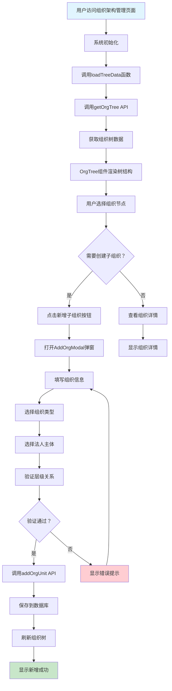
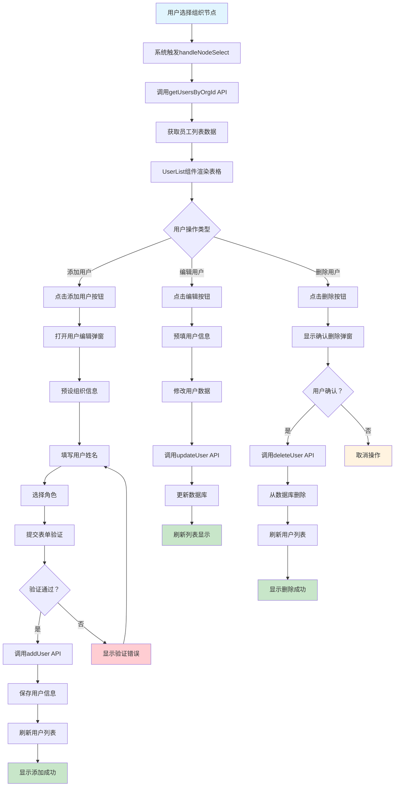
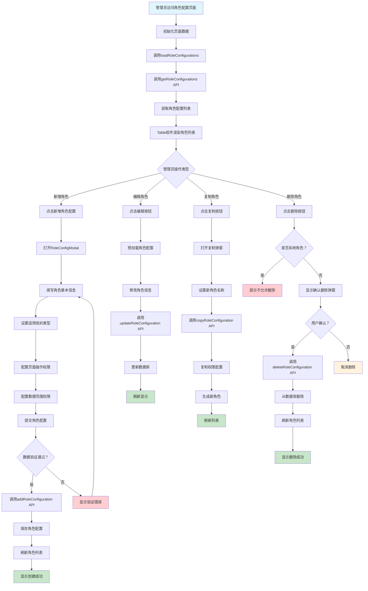
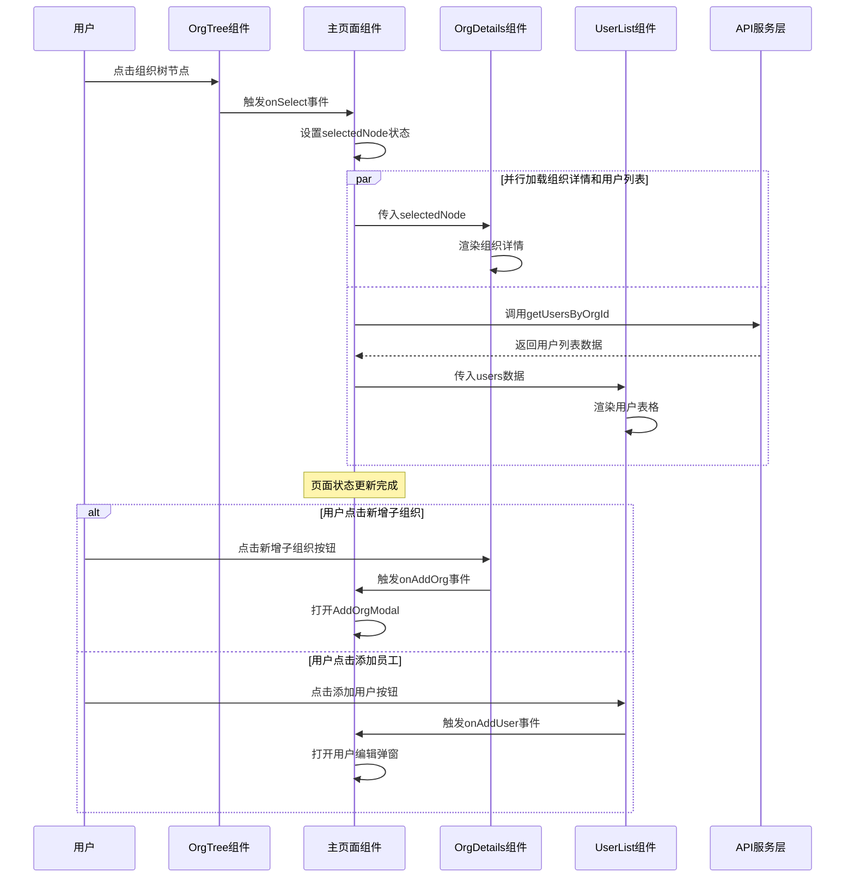
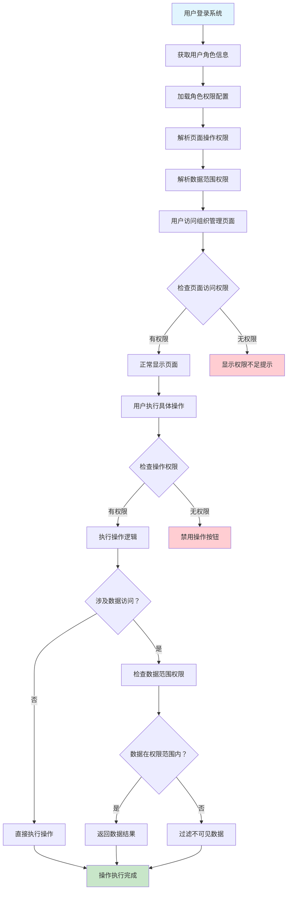

# 组织结构和角色设计业务流程图文档

**文档版本：** v1.0  
**创建日期：** 2025年7月8日  
**最后更新：** 2025年7月8日

## 1. 文档概述

本文档详细描述了组织结构和角色设计模块的核心业务流程，通过流程图的形式展示系统的业务逻辑和操作步骤。

## 2. 核心业务流程

### 2.1 组织架构管理流程

### 2.2 用户人员管理流程

### 2.3 角色权限配置流程

### 2.4 组织节点选择和数据联动流程

### 2.5 权限控制流程

## 3. 流程说明

### 3.1 组织架构管理流程说明

- **流程入口：** 用户访问 `/organization` 路由
- **关键节点：** 组织类型层级验证，确保组织结构的合理性
- **数据验证：** 组织名称长度、上级组织存在性、法人主体关联
- **异常处理：** 创建失败时提供明确的错误提示

### 3.2 用户人员管理流程说明

- **前置条件：** 必须先选择组织节点
- **权限控制：** 只能在有权限的组织下添加/编辑用户
- **数据关联：** 用户与组织、角色的多对一关系
- **状态同步：** 操作完成后实时刷新列表显示

### 3.3 角色权限配置流程说明

- **系统角色保护：** 系统内置角色不允许删除和关键配置修改
- **权限细粒度：** 支持页面级和数据级的权限控制
- **复制功能：** 支持基于现有角色快速创建新角色
- **生效机制：** 角色配置修改后影响所有使用该角色的用户

### 3.4 组件间通信机制

- **状态管理：** 使用React useState进行状态管理
- **事件驱动：** 通过回调函数实现组件间通信
- **数据流：** 单向数据流，父组件管理状态，子组件触发事件

## 4. 技术实现要点

### 4.1 API调用模式
- 所有API调用都有统一的错误处理机制
- 支持loading状态显示，提升用户体验
- 模拟延迟确保真实性

### 4.2 组件设计原则
- 单一职责：每个组件负责特定功能
- 可复用性：通用组件支持多场景使用
- 响应式设计：适配不同屏幕尺寸

### 4.3 状态管理策略
- 本地状态：组件内部状态使用useState
- 状态提升：共享状态提升到父组件
- 异步状态：使用useEffect处理副作用

---

**文档说明：** 本流程图文档基于 `src\pages\organization` 模块的代码实现，展示了组织架构管理、用户管理、角色配置等核心业务流程的详细步骤和交互关系。 