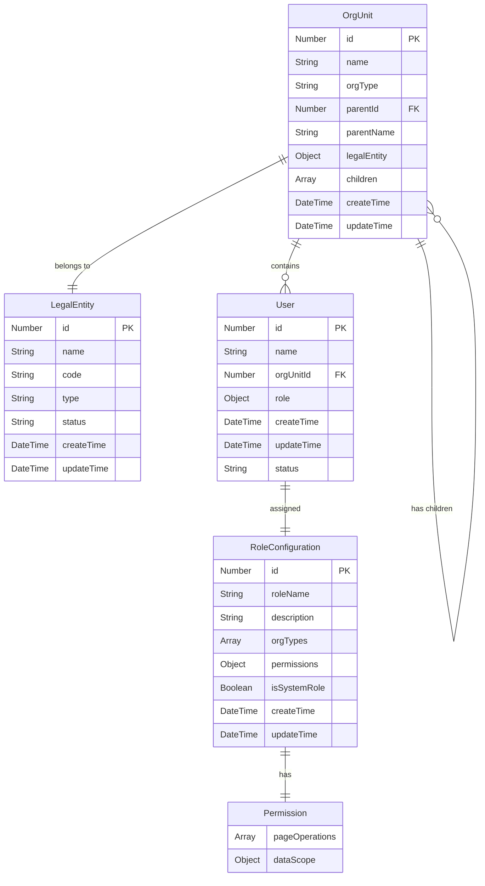

# 组织结构和角色设计数据字典文档

**文档版本：** v1.0  
**创建日期：** 2025年7月8日  
**最后更新：** 2025年7月8日

## 1. 文档概述

本文档详细定义了组织结构和角色设计模块中涉及的所有数据实体、字段属性、数据类型、约束条件和业务规则。

## 2. 数据实体定义

### 2.1 组织单元实体 (OrgUnit)

**实体说明：** 表示企业组织架构中的组织单元，支持层级结构。

| 字段名称 | 中文名称 | 数据类型 | 长度 | 是否必填 | 默认值 | 约束条件 | 备注 |
|---------|---------|---------|------|---------|--------|---------|------|
| id | 组织ID | Number | - | 是 | 自动生成 | 主键，唯一 | 系统自动生成的唯一标识 |
| name | 组织名称 | String | 50 | 是 | - | 2-50字符 | 组织单元的显示名称 |
| orgType | 组织类型 | String | 20 | 是 | - | 枚举值 | 见组织类型枚举表 |
| parentId | 上级组织ID | Number | - | 否 | null | 外键 | 引用同表id字段 |
| parentName | 上级组织名称 | String | 50 | 否 | - | - | 冗余字段，便于显示 |
| legalEntity | 法人主体 | Object | - | 是 | - | 对象引用 | 关联法人主体实体 |
| children | 子组织列表 | Array | - | 否 | [] | - | 子组织单元数组 |
| createTime | 创建时间 | DateTime | - | 是 | 当前时间 | - | 记录创建时间 |
| updateTime | 更新时间 | DateTime | - | 是 | 当前时间 | - | 记录最后更新时间 |

**组织类型枚举 (OrgType)**

| 枚举值 | 中文名称 | 层级 | 上级类型 | 可创建子类型 | 描述 |
|--------|---------|------|---------|-------------|------|
| HEADQUARTER | 集团总部 | 1 | - | DEPARTMENT, CITY_BRANCH | 集团最高层级组织 |
| DEPARTMENT | 部门 | 2 | HEADQUARTER | - | 总部下属部门，不可再创建子组织 |
| CITY_BRANCH | 分公司 | 2 | HEADQUARTER | SERVICE_AREA | 地区分公司 |
| SERVICE_AREA | 服务区 | 3 | CITY_BRANCH | GAS_STATION | 服务区域 |
| GAS_STATION | 加油站 | 4 | SERVICE_AREA | - | 最底层运营单位 |

### 2.2 用户实体 (User)

**实体说明：** 表示系统用户基本信息及其组织归属关系。

| 字段名称 | 中文名称 | 数据类型 | 长度 | 是否必填 | 默认值 | 约束条件 | 备注 |
|---------|---------|---------|------|---------|--------|---------|------|
| id | 用户ID | Number | - | 是 | 自动生成 | 主键，唯一 | 系统自动生成的唯一标识 |
| name | 用户姓名 | String | 20 | 是 | - | 1-20字符 | 用户真实姓名 |
| orgUnitId | 所属组织ID | Number | - | 是 | - | 外键 | 引用OrgUnit表id字段 |
| role | 角色信息 | Object | - | 是 | - | 对象引用 | 关联角色配置实体 |
| createTime | 创建时间 | DateTime | - | 是 | 当前时间 | - | 用户创建时间 |
| updateTime | 更新时间 | DateTime | - | 是 | 当前时间 | - | 信息最后更新时间 |
| status | 用户状态 | String | 10 | 是 | ACTIVE | 枚举值 | ACTIVE/INACTIVE/LOCKED |

### 2.3 角色配置实体 (RoleConfiguration)

**实体说明：** 定义系统角色及其权限配置信息。

| 字段名称 | 中文名称 | 数据类型 | 长度 | 是否必填 | 默认值 | 约束条件 | 备注 |
|---------|---------|---------|------|---------|--------|---------|------|
| id | 角色ID | Number | - | 是 | 自动生成 | 主键，唯一 | 系统自动生成的唯一标识 |
| roleName | 角色名称 | String | 30 | 是 | - | 2-30字符，唯一 | 角色的显示名称 |
| description | 角色描述 | String | 200 | 否 | - | 最大200字符 | 角色功能描述 |
| orgTypes | 适用组织类型 | Array | - | 是 | - | 非空数组 | 该角色适用的组织类型列表 |
| permissions | 权限配置 | Object | - | 是 | - | 权限对象 | 详细权限配置信息 |
| isSystemRole | 是否系统角色 | Boolean | - | 是 | false | - | 系统角色不允许删除 |
| createTime | 创建时间 | DateTime | - | 是 | 当前时间 | - | 角色创建时间 |
| updateTime | 更新时间 | DateTime | - | 是 | 当前时间 | - | 配置最后更新时间 |

### 2.4 权限定义实体 (Permission)

**实体说明：** 定义系统权限的详细配置结构。

| 字段名称 | 中文名称 | 数据类型 | 长度 | 是否必填 | 默认值 | 约束条件 | 备注 |
|---------|---------|---------|------|---------|--------|---------|------|
| pageOperations | 页面操作权限 | Array | - | 是 | [] | 权限码数组 | 页面级操作权限列表 |
| dataScope | 数据范围权限 | Object | - | 是 | {} | 数据权限对象 | 数据访问范围控制 |

**页面操作权限枚举 (PageOperation)**

| 权限码 | 权限名称 | 权限描述 | 适用页面 |
|--------|---------|---------|---------|
| ORG_VIEW | 查看组织架构 | 查看组织架构树和详情 | 组织管理页面 |
| ORG_CREATE | 创建组织单元 | 新增子组织单元 | 组织管理页面 |
| ORG_EDIT | 编辑组织信息 | 修改组织基本信息 | 组织管理页面 |
| ORG_DELETE | 删除组织单元 | 删除组织单元 | 组织管理页面 |
| USER_VIEW | 查看用户列表 | 查看组织下用户信息 | 用户管理 |
| USER_CREATE | 添加用户 | 在组织下新增用户 | 用户管理 |
| USER_EDIT | 编辑用户信息 | 修改用户基本信息和角色 | 用户管理 |
| USER_DELETE | 删除用户 | 从组织中移除用户 | 用户管理 |
| ROLE_VIEW | 查看角色配置 | 查看角色配置列表 | 角色配置页面 |
| ROLE_CREATE | 创建角色配置 | 新增角色配置 | 角色配置页面 |
| ROLE_EDIT | 编辑角色配置 | 修改角色权限配置 | 角色配置页面 |
| ROLE_DELETE | 删除角色配置 | 删除自定义角色 | 角色配置页面 |
| ROLE_COPY | 复制角色配置 | 基于现有角色创建副本 | 角色配置页面 |

**数据范围权限配置 (DataScope)**

| 字段名称 | 中文名称 | 数据类型 | 可选值 | 描述 |
|---------|---------|---------|--------|------|
| scopeType | 数据范围类型 | String | ALL/ORG/SUB_ORG/SELF | 数据访问范围 |
| orgIds | 指定组织ID列表 | Array | - | 当scopeType为指定组织时使用 |
| excludeOrgIds | 排除组织ID列表 | Array | - | 需要排除的组织ID |

**数据范围类型说明：**
- **ALL：** 全部数据权限，可访问所有组织数据
- **ORG：** 本组织数据权限，仅可访问用户所属组织数据
- **SUB_ORG：** 本组织及下级数据权限，可访问本组织及所有下级组织数据
- **SELF：** 个人数据权限，仅可访问个人相关数据

### 2.5 法人主体实体 (LegalEntity)

**实体说明：** 表示企业法人主体信息，用于组织单元的法人关联。

| 字段名称 | 中文名称 | 数据类型 | 长度 | 是否必填 | 默认值 | 约束条件 | 备注 |
|---------|---------|---------|------|---------|--------|---------|------|
| id | 法人主体ID | Number | - | 是 | 自动生成 | 主键，唯一 | 系统自动生成的唯一标识 |
| name | 法人主体名称 | String | 100 | 是 | - | 2-100字符，唯一 | 法人主体的正式名称 |
| code | 法人主体编码 | String | 20 | 否 | - | 唯一 | 内部编码 |
| type | 法人主体类型 | String | 20 | 否 | - | 枚举值 | COMPANY/BRANCH等 |
| status | 状态 | String | 10 | 是 | ACTIVE | 枚举值 | ACTIVE/INACTIVE |
| createTime | 创建时间 | DateTime | - | 是 | 当前时间 | - | 创建时间 |
| updateTime | 更新时间 | DateTime | - | 是 | 当前时间 | - | 最后更新时间 |

## 3. 数据关系图



## 4. 索引设计

### 4.1 主键索引
- `OrgUnit.id` - 主键索引
- `User.id` - 主键索引  
- `RoleConfiguration.id` - 主键索引
- `LegalEntity.id` - 主键索引

### 4.2 外键索引
- `OrgUnit.parentId` - 支持父子关系查询
- `User.orgUnitId` - 支持按组织查询用户
- `OrgUnit.legalEntity.id` - 支持按法人主体查询组织

### 4.3 业务索引
- `OrgUnit.orgType` - 支持按组织类型查询
- `RoleConfiguration.roleName` - 角色名称唯一性约束
- `LegalEntity.name` - 法人主体名称唯一性约束
- `User.name + User.orgUnitId` - 组合索引，支持组织内用户查询

## 5. 数据约束规则

### 5.1 业务约束
1. **组织层级约束：**
   - 总部(HEADQUARTER) -> 部门(DEPARTMENT) | 分公司(CITY_BRANCH)
   - 分公司(CITY_BRANCH) -> 服务区(SERVICE_AREA)
   - 服务区(SERVICE_AREA) -> 加油站(GAS_STATION)
   - 部门和加油站不能创建子组织

2. **角色分配约束：**
   - 用户只能分配与其所属组织类型匹配的角色
   - 系统角色不允许删除
   - 角色名称在系统内必须唯一

3. **权限继承约束：**
   - 数据权限不能超越组织层级
   - 下级组织用户不能访问上级组织数据
   - 页面权限与组织类型相关联

### 5.2 数据完整性约束
1. **引用完整性：**
   - 删除组织前必须先删除其下所有用户
   - 删除角色前必须先解除所有用户的角色分配
   - 法人主体被组织引用时不允许删除

2. **唯一性约束：**
   - 同一法人主体下组织名称不能重复
   - 角色名称全局唯一
   - 法人主体名称全局唯一

### 5.3 数据验证规则
1. **格式验证：**
   - 组织名称：2-50个字符，不能包含特殊字符
   - 用户姓名：1-20个字符，支持中英文
   - 角色名称：2-30个字符，支持中英文数字

2. **业务规则验证：**
   - 创建组织时必须验证上级组织类型是否允许创建当前类型
   - 用户分配角色时必须验证角色是否适用于用户所属组织类型
   - 权限配置时必须验证数据范围的合理性

## 6. 数据初始化

### 6.1 系统角色初始化
```json
{
  "systemRoles": [
    {
      "roleName": "系统管理员",
      "description": "系统最高权限管理员",
      "orgTypes": ["HEADQUARTER"],
      "permissions": {
        "pageOperations": ["*"],
        "dataScope": { "scopeType": "ALL" }
      }
    },
    {
      "roleName": "分公司经理",
      "description": "分公司管理员",
      "orgTypes": ["CITY_BRANCH"],
      "permissions": {
        "pageOperations": ["ORG_VIEW", "USER_*"],
        "dataScope": { "scopeType": "SUB_ORG" }
      }
    }
  ]
}
```

### 6.2 默认法人主体
```json
{
  "legalEntities": [
    {
      "name": "某某石油集团有限公司",
      "code": "HEAD_COMPANY",
      "type": "COMPANY",
      "status": "ACTIVE"
    }
  ]
}
```

## 7. 数据备份与恢复策略

### 7.1 备份策略
- **全量备份：** 每日凌晨执行全量备份
- **增量备份：** 每小时执行增量备份
- **关键数据：** 组织架构变更、角色配置变更实时备份

### 7.2 数据迁移
- 支持组织架构数据的导入导出
- 角色配置支持模板化迁移
- 用户数据支持批量导入功能

---

**文档说明：** 本数据字典基于 `src\pages\organization` 模块的代码实现，定义了组织架构管理系统的完整数据模型，包括实体关系、约束规则和业务逻辑。 