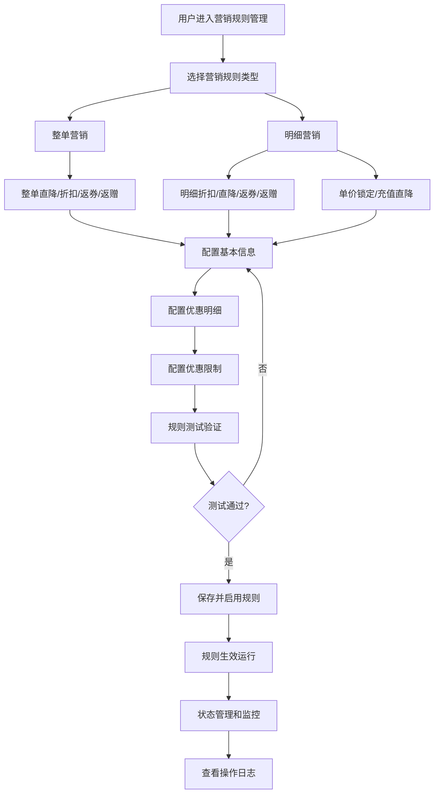

# 商业需求文档 (BRD) - 营销规则引擎系统

## 1. 模块概述 (Project Overview)

### 1.1 模块目标与价值 (Project Goals and Value Proposition)
**主要目标：** 构建一个全面的、多维度的营销规则引擎系统，支持油品和非油品的多种营销策略配置，实现智能化的价格优惠、折扣、返赠等营销活动管理，提升油站经营效率和客户满意度。

**核心价值：**
- **业务价值：** 通过灵活的营销规则配置，实现精准营销，提升客户粘性和消费额度
- **管理价值：** 统一的营销规则管理平台，支持多油站、多支付方式、多用户群体的精细化运营
- **技术价值：** 建立营销引擎技术基础设施，支持复杂业务逻辑的可配置化实现

### 1.2 模块范围 (Project Scope)
**核心功能模块：**
1. 营销规则类型选择模块
2. 营销规则创建编辑模块  
3. 营销规则详情查看模块
4. 营销规则列表管理模块
5. 营销规则测试验证模块
6. 特殊营销规则模块（一口价、充值直降）
7. 营销规则操作日志模块

**本次迭代：** 基于当前代码逻辑的完整功能范围，涵盖17种营销规则类型的全生命周期管理

## 2. 用户分析 (User Analysis)

### 2.1 用户场景 (User Scenarios)

**场景1：油站运营经理配置整单营销规则**
- 用户：油站运营经理张经理
- 需求：设置"满200元整单直降10元"的促销活动
- 操作流程：
  1. 访问营销规则管理页面 (`show.blade.php`)
  2. 点击"新建规则"进入类型选择页面 (`add.blade.php`)
  3. 选择"整单营销"→"整单直降"
  4. 配置基本信息：规则名称、活动时间、优惠油站、支付方式等
  5. 设置优惠明细：满200元直降10元
  6. 配置优惠限制：用户类型、重复频次等
  7. 测试规则有效性 (`test.blade.php`)
  8. 提交审核并启用

**场景2：区域经理查看营销规则执行效果**
- 用户：区域经理李总
- 需求：查看所有油站的营销规则运行状态和执行日志
- 操作流程：
  1. 进入营销规则列表 (`show.blade.php`)
  2. 按条件筛选：状态、优惠类型、油品类型、可用油站
  3. 查看规则详情 (`info.blade.php`)
  4. 查看操作日志 (`ruleLog.blade.php`)
  5. 分析规则效果并调整策略

**场景3：系统管理员配置喂通卡专享规则**
- 用户：系统管理员王工
- 需求：为喂通卡用户设置单价锁定规则
- 操作流程：
  1. 选择"明细营销"→"单价锁定"
  2. 配置规则限制：仅喂通卡支付方式
  3. 设置锁定价格 (`fixedPrice.blade.php`)
  4. 配置有效期和适用油站
  5. 测试并上线规则

## 3. 产品需求 (Product Requirements)

### 3.1 功能需求 (Functional Requirements)

#### 模块一：营销规则类型选择模块
**FR1.1 功能点名称：** 营销类型导航选择
- **描述：** 提供整单营销和明细营销两大类型的可视化选择界面，支持17种具体营销规则类型
- **输入：** 用户点击选择营销类型
- **处理逻辑：** 根据选择的类型(`toAddRule(type)`)跳转到对应的规则配置页面，不同类型对应不同的参数和配置项
- **输出/预期结果：** 进入对应营销规则的配置页面，显示相应的表单字段

**FR1.2 功能点名称：** 营销规则类型说明
- **描述：** 为每种营销规则类型提供详细说明和示例，帮助用户理解规则适用场景
- **输入：** 鼠标悬停或点击帮助图标
- **处理逻辑：** 显示营销引擎、整单营销、明细营销的区别和使用说明
- **输出/预期结果：** 弹出提示框显示详细说明文档

#### 模块二：营销规则创建编辑模块
**FR2.1 功能点名称：** 基本信息配置
- **描述：** 配置营销规则的基础信息，包括规则名称、活动时间、适用油站等
- **输入：** 规则名称(rule_name)、活动时间(time)、优惠油站(selection_stids)、专车身份(selection_identity)等
- **处理逻辑：** 表单验证必填项，支持多选油站、多选支付方式、用户限制条件设置
- **输出/预期结果：** 基本信息配置完成，进入下一步优惠明细配置

**FR2.2 功能点名称：** 优惠明细配置
- **描述：** 配置具体的优惠规则，支持多阶梯价格区间设置
- **输入：** 优惠类型、价格区间(StartNum, EndNum)、优惠金额/折扣率(CalculationNum)
- **处理逻辑：** 根据营销规则类型动态调整配置项，支持按金额/升数/数量的不同计算方式
- **输出/预期结果：** 优惠明细配置完成，生成优惠规则数组

**FR2.3 功能点名称：** 优惠限制配置
- **描述：** 设置营销规则的限制条件，包括与其他优惠的互斥关系、优先级等
- **输入：** 积分抵油互斥(ISOilDisplacement)、抵扣券共享(ISCoupon)、优惠共享(ISDiscountShare)、优先级(RulePriority)
- **处理逻辑：** 设置规则间的互斥和共享关系，确保营销策略的合理执行
- **输出/预期结果：** 完整的营销规则配置，可提交保存

**FR2.4 功能点名称：** 规则编辑与修改
- **描述：** 支持对已有营销规则的编辑修改，保持原有配置数据
- **输入：** 规则ID、修改的字段值
- **处理逻辑：** 加载原有规则数据，支持分步骤修改，验证修改后的规则有效性
- **输出/预期结果：** 规则修改成功，更新数据库记录

#### 模块三：营销规则详情查看模块
**FR3.1 功能点名称：** 规则详情展示
- **描述：** 完整展示营销规则的所有配置信息，包括规则条件和优惠明细
- **输入：** 规则ID
- **处理逻辑：** 查询规则详细信息，格式化显示优惠类型、适用条件、优惠规则等
- **输出/预期结果：** 结构化展示规则详情，便于用户查看和理解

#### 模块四：营销规则列表管理模块
**FR4.1 功能点名称：** 规则列表查询筛选
- **描述：** 支持多维度筛选查看营销规则，包括状态、类型、油站等
- **输入：** 筛选条件：状态(query_type)、优惠类型(rule_type)、油品类型(oil_type)、油站(stids)、关键字搜索
- **处理逻辑：** 根据筛选条件查询数据库，分页展示结果
- **输出/预期结果：** 符合条件的规则列表，支持分页浏览

**FR4.2 功能点名称：** 规则状态管理
- **描述：** 支持营销规则的启用、禁用、删除等状态管理操作
- **输入：** 规则ID、操作类型(启用/禁用)
- **处理逻辑：** 更新规则状态，记录操作日志，验证状态变更的合理性
- **输出/预期结果：** 规则状态更新成功，状态变更实时生效

#### 模块五：营销规则测试验证模块
**FR5.1 功能点名称：** 规则效果测试
- **描述：** 提供营销规则的效果测试功能，验证规则配置的正确性
- **输入：** 测试条件：交易时间、油站、支付方式、用户类型、商品信息等
- **处理逻辑：** 模拟真实交易场景，计算营销规则的优惠效果，验证规则逻辑
- **输出/预期结果：** 显示测试结果，包括原价、优惠金额、实付金额等

#### 模块六：特殊营销规则模块
**FR6.1 功能点名称：** 一口价营销规则
- **描述：** 支持单价锁定类型的营销规则配置，主要针对喂通卡用户
- **输入：** 规则名称、活动时间、锁定价格、适用油品、适用油站
- **处理逻辑：** 设置固定单价，支持喂通卡专享，配置有效期限制
- **输出/预期结果：** 一口价规则创建成功，指定价格生效

**FR6.2 功能点名称：** 充值直降营销规则
- **描述：** 基于用户充值金额配置的营销优惠规则
- **输入：** 充值金额阈值、优惠油品、优惠金额、适用条件
- **处理逻辑：** 验证用户充值记录，根据充值金额计算相应优惠
- **输出/预期结果：** 充值直降规则配置完成，与充值系统联动

#### 模块七：营销规则操作日志模块
**FR7.1 功能点名称：** 操作日志记录查询
- **描述：** 记录和查询营销规则相关的所有操作日志
- **输入：** 查询条件：优惠类型、商品类型、操作人员、时间范围
- **处理逻辑：** 查询操作日志数据，支持筛选和分页显示
- **输出/预期结果：** 操作日志列表，包含操作时间、操作人、操作内容

### 3.2 数据需求 (Data Requirements)

#### 数据实体一：营销规则(DiscountRule)
**属性：**
- ID: 规则唯一标识
- RuleName: 规则名称
- RuleDiscountType: 优惠类型(0-折扣,1-满立减,2-赠送,3-单价锁定,4-充值直降,5-每满直降,6-每满折扣)
- RuleStartTime/RuleEndTime: 规则有效期
- RuleStation: 适用油站列表
- RulePayMethod: 支付方式限制
- RuleCustomerType: 用户限制类型
- RuleOilInfo: 适用油品信息
- RuleDiscount: 优惠明细配置(JSON格式)
- RulePriority: 优先级(1-10)
- RuleState: 规则状态(100-启用,101-禁用)
- ActivityStatus: 活动状态(NotStarted-未开始,Active-进行中,Expired-已结束,Disable-已禁用)

**来源：** 管理员通过规则配置表单创建
**存储：** 数据库表，支持复杂JSON结构存储

#### 数据实体二：营销规则配置明细(RuleDiscountDetail)
**属性：**
- calculationInterval: 计算区间配置
- PayMethod: 支付方式数组
- oilAndGoods: 适用油品/商品数组
- Type: 计算类型(0-按实付,5-按原价,1-按升数/数量)
- StartNum/EndNum: 价格区间
- CalculationNum: 优惠金额/折扣率
- CalculationType: 计算方式(>=, <, =)

**来源：** 规则创建过程中的优惠明细配置
**存储：** 嵌套在营销规则JSON结构中

#### 数据实体三：操作日志(RuleOperationLog)
**属性：**
- id: 日志ID
- oper_name: 操作人员
- operate: 操作内容描述
- create_time: 操作时间
- rule_type: 相关规则类型
- oil_type: 相关商品类型

**来源：** 系统自动记录用户操作
**存储：** 日志表，支持历史数据查询

#### 数据实体四：油站信息(StationInfo)
**属性：**
- stid: 油站ID
- stname: 油站名称
- channel_code: 专车身份渠道代码
- status: 油站状态

**来源：** 油站管理系统
**存储：** 油站基础信息表

#### 数据实体五：油品信息(OilInfo)
**属性：**
- oil_id: 油品ID
- oil_name: 油品名称
- price: 油品价格
- status: 状态

**来源：** 商品管理系统
**存储：** 油品基础信息表

## 4. 核心业务流程 (Core Business Flows)

### 流程一：营销规则创建流程
1. 用户访问营销规则管理页面，点击"新建规则"
2. 进入规则类型选择页面，展示17种营销规则类型
3. 用户选择具体的营销类型(整单直降、明细折扣等)
4. 进入三步骤配置流程：
   - 步骤1：配置基本信息(规则名称、时间、油站、支付方式、用户限制等)
   - 步骤2：配置优惠明细(价格区间、优惠金额、计算方式等)
   - 步骤3：配置优惠限制(互斥关系、优先级、取整方式等)
5. 系统验证配置数据的完整性和合理性
6. 保存规则配置，更新规则状态为"未开始"
7. 可选：进行规则测试验证
8. 规则正式启用，状态变更为"进行中"

### 流程二：营销规则测试验证流程
1. 用户进入规则测试页面(`test.blade.php`)
2. 配置测试条件：
   - 交易时间、消费油站、专车身份
   - 支付方式、用户限制类型
   - 消费商品类型(油品/非油品)
   - 具体商品信息和数量
3. 系统根据测试条件匹配适用的营销规则
4. 计算优惠效果：原价、优惠金额、实付金额
5. 展示测试结果，验证规则逻辑正确性
6. 如有问题，返回规则配置页面进行调整

### 流程三：营销规则状态管理流程
1. 用户在规则列表页面查看所有规则
2. 根据规则有效期和当前时间，系统自动更新规则状态：
   - 未到开始时间：NotStarted(未开始)
   - 在有效期内：Active(进行中)
   - 超过结束时间：Expired(已结束)
3. 用户可手动执行状态操作：
   - 启用规则：RuleState变更为100
   - 禁用规则：RuleState变更为101
4. 记录状态变更操作日志
5. 状态变更实时生效，影响客户端营销计算

### 流程四：营销规则查询筛选流程
1. 用户进入规则列表页面
2. 使用多维度筛选条件：
   - 状态筛选：全部/未开始/进行中/已结束
   - 优惠类型筛选：折扣/满立减/赠送/单价锁定等
   - 油品类型筛选：全部/油品/非油品
   - 油站筛选：全部/具体油站
   - 关键字搜索：规则名称、ID
3. 系统根据筛选条件查询数据库
4. 分页展示查询结果
5. 支持查看规则详情、编辑、状态管理等操作

## 5. 假设与约束 (Assumptions and Constraints)

### 技术假设
- 基于Laravel Blade模板引擎和Vue.js前端框架
- 使用Element UI组件库提供用户界面
- 采用MySQL数据库存储规则配置和日志信息
- 支持JSON格式存储复杂的规则配置结构
- 营销规则引擎与支付系统、会员系统、商品系统集成

### 功能约束
- 仅支持喂通卡和喂油OS平台，SaaS端营销功能暂未支持
- 合并支付仅支持整单营销规则，不支持明细营销
- 一口价和充值直降功能为喂通卡专享
- 规则优先级范围限制为1-10，数值越小优先级越高
- 最多支持5个时间段配置，每个时间段可设置多个价格区间

### 数据约束
- 规则名称最大长度30字符
- 优惠金额精度最大支持4位小数
- 价格区间须满足StartNum < EndNum的逻辑关系
- 折扣率范围：1-99(对应1%-99%折扣)
- 规则有效期不能晚于关联储值卡的有效期

### 业务约束
- 同一时间同一条件下，多个规则按优先级顺序执行
- 规则互斥关系：积分抵油、抵扣券、其他优惠的互斥配置
- 用户限制：支持会员等级、卡组、车队卡三种限制类型
- 重复类型：支持每日、每周、每月的时间重复配置
- 实付金额取整方式：四舍五入、截尾、进位三种方式

---

**文档版本：** v1.0  
**创建日期：** 2025-08-26  
**文档状态：** 初稿  
**适用系统：** 智慧能源BOS商户平台营销中心