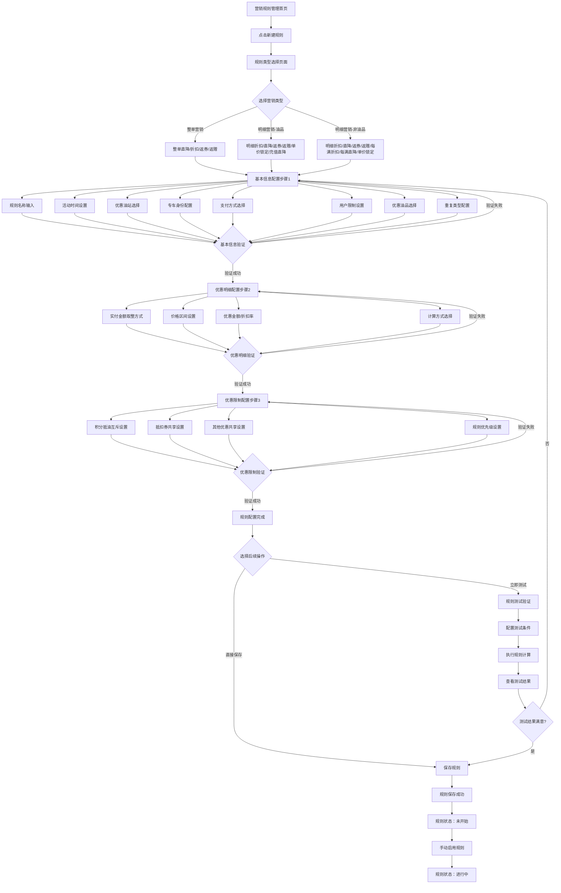
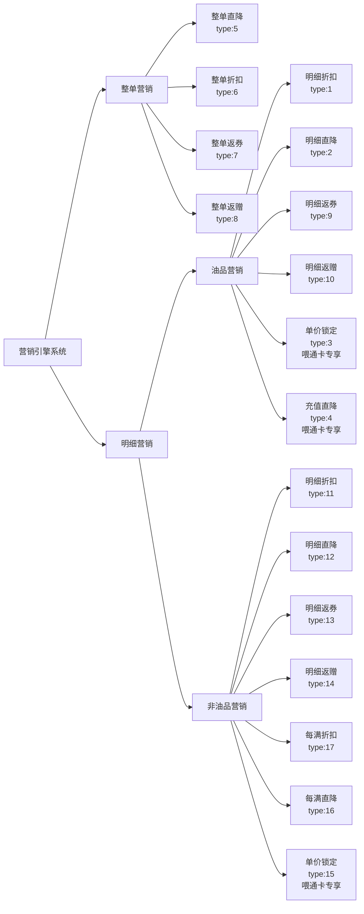
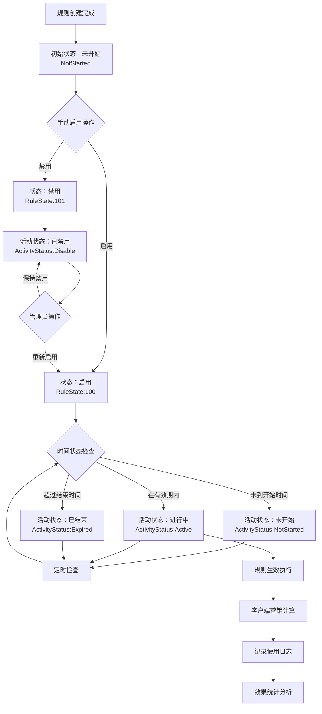
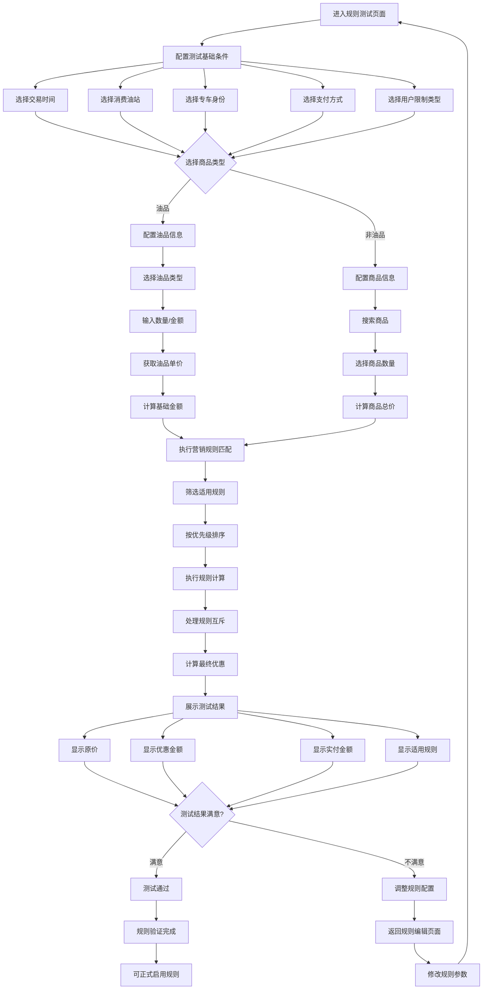
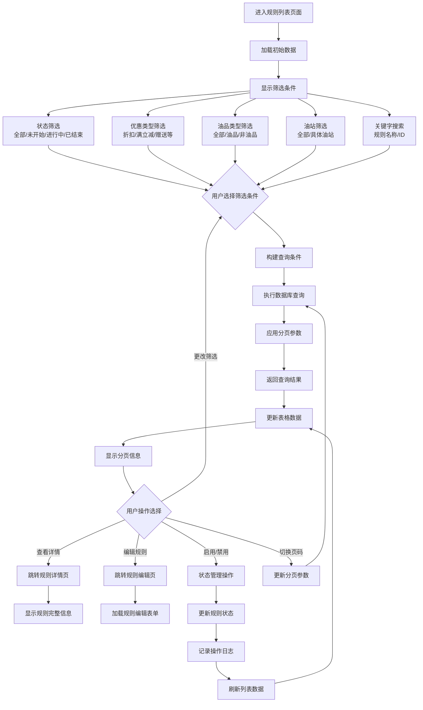
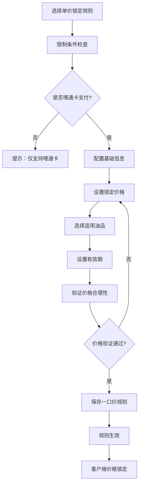
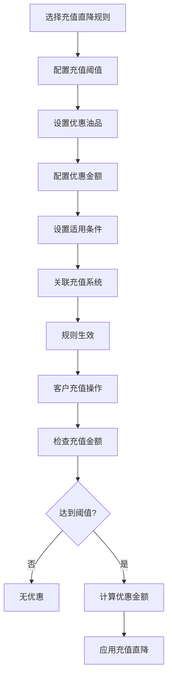
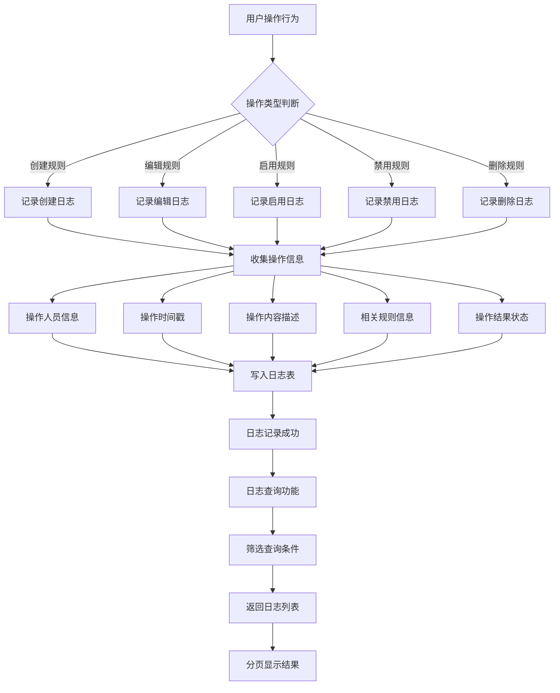
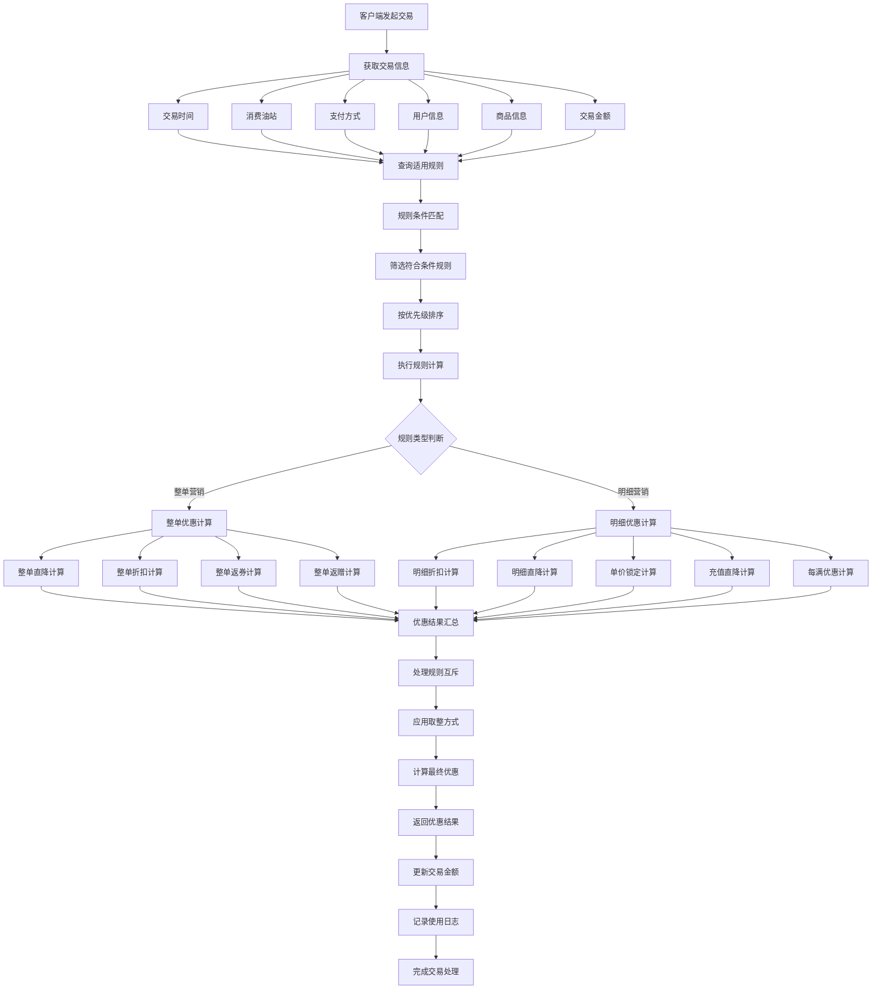

# 业务流程图 - 营销规则引擎系统模块v1.0

## 1. 营销规则创建配置流程

## 2. 营销规则类型选择流程

## 3. 营销规则状态管理流程

## 4. 营销规则测试验证流程

## 5. 营销规则查询筛选流程

## 6. 特殊营销规则处理流程

### 6.1 一口价规则流程

### 6.2 充值直降规则流程

## 7. 营销规则操作日志流程

## 8. 营销规则计算引擎流程

---

**流程图说明：**
1. 所有流程图使用Mermaid语法，支持在Markdown中直接渲染
2. 流程覆盖营销规则系统的完整生命周期管理
3. 特别标注了喂通卡专享功能的特殊处理流程
4. 包含了规则验证、测试、状态管理等关键业务节点
5. 营销计算引擎流程展示了规则执行的核心逻辑

**文档版本：** v1.0  
**创建日期：** 2025-08-26  
**文档状态：** 初稿