# 设备管理系统 - 业务流程图文档

**文档版本：** v1.0  
**创建日期：** 2025年7月21日  
**创建人：** 孙杨竣

## 1. 文档概述

本文档描述设备管理系统的核心业务流程，包括设备档案管理、液位仪监控、校验记录、发电机运行记录和水电表记录等主要业务流程。

## 2. 设备档案管理流程

### 2.1 设备档案新增流程

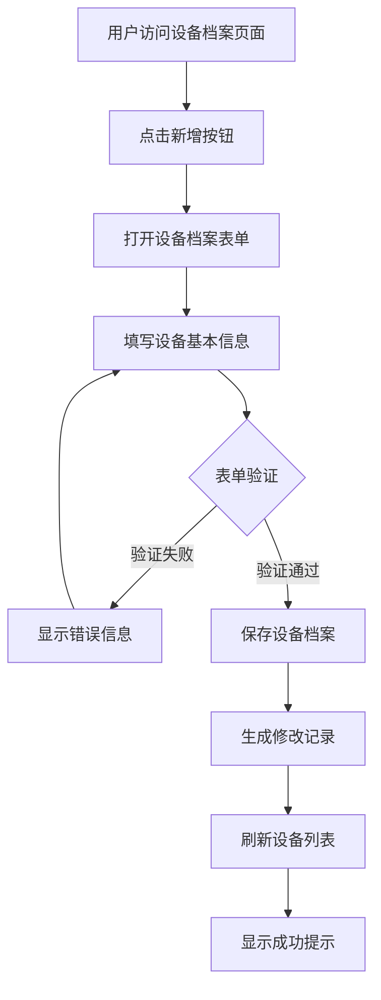

### 2.2 设备档案查询流程

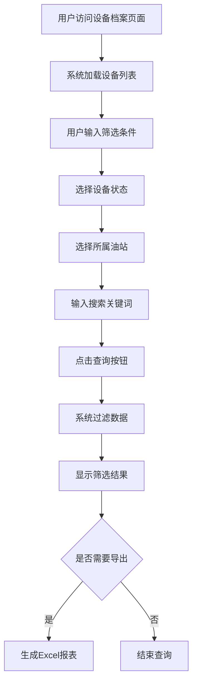

## 3. 液位仪管理流程

### 3.1 设备状态监控流程

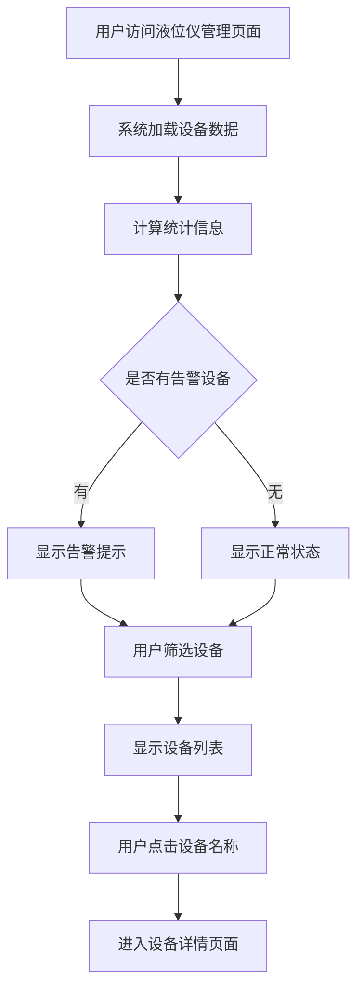

### 3.2 设备详情监控流程

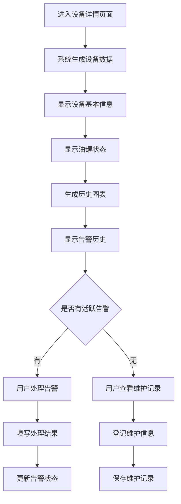

## 4. 加油机校验记录流程

### 4.1 校验记录创建流程

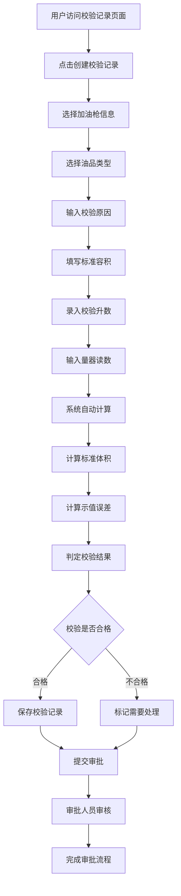

### 4.2 校验记录审批流程

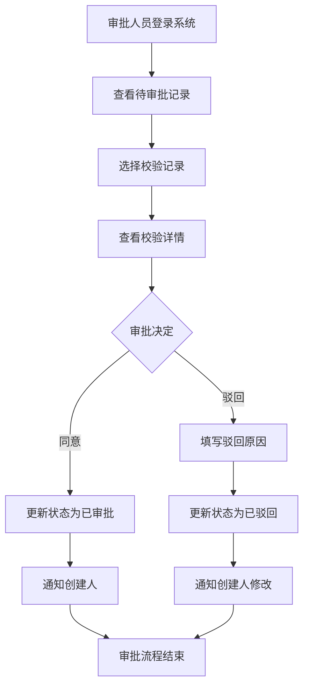

## 5. 发电机运行记录流程

### 5.1 运行记录创建流程

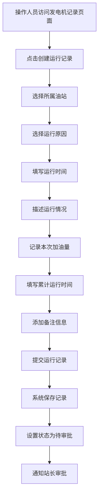

### 5.2 运行记录审批流程

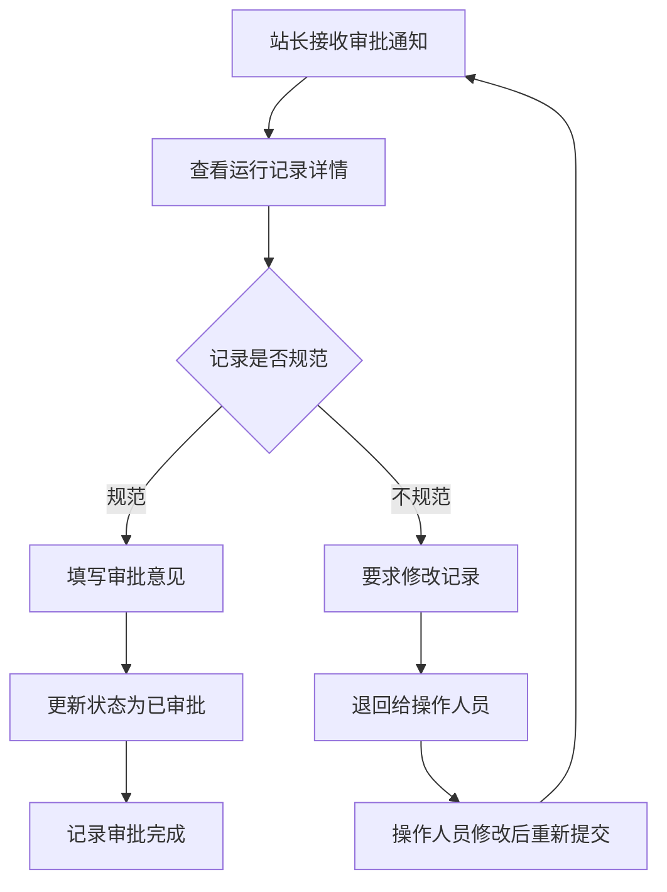

## 6. 水电表记录管理流程

### 6.1 交接明细记录流程

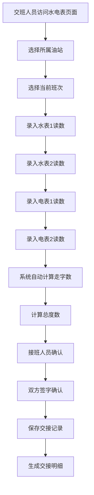

### 6.2 月报表生成流程

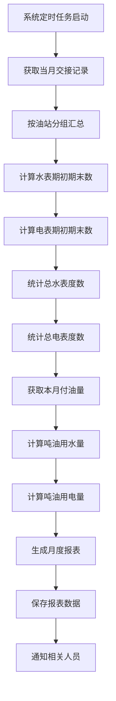

## 7. 系统集成流程

### 7.1 数据同步流程

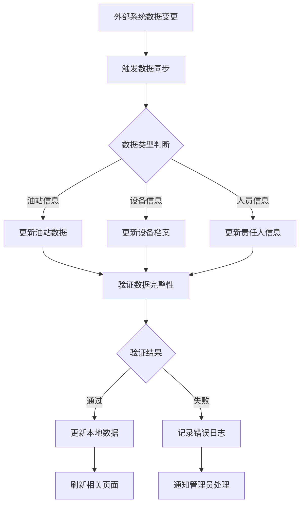

### 7.2 权限控制流程

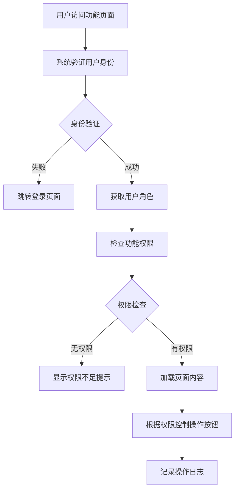

## 8. 异常处理流程

### 8.1 设备离线处理流程

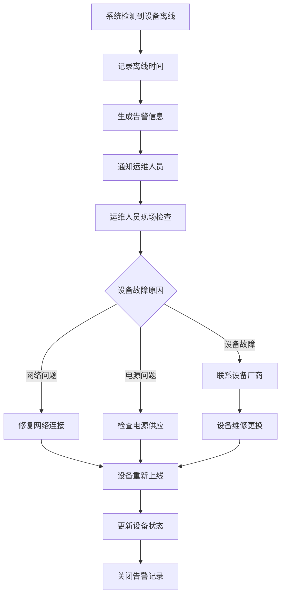

### 8.2 数据异常处理流程

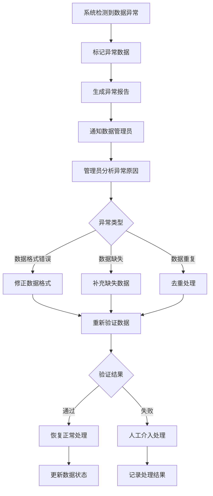

## 9. 总结

设备管理系统的业务流程覆盖了设备全生命周期管理，从设备档案建立、运行监控、维护校验到数据统计分析，形成了完整的管理闭环。各个流程之间相互关联，共同支撑加油站设备的高效、安全运行。 
