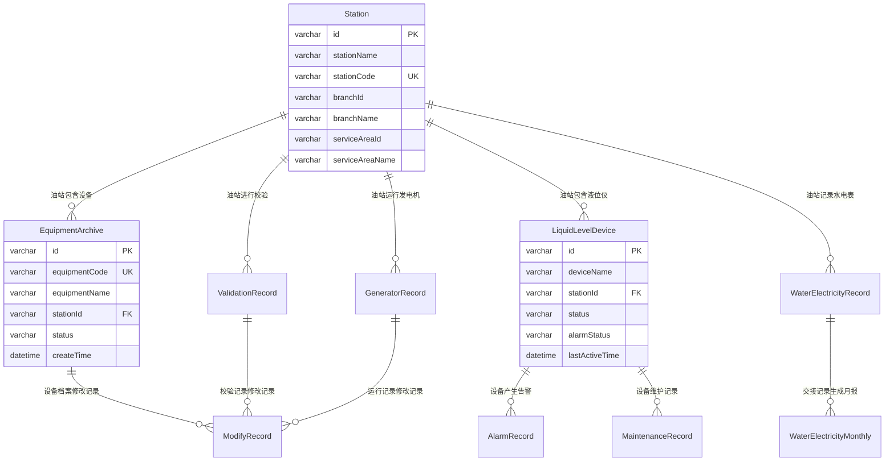

# 设备管理系统 - 数据字典文档

**文档版本：** v1.0  
**创建日期：** 2025年7月21日  
**创建人：** 孙杨竣

## 1. 文档概述

本文档定义了设备管理系统中所有数据实体的详细结构，包括字段名称、数据类型、约束条件、业务含义等信息。

## 2. 数据实体清单

设备管理系统包含以下核心数据实体：
- 设备档案表 (EquipmentArchive)
- 液位仪设备表 (LiquidLevelDevice)
- 告警记录表 (AlarmRecord)
- 维护记录表 (MaintenanceRecord)
- 校验记录表 (ValidationRecord)
- 发电机运行记录表 (GeneratorRecord)
- 水电表交接记录表 (WaterElectricityRecord)
- 水电表月报表 (WaterElectricityMonthly)
- 修改记录表 (ModifyRecord)

## 3. 数据实体详细定义

### 3.1 设备档案表 (EquipmentArchive)

| 字段名称 | 数据类型 | 长度 | 是否必填 | 是否唯一 | 默认值 | 说明 |
|---------|---------|------|---------|---------|--------|------|
| id | VARCHAR | 20 | 是 | 是 | 无 | 设备档案主键ID |
| equipmentCode | VARCHAR | 50 | 是 | 是 | 无 | 设备编号，全局唯一 |
| equipmentName | VARCHAR | 100 | 是 | 否 | 无 | 设备名称 |
| model | VARCHAR | 50 | 是 | 否 | 无 | 设备型号 |
| usageNature | VARCHAR | 20 | 是 | 否 | 无 | 使用性质：营业设备、储存设备等 |
| stationId | VARCHAR | 20 | 是 | 否 | 无 | 所属油站ID，外键关联Station表 |
| stationName | VARCHAR | 100 | 是 | 否 | 无 | 所属油站名称 |
| serialNumber | VARCHAR | 50 | 是 | 否 | 无 | 出厂编号 |
| purchaseDate | DATE | - | 是 | 否 | 无 | 购置时间 |
| manufacturer | VARCHAR | 100 | 是 | 否 | 无 | 生产厂家 |
| status | VARCHAR | 20 | 是 | 否 | 在用 | 使用状态：闲置、在用、故障 |
| responsiblePerson | VARCHAR | 50 | 是 | 否 | 无 | 责任人 |
| createTime | DATETIME | - | 是 | 否 | CURRENT_TIMESTAMP | 创建时间 |
| updateTime | DATETIME | - | 是 | 否 | CURRENT_TIMESTAMP | 更新时间 |

**业务规则：**
- 设备编号格式：油站编号+设备类型缩写+序号
- 使用状态包括：闲置、在用、故障
- 使用性质包括：营业设备、储存设备、辅助设备

### 3.2 液位仪设备表 (LiquidLevelDevice)

| 字段名称 | 数据类型 | 长度 | 是否必填 | 是否唯一 | 默认值 | 说明 |
|---------|---------|------|---------|---------|--------|------|
| id | VARCHAR | 20 | 是 | 是 | 无 | 设备主键ID |
| deviceName | VARCHAR | 100 | 是 | 否 | 无 | 设备名称 |
| deviceType | VARCHAR | 50 | 是 | 否 | 液位监测设备 | 设备类型 |
| stationId | VARCHAR | 20 | 是 | 否 | 无 | 所属油站ID |
| stationName | VARCHAR | 100 | 是 | 否 | 无 | 所属油站名称 |
| location | VARCHAR | 100 | 是 | 否 | 无 | 安装位置 |
| status | VARCHAR | 20 | 是 | 否 | offline | 设备状态：online、offline、maintenance、error |
| alarmStatus | VARCHAR | 20 | 是 | 否 | normal | 报警状态：normal、warning、error |
| lastActiveTime | DATETIME | - | 否 | 否 | 无 | 最后活跃时间 |
| model | VARCHAR | 50 | 是 | 否 | 无 | 设备型号 |
| manufacturer | VARCHAR | 100 | 是 | 否 | 无 | 制造商 |
| installDate | DATE | - | 是 | 否 | 无 | 安装日期 |
| ipAddress | VARCHAR | 15 | 否 | 否 | 无 | IP地址 |
| firmwareVersion | VARCHAR | 20 | 否 | 否 | 无 | 固件版本 |
| maintenanceCount | INT | - | 是 | 否 | 0 | 维护次数 |
| faultCount | INT | - | 是 | 否 | 0 | 故障次数 |

**业务规则：**
- 设备状态包括：online(在线)、offline(离线)、maintenance(维护中)、error(故障)
- 报警状态包括：normal(正常)、warning(警告)、error(错误)
- IP地址格式必须符合IPv4标准

### 3.3 油枪校验记录表 (ValidationRecord)

| 字段名称 | 数据类型 | 长度 | 是否必填 | 是否唯一 | 默认值 | 说明 |
|---------|---------|------|---------|---------|--------|------|
| id | VARCHAR | 20 | 是 | 是 | 无 | 校验记录主键ID |
| validationNumber | VARCHAR | 50 | 是 | 是 | 无 | 校验单编号，全局唯一 |
| gunId | VARCHAR | 20 | 是 | 否 | 无 | 加油枪ID |
| gunCode | VARCHAR | 50 | 是 | 否 | 无 | 加油枪编码 |
| gunName | VARCHAR | 100 | 是 | 否 | 无 | 加油枪名称 |
| stationId | VARCHAR | 20 | 是 | 否 | 无 | 所属油站ID |
| stationName | VARCHAR | 100 | 是 | 否 | 无 | 所属油站名称 |
| oilType | VARCHAR | 20 | 是 | 否 | 无 | 油品名称 |
| validationReason | VARCHAR | 20 | 是 | 否 | 无 | 校验原因：自检、强检 |
| standardCapacity | VARCHAR | 10 | 是 | 否 | 无 | 标准金属量器规格容积 |
| validationVolume | DECIMAL | 10,3 | 是 | 否 | 无 | 加油机校验升数 |
| gaugeReading | DECIMAL | 10,2 | 是 | 否 | 无 | 标准金属量器读数(mm) |
| standardVolume | DECIMAL | 10,3 | 是 | 否 | 无 | 标准体积 |
| indicationError | DECIMAL | 10,1 | 是 | 否 | 无 | 示值误差(‰) |
| averageIndicationError | DECIMAL | 10,1 | 否 | 否 | 无 | 平均示值误差(‰) |
| repeatabilityError | DECIMAL | 10,1 | 否 | 否 | 无 | 重复性误差(‰) |
| validationDate | DATE | - | 是 | 否 | 无 | 校验时间 |
| validatorName | VARCHAR | 50 | 是 | 否 | 无 | 校验人名称 |
| status | VARCHAR | 20 | 是 | 否 | 草稿 | 单据状态：草稿、待审批、已审批 |
| approvalComment | TEXT | - | 否 | 否 | 无 | 审批意见 |
| createTime | DATETIME | - | 是 | 否 | CURRENT_TIMESTAMP | 创建时间 |
| updateTime | DATETIME | - | 是 | 否 | CURRENT_TIMESTAMP | 更新时间 |

**业务规则：**
- 校验单编号格式：JYJ+年月日+序号
- 校验原因包括：自检、强检
- 示值误差计算公式：(加油机校验升数-标准体积)/标准体积×1000
- 平均示值误差≤±3‰为合格
- 重复性误差≤1.5‰为合格

### 3.4 发电机运行记录表 (GeneratorRecord)

| 字段名称 | 数据类型 | 长度 | 是否必填 | 是否唯一 | 默认值 | 说明 |
|---------|---------|------|---------|---------|--------|------|
| id | VARCHAR | 20 | 是 | 是 | 无 | 运行记录主键ID |
| recordNumber | VARCHAR | 50 | 是 | 是 | 无 | 记录单编号，全局唯一 |
| stationId | VARCHAR | 20 | 是 | 否 | 无 | 所属油站ID |
| stationName | VARCHAR | 100 | 是 | 否 | 无 | 所属油站名称 |
| operationReason | VARCHAR | 20 | 是 | 否 | 无 | 运行原因：周保养、发电、维修 |
| startTime | DATETIME | - | 是 | 否 | 无 | 运行开始时间 |
| endTime | DATETIME | - | 是 | 否 | 无 | 运行结束时间 |
| operationStatus | VARCHAR | 100 | 是 | 否 | 无 | 运行情况描述 |
| fuelConsumption | DECIMAL | 10,2 | 是 | 否 | 无 | 本次加油量(L) |
| maintenanceAccumulatedTime | DECIMAL | 10,2 | 否 | 否 | 无 | 保养后累计运行时间(小时) |
| status | VARCHAR | 20 | 是 | 否 | 草稿 | 单据状态：草稿、待审批、已审批 |
| approvalComment | TEXT | - | 否 | 否 | 无 | 审批意见 |
| creator | VARCHAR | 50 | 是 | 否 | 无 | 创建人 |
| stationManager | VARCHAR | 50 | 是 | 否 | 无 | 站长姓名 |
| remark | TEXT | - | 否 | 否 | 无 | 备注信息 |
| createTime | DATETIME | - | 是 | 否 | CURRENT_TIMESTAMP | 创建时间 |
| updateTime | DATETIME | - | 是 | 否 | CURRENT_TIMESTAMP | 更新时间 |

**业务规则：**
- 记录单编号格式：FDJ+年月日+序号
- 运行原因包括：周保养、发电、维修
- 运行开始时间不能晚于结束时间
- 累计运行时间自动累加计算

### 3.5 水电表交接记录表 (WaterElectricityRecord)

| 字段名称 | 数据类型 | 长度 | 是否必填 | 是否唯一 | 默认值 | 说明 |
|---------|---------|------|---------|---------|--------|------|
| id | VARCHAR | 20 | 是 | 是 | 无 | 交接记录主键ID |
| recordNumber | VARCHAR | 50 | 是 | 是 | 无 | 记录单编号，全局唯一 |
| stationId | VARCHAR | 20 | 是 | 否 | 无 | 所属油站ID |
| stationName | VARCHAR | 100 | 是 | 否 | 无 | 所属油站名称 |
| shift | VARCHAR | 10 | 是 | 否 | 无 | 班次：早班、中班、晚班 |
| waterMeter1StartReading | DECIMAL | 10,2 | 是 | 否 | 无 | 水表1接班数 |
| waterMeter1EndReading | DECIMAL | 10,2 | 是 | 否 | 无 | 水表1交班数 |
| waterMeter1Consumption | DECIMAL | 10,2 | 是 | 否 | 无 | 水表1走字数 |
| waterMeter2StartReading | DECIMAL | 10,2 | 是 | 否 | 无 | 水表2接班数 |
| waterMeter2EndReading | DECIMAL | 10,2 | 是 | 否 | 无 | 水表2交班数 |
| waterMeter2Consumption | DECIMAL | 10,2 | 是 | 否 | 无 | 水表2走字数 |
| totalWaterConsumption | DECIMAL | 10,2 | 是 | 否 | 无 | 本班水表总度数 |
| electricMeter1StartReading | DECIMAL | 10,2 | 是 | 否 | 无 | 电表1接班数 |
| electricMeter1EndReading | DECIMAL | 10,2 | 是 | 否 | 无 | 电表1交班数 |
| electricMeter1Consumption | DECIMAL | 10,2 | 是 | 否 | 无 | 电表1走字数 |
| electricMeter2StartReading | DECIMAL | 10,2 | 是 | 否 | 无 | 电表2接班数 |
| electricMeter2EndReading | DECIMAL | 10,2 | 是 | 否 | 无 | 电表2交班数 |
| electricMeter2Consumption | DECIMAL | 10,2 | 是 | 否 | 无 | 电表2走字数 |
| totalElectricConsumption | DECIMAL | 10,2 | 是 | 否 | 无 | 本班电表总度数 |
| handoverPerson | VARCHAR | 50 | 是 | 否 | 无 | 交班人 |
| takeoverPerson | VARCHAR | 50 | 是 | 否 | 无 | 接班人 |
| creator | VARCHAR | 50 | 是 | 否 | 无 | 创建人 |
| remark | TEXT | - | 否 | 否 | 无 | 备注信息 |
| createTime | DATETIME | - | 是 | 否 | CURRENT_TIMESTAMP | 创建时间 |

**业务规则：**
- 记录单编号格式：SDJ+年月日+序号
- 班次包括：早班、中班、晚班
- 走字数 = 交班数 - 接班数
- 总度数 = 表1走字数 + 表2走字数
- 交班数不能小于接班数

### 3.6 水电表月报表 (WaterElectricityMonthly)

| 字段名称 | 数据类型 | 长度 | 是否必填 | 是否唯一 | 默认值 | 说明 |
|---------|---------|------|---------|---------|--------|------|
| id | VARCHAR | 20 | 是 | 是 | 无 | 月报表主键ID |
| stationId | VARCHAR | 20 | 是 | 否 | 无 | 所属油站ID |
| stationName | VARCHAR | 100 | 是 | 否 | 无 | 所属油站名称 |
| reportMonth | VARCHAR | 7 | 是 | 否 | 无 | 报表月份(YYYY-MM) |
| waterMeter1StartReading | DECIMAL | 10,2 | 是 | 否 | 无 | 水表1期初数 |
| waterMeter1EndReading | DECIMAL | 10,2 | 是 | 否 | 无 | 水表1期末数 |
| waterMeter1Consumption | DECIMAL | 10,2 | 是 | 否 | 无 | 水表1走字数 |
| waterMeter2StartReading | DECIMAL | 10,2 | 是 | 否 | 无 | 水表2期初数 |
| waterMeter2EndReading | DECIMAL | 10,2 | 是 | 否 | 无 | 水表2期末数 |
| waterMeter2Consumption | DECIMAL | 10,2 | 是 | 否 | 无 | 水表2走字数 |
| totalWaterConsumption | DECIMAL | 10,2 | 是 | 否 | 无 | 本月总水表度数 |
| electricMeter1StartReading | DECIMAL | 10,2 | 是 | 否 | 无 | 电表1期初数 |
| electricMeter1EndReading | DECIMAL | 10,2 | 是 | 否 | 无 | 电表1期末数 |
| electricMeter1Consumption | DECIMAL | 10,2 | 是 | 否 | 无 | 电表1走字数 |
| electricMeter2StartReading | DECIMAL | 10,2 | 是 | 否 | 无 | 电表2期初数 |
| electricMeter2EndReading | DECIMAL | 10,2 | 是 | 否 | 无 | 电表2期末数 |
| electricMeter2Consumption | DECIMAL | 10,2 | 是 | 否 | 无 | 电表2走字数 |
| totalElectricConsumption | DECIMAL | 10,2 | 是 | 否 | 无 | 本月总电表度数 |
| monthlyOilVolume | DECIMAL | 10,2 | 是 | 否 | 无 | 本月付油量(吨) |
| waterConsumptionPerTon | DECIMAL | 10,3 | 是 | 否 | 无 | 吨油用水量(吨) |
| electricConsumptionPerTon | DECIMAL | 10,3 | 是 | 否 | 无 | 吨油用电量(度) |
| generateTime | DATETIME | - | 是 | 否 | CURRENT_TIMESTAMP | 生成时间 |

**业务规则：**
- 报表月份格式：YYYY-MM
- 吨油用水量 = 本月总水表度数 / 本月付油量
- 吨油用电量 = 本月总电表度数 / 本月付油量
- 月报表每月自动生成一次

### 3.7 修改记录表 (ModifyRecord)

| 字段名称 | 数据类型 | 长度 | 是否必填 | 是否唯一 | 默认值 | 说明 |
|---------|---------|------|---------|---------|--------|------|
| id | VARCHAR | 20 | 是 | 是 | 无 | 修改记录主键ID |
| targetTable | VARCHAR | 50 | 是 | 否 | 无 | 被修改的表名 |
| targetId | VARCHAR | 20 | 是 | 否 | 无 | 被修改记录的ID |
| operationType | VARCHAR | 20 | 是 | 否 | 无 | 操作类型：新增、编辑、删除 |
| operatorName | VARCHAR | 50 | 是 | 否 | 无 | 操作人姓名 |
| operateTime | DATETIME | - | 是 | 否 | CURRENT_TIMESTAMP | 操作时间 |
| description | TEXT | - | 否 | 否 | 无 | 操作描述 |
| changes | TEXT | - | 否 | 否 | 无 | 变更内容详情 |
| beforeData | TEXT | - | 否 | 否 | 无 | 修改前数据(JSON格式) |
| afterData | TEXT | - | 否 | 否 | 无 | 修改后数据(JSON格式) |

**业务规则：**
- 操作类型包括：新增、编辑、删除
- 变更内容以JSON格式存储
- 所有重要数据修改都必须记录

### 3.8 告警记录表 (AlarmRecord)

| 字段名称 | 数据类型 | 长度 | 是否必填 | 是否唯一 | 默认值 | 说明 |
|---------|---------|------|---------|---------|--------|------|
| id | VARCHAR | 20 | 是 | 是 | 无 | 告警记录主键ID |
| deviceId | VARCHAR | 20 | 是 | 否 | 无 | 设备ID |
| deviceName | VARCHAR | 100 | 是 | 否 | 无 | 设备名称 |
| alarmType | VARCHAR | 50 | 是 | 否 | 无 | 告警类型 |
| alarmLevel | VARCHAR | 20 | 是 | 否 | 无 | 告警级别：低、中、高、严重 |
| alarmMessage | TEXT | - | 是 | 否 | 无 | 告警信息 |
| alarmTime | DATETIME | - | 是 | 否 | CURRENT_TIMESTAMP | 告警时间 |
| status | VARCHAR | 20 | 是 | 否 | 活跃 | 告警状态：活跃、已处理、已忽略 |
| processMethod | VARCHAR | 100 | 否 | 否 | 无 | 处理方式 |
| processResult | TEXT | - | 否 | 否 | 无 | 处理结果 |
| processTime | DATETIME | - | 否 | 否 | 无 | 处理时间 |
| processor | VARCHAR | 50 | 否 | 否 | 无 | 处理人 |

**业务规则：**
- 告警级别包括：低、中、高、严重
- 告警状态包括：活跃、已处理、已忽略
- 严重告警需要立即处理

### 3.10 维护记录表 (MaintenanceRecord)

| 字段名称 | 数据类型 | 长度 | 是否必填 | 是否唯一 | 默认值 | 说明 |
|---------|---------|------|---------|---------|--------|------|
| id | VARCHAR | 20 | 是 | 是 | 无 | 维护记录主键ID |
| deviceId | VARCHAR | 20 | 是 | 否 | 无 | 设备ID |
| deviceName | VARCHAR | 100 | 是 | 否 | 无 | 设备名称 |
| maintenanceType | VARCHAR | 20 | 是 | 否 | 无 | 维护类型：定期维护、故障维修、设备升级、设备校准 |
| maintenanceDate | DATE | - | 是 | 否 | 无 | 维护日期 |
| maintenancePerson | VARCHAR | 50 | 是 | 否 | 无 | 维护人员 |
| maintenanceContent | TEXT | - | 是 | 否 | 无 | 维护内容 |
| maintenanceResult | VARCHAR | 100 | 否 | 否 | 无 | 维护结果 |
| nextMaintenanceDate | DATE | - | 否 | 否 | 无 | 下次维护日期 |
| cost | DECIMAL | 10,2 | 否 | 否 | 无 | 维护费用 |
| remark | TEXT | - | 否 | 否 | 无 | 备注信息 |
| createTime | DATETIME | - | 是 | 否 | CURRENT_TIMESTAMP | 创建时间 |

**业务规则：**
- 维护类型包括：定期维护、故障维修、设备升级、设备校准
- 定期维护需要设置下次维护日期
- 维护费用以元为单位

## 4. 数据关系图

## 5. 数据约束和规则

### 5.1 主键约束
- 所有表都必须有主键
- 主键采用VARCHAR类型，长度为20字符
- 主键值全局唯一，不可重复

### 5.2 外键约束
- 设备相关表的stationId必须存在于Station表中
- 删除油站记录前必须先删除相关设备记录

### 5.3 唯一性约束
- 设备编号在整个系统中必须唯一
- 校验单编号在整个系统中必须唯一
- 运行记录编号在整个系统中必须唯一

### 5.4 数据完整性约束
- 必填字段不能为空
- 日期字段必须符合标准格式
- 数值字段不能为负数（除特殊说明外）
- 百分比字段取值范围为0-100

### 5.5 业务逻辑约束
- 结束时间不能早于开始时间
- 交班数不能小于接班数
- 示值误差必须在合理范围内
- 设备状态变更必须符合状态转换规则

## 6. 数据字典维护说明

### 6.1 版本控制
- 数据字典版本与系统版本保持一致
- 字段变更需要更新版本号
- 重要变更需要进行影响分析

### 6.2 变更管理
- 新增字段需要评估对现有功能的影响
- 修改字段类型需要考虑数据迁移
- 删除字段需要确认无业务依赖

### 6.3 审核流程
- 数据字典变更需要经过技术评审
- 重要变更需要业务部门确认
- 变更实施前需要制定回滚方案

## 7. 附录

### 7.1 数据类型说明
- VARCHAR：可变长度字符串
- DECIMAL：精确数值类型，用于存储金额、比率等
- INT：整数类型
- DATE：日期类型(YYYY-MM-DD)
- DATETIME：日期时间类型(YYYY-MM-DD HH:MM:SS)
- TEXT：大文本类型

### 7.2 状态枚举值
- 设备状态：在用、闲置、故障、维护中
- 审批状态：草稿、待审批、已审批、已驳回
- 告警级别：低、中、高、严重
- 班次类型：早班、中班、晚班

### 7.3 编码规则
- 设备编号：油站编号(4位)+设备类型(2-3位)+序号(3位)
- 校验单号：JYJ+年月日(8位)+序号(4位)
- 运行记录号：FDJ+年月日(8位)+序号(4位)
- 交接记录号：SDJ+年月日(8位)+序号(4位) 
