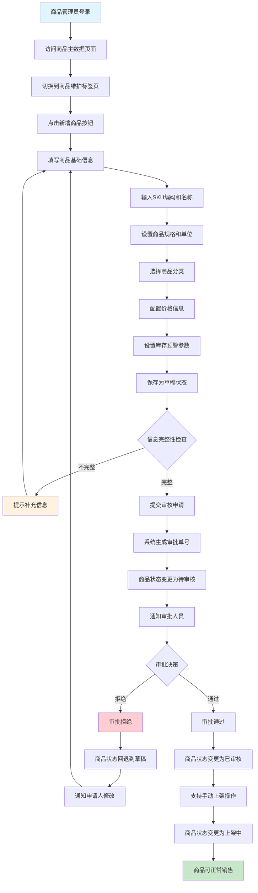
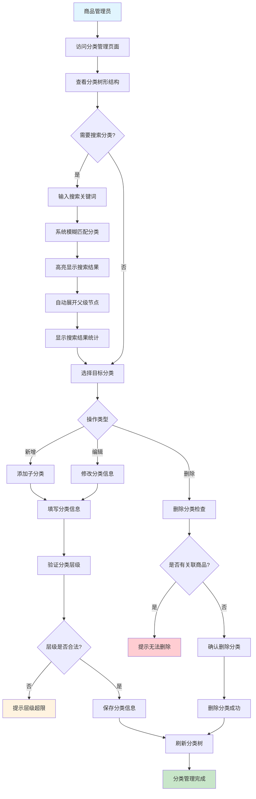
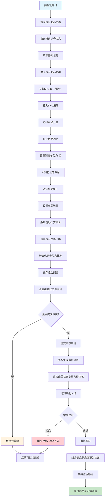
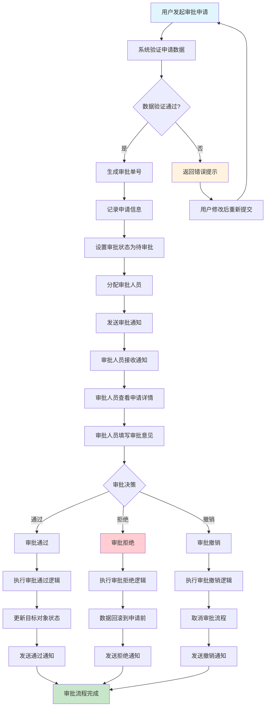
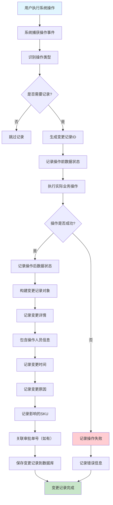
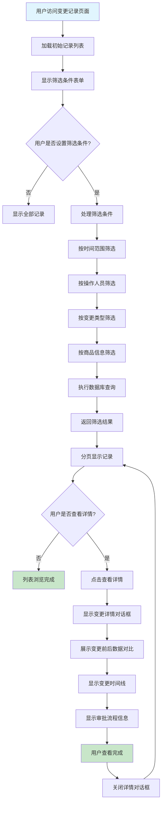

# 业务流程图 - 商品主数据管理系统

## 1. 流程图说明

本文档展示了商品主数据管理系统的核心业务流程，通过可视化流程图帮助理解系统的业务逻辑和操作流程。基于最新的代码逻辑，系统主要包含商品维护、分类管理、组合商品、审批流程和变更记录等核心功能模块。

## 2. 商品新增上架流程

### 2.1 流程描述
商品新增上架是系统最核心的业务流程，涉及商品信息录入、分类设置、价格配置、审核确认和上架销售等关键环节，支持完整的状态流转管理。

### 2.2 流程图

### 2.3 流程步骤说明

| 步骤 | 操作 | 描述 | 参与角色 |
|------|------|------|----------|
| 1 | 登录系统 | 商品管理员使用账号密码登录系统 | 商品管理员 |
| 2 | 访问功能页面 | 导航到商品主数据管理页面 | 商品管理员 |
| 3 | 切换功能标签 | 在标签页中切换到商品维护功能 | 商品管理员 |
| 4 | 新增商品 | 点击"新增商品"按钮打开表单 | 商品管理员 |
| 5 | 填写基础信息 | 录入SKU编码、名称、规格、条形码等 | 商品管理员 |
| 6 | 选择商品分类 | 从三级分类树中选择合适分类 | 商品管理员 |
| 7 | 配置价格信息 | 设置销售价、成本价、会员价等 | 商品管理员 |
| 8 | 设置库存参数 | 配置最小库存、最大库存预警 | 商品管理员 |
| 9 | 保存草稿 | 暂存商品信息，状态为草稿 | 系统自动 |
| 10 | 信息完整性检查 | 验证必填字段和数据格式 | 系统自动 |
| 11 | 提交审核 | 信息完整后提交给审核人员 | 商品管理员 |
| 12 | 审核决策 | 审核商品信息是否符合要求 | 审核人员 |
| 13 | 审批通过 | 审核通过后可以手动上架 | 审核人员 |
| 14 | 手动上架 | 商品管理员手动上架销售 | 商品管理员 |
| 15 | 正常销售 | 商品在门店可正常销售 | 系统状态 |

## 3. 商品分类管理流程

### 3.1 流程图

## 4. 组合商品创建流程

### 4.1 流程图

## 5. 审批流程管理

### 5.1 审批流程图

## 6. 变更记录管理流程

### 6.1 变更记录生成流程

### 6.2 变更记录查询流程

**文档说明：**
- 本文档使用Mermaid语法绘制流程图，支持在线渲染
- 不同颜色代表不同的流程状态：
  - 蓝色：起始节点
  - 绿色：成功结束节点  
  - 红色：异常或失败节点
  - 橙色：警告或待处理节点
- 流程图涵盖了系统的核心业务流程和技术流程
- 每个流程都基于实际的代码逻辑和业务需求设计

**文档版本：** V1.1  
**创建时间：** 2025年7月03日  
**创建人：** 孙杨竣  
**最后更新：** 2025年7月03日 