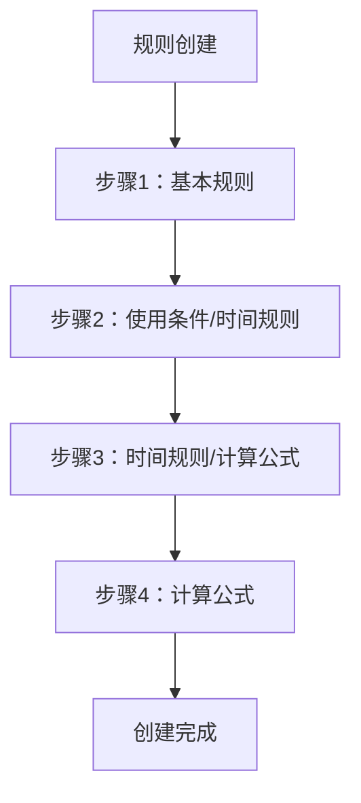
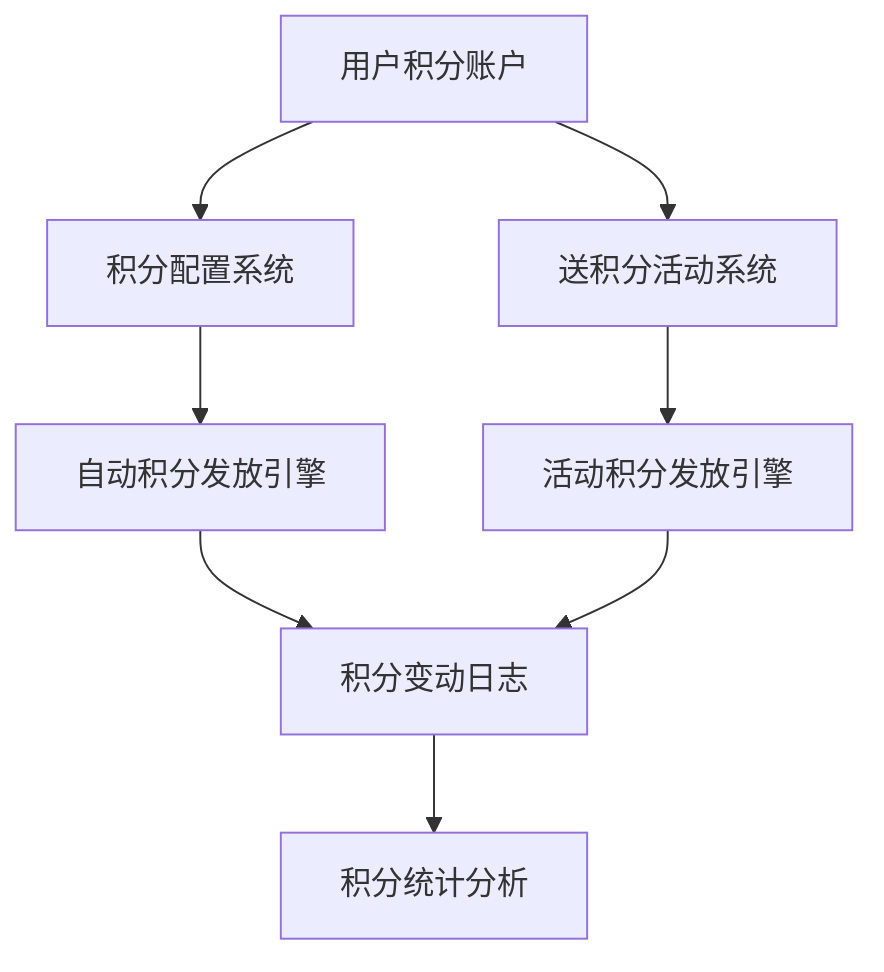

# 送积分与积分配置对比文档

## 1. 功能概述对比

### 1.1 模块定位

| 方面 | 送积分活动(IntegralAct) | 积分配置(Integral) |
|------|------------------------|-------------------|
| **功能定位** | 营销活动工具 | 系统配置工具 |
| **使用场景** | 临时性促销活动 | 长期业务规则设置 |
| **目标用户** | 营销人员 | 系统管理员 |
| **复杂程度** | 简单直接 | 复杂精细 |

### 1.2 核心差异

**送积分活动**：面向营销活动的**临时性**积分发放工具，重点是快速创建有时效性的积分赠送活动。

**积分配置**：面向业务运营的**系统性**积分规则配置工具，重点是建立长期稳定的积分获取机制。

## 2. 功能模块详细对比

### 2.1 文件结构对比

| 送积分活动(IntegralAct) | 积分配置(Integral) |
|------------------------|-------------------|
| `add.blade.php` (12.6KB) - 活动创建页面 | `ruleCreation.blade.php` (62.2KB) - 规则创建页面 |
| `log.blade.php` (7.4KB) - 活动列表查看 | `ruleList.blade.php` (6.0KB) - 规则列表管理 |
| - | `log.blade.php` (8.2KB) - 积分日志查看 |
| - | `updateList.blade.php` (1.4KB) - 更新列表 |

**对比分析**：
- 送积分活动只有2个核心页面，功能相对简单
- 积分配置有4个页面，功能更加完善和复杂

### 2.2 创建流程对比

#### 送积分活动创建流程（1步完成）


**涉及字段**：
- 活动名称（15字符限制）
- 活动有效期（开始-结束时间）
- 活动图片URL
- 固定积分数量

#### 积分配置创建流程（3-4步完成）


**涉及配置项**：
1. **基本规则**：规则名称、时间范围、说明、优先级、绑定油站、来源类型
2. **使用条件**：卡属性、卡主题、客户来源、客户类型、客户身份、客户分类
3. **高级设置**：油品限制、数据来源、付款方式、消费/充值限制、专享限制
4. **时间规则**：重复类型（无/每日/每周/每月）、具体时间段设置
5. **计算公式**：规则积分、随机积分、固定积分，支持不同计算方式

### 2.3 积分发放机制对比

| 对比维度 | 送积分活动 | 积分配置 |
|---------|-----------|---------|
| **积分类型** | 仅固定积分 | 规则积分、随机积分、固定积分 |
| **发放方式** | 活动链接领取 | 自动触发发放 |
| **发放条件** | 点击链接即可 | 满足复杂业务规则 |
| **计算方式** | 固定数值 | 支持四舍五入、进位、截尾 |
| **时间控制** | 活动有效期 | 重复时间规则 |

#### 送积分活动积分发放
```javascript
// 简单的固定积分发放
{
    title: "春节送积分活动",
    points: "100",  // 固定100积分
    date: ["2025-02-01 00:00:00", "2025-02-28 23:59:59"]
}
```

#### 积分配置积分发放
```javascript
// 复杂的规则积分计算
{
    integraltype: 1, // 规则积分
    rule_integral: {
        type: 1,     // 金额类型
        gt: 10,      // 每消费1元积10分
        intType: 2   // 四舍五入取整
    },
    // 或随机积分
    integraltype: 2,
    random_integral: {
        lt: 5,   // 最少5分
        gt: 50   // 最多50分
    }
}
```

### 2.4 用户权限和使用范围对比

#### 送积分活动
- **使用范围**：全平台用户
- **获取条件**：访问活动链接
- **限制条件**：活动时间内有效
- **重复获取**：通常一次性

#### 积分配置
- **使用范围**：可精细化配置
  - 卡属性限制（不同类型会员卡）
  - 客户类型限制（个人/企业等）
  - 客户身份限制（普通/VIP等）
  - 油站绑定限制
  - 油品种类限制
  - 付款方式限制
- **获取条件**：满足业务行为（消费、充值等）
- **限制条件**：复杂的业务规则组合
- **重复获取**：根据时间规则重复触发

### 2.5 管理功能对比

| 功能 | 送积分活动 | 积分配置 |
|------|-----------|---------|
| **列表展示** | 活动ID、名称、有效期 | 规则ID、状态、名称、用途、优先级、公式、时间规则 |
| **状态管理** | 基于时间自动判断 | 手动启用/禁用 |
| **操作功能** | 修改、查看详情 | 修改、启用、禁用 |
| **链接生成** | 自动生成活动链接和二维码 | 无链接生成 |
| **数据统计** | 基本活动信息展示 | 无统计功能 |

## 3. 技术实现对比

### 3.1 前端技术栈

| 方面 | 送积分活动 | 积分配置 |
|------|-----------|---------|
| **UI框架** | Element UI | Element UI |
| **JavaScript框架** | Vue.js | Vue.js |
| **表单复杂度** | 简单表单（4个字段） | 复杂多步骤表单（50+字段） |
| **交互组件** | 日期选择器、文件上传、二维码生成 | 多选框组、单选按钮组、数值输入器、时间选择器 |

### 3.2 数据结构复杂度

#### 送积分活动数据结构
```javascript
// 相对简单的数据结构
{
    title: String,           // 活动名称
    date: Array,            // 时间范围
    points: String,         // 积分数量
    img_url: String,        // 图片URL
    act_url: String,        // 活动链接
    download_url: String    // 二维码下载链接
}
```

#### 积分配置数据结构
```javascript
// 复杂的嵌套数据结构
{
    ruleName: String,              // 规则名称
    timescope: Array,              // 时间范围
    ruleExplain: String,           // 规则说明
    propity: Number,               // 优先级
    stationbind: Array,            // 绑定油站
    purpose: Number,               // 来源类型
    cardattr: Array,               // 卡属性
    cardthem: Array,               // 卡主题
    customerOrigin: Array,         // 客户来源
    custormType: Array,            // 客户类型
    ruleIdentity: Array,           // 客户身份
    customerClass: Object,         // 客户分类
    oil: Array,                    // 油品
    dataOrigin: Array,             // 数据来源
    payType: Array,                // 付款方式
    shoppingLimit: Object,         // 消费限制
    rechangeLimit: Object,         // 充值限制
    exclusive_restriction: Number,  // 专享限制
    vip_type: Number,              // 会员类型
    repeatType: Number,            // 时间重复类型
    selectedTime: Array,           // 选定时间
    integraltype: Number,          // 积分类型
    rule_integral: Object,         // 规则积分配置
    random_integral: Object,       // 随机积分配置
    fixed_integral: Number         // 固定积分数值
}
```

## 4. 业务价值对比

### 4.1 应用场景

#### 送积分活动典型场景
- **节日促销**：春节、国庆等节日积分赠送
- **新用户引导**：注册送积分活动
- **短期营销**：配合其他促销活动的积分奖励
- **用户召回**：针对流失用户的积分激励

#### 积分配置典型场景
- **消费奖励**：每消费1元获得N积分
- **充值返积分**：充值金额按比例返还积分
- **会员等级权益**：不同等级会员享受不同积分倍率
- **生日专享**：生日当天消费额外积分奖励
- **时段营销**：特定时间段消费获得更多积分

### 4.2 运营价值

| 价值维度 | 送积分活动 | 积分配置 |
|---------|-----------|---------|
| **实施难度** | 低 - 几分钟即可创建 | 高 - 需要深入理解业务规则 |
| **灵活性** | 高 - 可随时创建新活动 | 中 - 需要系统性规划 |
| **可控性** | 高 - 明确的时间和数量限制 | 中 - 需要持续监控和调优 |
| **营销效果** | 短期拉新、促活 | 长期用户留存、忠诚度建设 |
| **成本控制** | 精确 - 固定总成本 | 需预测 - 基于业务量浮动 |
| **数据分析** | 简单 - 参与人数统计 | 复杂 - 需要深度业务分析 |

## 5. 使用建议

### 5.1 功能选择指导

**选择送积分活动的情况**：
- ✅ 需要快速上线的短期促销活动
- ✅ 明确的积分发放数量和总预算
- ✅ 针对特定活动或节日的营销推广
- ✅ 不需要复杂条件判断的简单积分发放
- ✅ 需要生成推广链接和二维码的场景

**选择积分配置的情况**：
- ✅ 建立长期稳定的积分获取机制
- ✅ 需要根据用户行为自动发放积分
- ✅ 要求精细化的用户群体和条件控制
- ✅ 需要与业务系统深度集成的积分规则
- ✅ 建立差异化的会员权益体系

### 5.2 组合使用策略

**最佳实践**：
1. **基础积分体系**：使用积分配置建立日常的消费、充值积分规则
2. **营销活动补充**：使用送积分活动开展临时性的促销和拉新
3. **分层管理**：积分配置处理自动化场景，送积分活动处理人工干预场景
4. **数据互补**：两套系统的数据可以形成完整的用户积分行为分析

## 6. 技术架构建议

### 6.1 系统集成方案



### 6.2 数据统一管理

**建议实现统一的积分管理中心**：
- 统一积分账户体系
- 统一积分变动日志
- 统一积分统计分析
- 分离积分获取渠道（配置规则 vs 活动发放）

## 7. 总结

送积分活动和积分配置是两个功能定位不同但相互补充的系统：

**送积分活动**专注于**营销灵活性**，提供快速、简单、直接的积分营销工具。

**积分配置**专注于**业务系统性**，提供精细、复杂、自动化的积分规则引擎。

在实际业务中，两者应该协同使用，形成完整的用户积分激励体系：以积分配置建立稳定的基础积分获取机制，以送积分活动提供灵活的营销手段和用户激励。