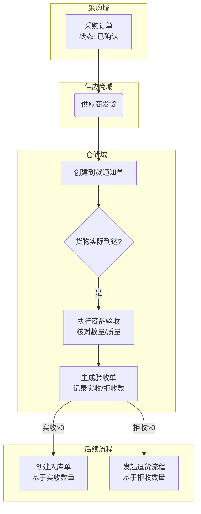
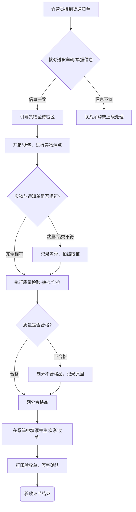
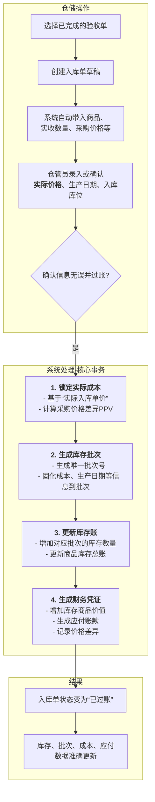
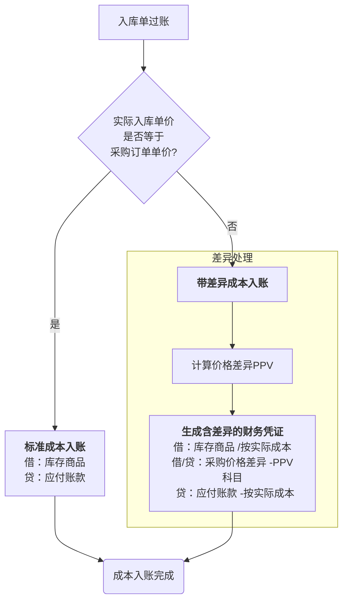
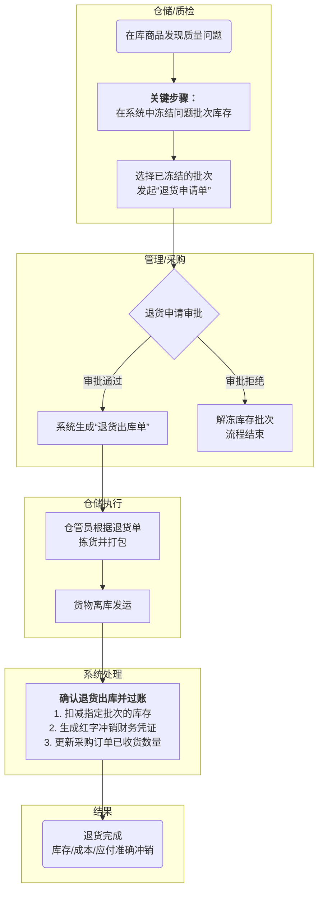
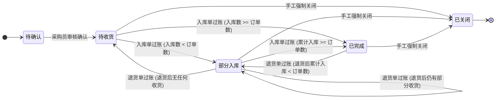
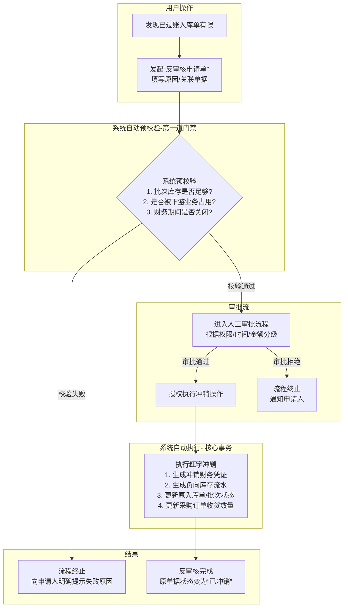

好的，我们完全可以这样做。

根据我们之前的分析结论，我将为您重新构建一份改进后的设计方案。这份新方案会**修正已发现的矛盾点、填补流程缺口、并明确模糊的定义**。最重要的是，我会按您的要求，为每个核心业务流程都配上清晰的**流程图**，以帮助您和您的团队更好地理解。

我们将分步骤完成这个过程，首先从入库流程的开端开始。

-----

### **第一部分：到货通知与商品验收流程**

这个阶段是入库管理的起点，目标是准确记录供应商的到货信息，并对实际到达的商品进行严格的数量和质量把关。

#### **流程图：到货与验收总览**

-----

### **1. 到货通知流程 (Arrival Notice)**

到货通知是供应商发货后，通知我方准备收货的凭证，是后续验收工作的依据。

#### **1.1 到货通知单生成**

**数据项定义**
| 数据项 | 计算逻辑/来源 | 单位 | 小数位 | 说明 |
|---|---|---|---|---|
| 通知单编号 | 系统自动生成 | - | - | 编码规则：ARN+年月日+3位流水号，保证唯一 |
| 关联采购订单号 | 手工选择，可多选 | - | - | 明确到货通知对应的采购订单，支持多订单合并到货 |
| 供应商信息 | 来源于采购订单 | - | - | 供应商编码、名称等，自动带出，不可修改 |
| 预计到货日期 | 来源于采购订单，可修改 | 日期 | - | 供应商确认的到货日期，作为收货计划依据 |
| 发货数量 | 手工填写或采购订单带出 | 基本计量单位 | 0 | 供应商声明的发货数量，作为验收的“应收”基准 |
| 备注 | 手工填写 | - | - | 可填写物流信息、司机联系方式等 |
| 到货通知状态 | 系统自动更新 | - | - | **草稿、已确认、已验收、已作废** |

#### **1.2 到货通知与采购订单关联**

**数据项映射关系**
| 采购订单数据项 | 到货通知数据项 | 映射规则 | 说明 |
|---|---|---|---|
| 订单编号 | 关联订单编号 | 直接引用 | 用于追溯来源 |
| 商品ID | 商品ID | 直接映射 | 确保商品一致性 |
| 订单未完成数量 | 发货数量 | 参考值 | 默认带出订单的未收货数量，但允许修改 |
| 供应商ID | 供应商ID | 直接映射 | 确保供应商一致性 |

#### **1.3 状态变更规则**

| 事件 | 采购订单状态变更 | 到货通知状态变更 | 说明 |
|---|---|---|---|
| 创建到货通知 | **保持不变** (仍为“已确认”或“待收货”) | 草稿 | 仅为计划，未实际影响订单 |
| 确认到货通知 | **保持不变** | 已确认 | 仓库确认收到通知，准备收货 |
| **完成商品验收** | **保持不变** | 已验收 | **关键修正**：验收完成只更新通知单状态，PO状态等待入库单过账后才更新 |
| 取消/作废通知 | **保持不变** | 已作废 | 供应商取消发货或我方拒绝 |

-----

### **2. 商品验收流程 (Goods Acceptance)**

商品验收是入库管理中**第一个关键物理控制点**，核心是确保收到的商品与订单要求在数量、质量上一致。我们将验收和入库明确为两个步骤，先完成物理验收，再进行系统入库。

#### **流程图：商品验收操作细化**

#### **2.1 验收单生成与处理**

**数据项定义**
| 数据项 | 计算逻辑/来源 | 单位 | 小数位 | 说明 |
|---|---|---|---|---|
| 验收单编号 | 系统自动生成 | - | - | 编码规则：QC+年月日+3位流水号 |
| 关联到货通知单号 | 直接引用 | - | - | 一个到货通知对应一个验收单 |
| 应收数量 | 来源于到货通知单的“发货数量” | 基本计量单位 | 0 | 预期要验收的商品数量 |
| **实收数量** | 验收人员清点后填写 | 基本计量单位 | 0 | **核心数据**：实际验收合格、准备入库的数量 |
| **拒收数量** | `应收数量 - 实收数量` 或手工填写 | 基本计量单位 | 0 | **核心数据**：因质量、破损等原因拒绝接收的数量 |
| 差异原因 | 当 `拒收数量 > 0` 时必填 | - | - | 提供结构化选项，如：包装破损、质量不符、数量短缺 |
| 质量状况 | 验收人员评定 | - | - | 分为：**全部合格、部分合格、全部不合格** |
| 验收人员 | 系统记录当前操作人 | - | - | 明确责任人 |
| 验收时间 | 系统记录操作时间 | 日期时间 | - | 记录实际验收发生时间 |
| 验收单状态 | 系统自动更新 | - | - | **验收中、已完成、已作废** |

#### **2.2 验收标准与质量控制**

*(此部分原设计非常出色，予以保留并优化)*
| 数据项 | 计算逻辑/来源 | 单位 | 小数位 | 说明 |
|---|---|---|---|---|
| 商品验收标准 | **来源于商品主数据** | - | - | 不同商品类别可预设不同验收模板 |
| 抽样比例 | 根据商品重要性或供应商评级设置 | % | 2 | 验收时的抽样检查比例 |
| 质量检验项 | 来源于验收标准模板 | - | - | 包括外观、包装、标识、生产日期标签等 |
| 合格标准 | 来源于验收标准模板 | - | - | 各检验项的合格条件 |
| 不合格处理方式 | 预设或自定义 | - | - | 包括：**整单拒收、部分拒收、让步接收** |
| 质量问题分类 | 系统预设 | - | - | 用于统计分析质量问题，反向评估供应商 |

#### **2.3 基于验收结果的后续处理（新增）**

“验收单”一经“已完成”状态确认，即成为下游流程的唯一合法依据，系统应自动或引导用户进行以下操作：

1.  **对于合格品（`实收数量 > 0`）**：

      * **触发**：“创建入库单”流程。
      * **数据传递**：“验收单”上的`商品ID`和`实收数量`将作为“入库单”的`商品ID`和`入库数量`的基准。

2.  **对于不合格品（`拒收数量 > 0`）**：

      * **触发**：“发起退货申请”或“采购-供应商协同处理”流程。
      * **数据传递**：“验收单”上的`商品ID`、`拒收数量`和`差异原因`将作为退货流程的依据。

-----

以上是第一部分——“到货通知与商品验收”的优化设计方案。我们明确了单据间的关系，修正了状态变更逻辑，并通过流程图具象化了操作步骤。

接下来，我们将进入第二部分，详细设计**入库单的生成、批次管理以及关键的成本核算**。您看可以吗？

好的，我们继续。

在第一部分，我们已经完成了对“到货通知”和“商品验收”流程的优化设计。现在，我们将进入整个入库流程的**核心环节**：**入库单的最终确认、库存与批次的生成、以及至关重要的成本核算**。

这是决定库存账目是否准确、财务数据是否合规的关键一步。我们将重点解决原方案中**采购价格僵化**的问题，并引入更规范的成本处理机制。

-----

### **第二部分：入库过账、批次生成与成本核算**

当商品验收无误后，仓管员将依据“验收单”在系统中创建并确认“入库单”。这一操作将正式增加系统库存，并确认一笔对供应商的应付账款。

#### **流程图：入库过账与批次生成流程**

-----

### **3. 入库单生成与处理 (Goods Receipt Note)**

入库单是确认库存增加和应付账款的正式单据。

#### **3.1 入库单数据项定义**

| 数据项 | 计算逻辑/来源 | 单位 | 小数位 | 说明 |
|---|---|---|---|---|
| 入库单编号 | 系统自动生成 | - | - | 编码规则：GR+年月日+3位流水号 |
| 关联验收单号 | 直接引用 | - | - | 确保入库基于已确认的验收结果 |
| 入库类型 | 系统自动判断或手工选择 | - | - | 采购入库、调拨入库、退货入库等 |
| 入库数量 | 来源于验收单的`实收数量` | 基本计量单位 | 0 | 此次操作增加库存的实际数量 |
| **采购订单单价(含税)** | **来源于采购订单，仅供参考** | 元/基本单位 | 2 | 用于与实际价格对比，计算差异 |
| **实际入库单价(含税)** | **手工填写或PO价带出后确认** | 元/基本单位 | 2 | **关键修正**：这是最终结算和成本核算的**唯一基准** |
| 实际入库单价(不含税) | `实际入库单价(含税) / (1 + 税率)` | 元/基本单位 | 4 | 税率来源于采购订单或商品主数据 |
| 实际入库金额(含税) | `入库数量 × 实际入库单价(含税)` | 元 | 2 | 含增值税总金额 |
| 实际入库金额(不含税) | `入库数量 × 实际入库单价(不含税)` | 元 | 2 | 不含增值税总金额 |
| 税额 | `实际入库金额(含税) - 实际入库金额(不含税)` | 元 | 2 | 增值税税额 |
| 入库仓库与库位 | 手工选择或系统推荐 | - | - | 明确商品存放的物理位置 |
| 入库操作人与时间 | 系统记录 | - | - | 明确操作责任 |
| 入库单状态 | 系统自动更新 | - | - | **草稿、已过账、已冲销** |

-----

### **4. 批次管理 (Batch Management)**

入库单过账时，系统必须为入库的商品生成一个或多个批次，用于后续的质量追溯和库存管理。

#### **4.1 批次生成机制**

  * **触发点**：`入库单`状态从“草稿”变为“**已过账**”时，系统在后台自动执行。
  * **批次号生成规则**：保持原优秀设计 `LOT+年月日+入库单号后4位+2位序号`，保证唯一且可读。
  * **批次拆分规则（关键修正）**：当一张入库单的**同一行商品**出现以下情况时，系统必须自动将其拆分为不同的批次：
    1.  **录入了不同的`生产日期`**：这是批次管理最核心的规则，用于效期管理。
    2.  **录入了不同的`供应商生产批号`**：即便生产日期相同，供应商自己的生产批号不同也应分开管理，便于精确追溯。
    3.  **验收时判定为不同的`质量等级`**：例如，部分商品为正品，部分为“让步接收”的次品，需分为不同质量等级的批次。
        *(已删除原设计中“不同供应商”的矛盾规则)*

#### **4.2 批次核心数据**

每个生成的批次记录都必须像“快照”一样，固化以下来自入库单的关键信息：

| 批次数据项 | 来源/映射规则 | 说明 |
|---|---|---|
| 批次编号 | 按规则自动生成 | 批次的唯一身份ID |
| 关联入库单号 | 直接引用 | 用于追溯该批次的来源单据 |
| 商品ID | 直接映射 | 明确批次对应的商品 |
| 批次初始数量 | 来源于入库数量 | 记录该批次诞生时的数量 |
| **批次成本单价** | **来源于`实际入库单价(不含税)`** | **关键修正**：批次的成本以实际发生价格为准 |
| 供应商ID | 直接映射 | 用于供应商质量追溯 |
| 生产日期 | 手工录入 | 用于计算有效期 |
| **保质期** | **来源于商品主数据** | 明确数据来源 |
| 有效期至 | `生产日期 + 保质期` | 系统自动计算 | 用于临期预警和先进先出 |
| 批次状态 | 默认为“正常” | 包括：正常、冻结、临期、过期等 |

-----

### **5. 入库与成本核算（新增核心章节）**

本章明确定义入库时如何处理成本，特别是当实际价格与订单价格不符时的会计处理。

#### **流程图：采购价格差异(PPV)处理**

#### **5.1 成本入账原则**

  * **库存资产价值**：库存商品的价值**必须**以`实际入库单价`为准进行核算。这是确保“存货”科目价值准确性的根本原则。
  * **批次成本**：每个批次的成本单价在生成时即被锁定，其价值等于 `批次成本单价 × 批次当前数量`。后续库存成本的计算（如移动平均成本）都将以此为基础。

#### **5.2 采购价格差异 (Purchase Price Variance - PPV) 处理**

  * **触发条件**：在入库单过账时，若`实际入库单价`与`采购订单单价`不一致，系统则自动计算PPV。
  * **计算公式**：`价格差异总额 = (实际入库单价 - 采购订单单价) × 入库数量`。
  * **会计处理**：系统应能自动生成或建议生成对应的会计凭证。价格差异会借记（成本增加）或贷记（成本降低）一个特定的损益类会计科目（如“主营业务成本 - 采购价格差异”），而不是直接增减库存资产的价值。
  * **业务价值**：通过PPV的核算，企业不仅能保证库存成本的准确性，还能清晰地衡量采购部门的价格谈判能力和供应商价格的稳定性。

-----

至此，第二部分完成。我们引入了处理价格差异的机制，并以此为基础，重新梳理了入库单、批次和成本三者之间的关系，使整个设计在财务规范性上更加严谨。

接下来，我们可以进入第三部分：**退货处理流程的优化**和**入库与采购订单关系的梳理**。

好的，我们继续进行第三部分的流程优化设计。

在前两部分，我们已经建立了一个严谨的从到货到入库、再到成本核算的流程。现在，我们将优化两个重要的关联流程：**一是当入库商品出现问题时的逆向流程——退货；二是从始至终与入库紧密相连的正向流程——采购订单的协同管理**。

-----

### **第三部分：退货处理与采购订单关系**

#### **流程图：采购退货流程（基于已入库商品）**

此流程图重点展示了当**商品入库后**发现质量问题时的标准处理步骤，核心是**先冻结、再申请**，确保过程可控。

-----

### **6. 退货处理流程 (Purchase Return)**

#### **6.1 退货申请与审核**

##### **6.1.1 前置操作：库存冻结 (新增)**

在针对已入库商品发起退货申请前，**必须**先在系统中将目标批次的状态变更为“**冻结**”。此操作将阻止该批次商品被销售、调拨或用于任何其他出库业务，是保证流程严谨性的关键一步。

##### **6.1.2 数据项定义**

| 数据项 | 计算逻辑/来源 | 单位 | 小数位 | 说明 |
|---|---|---|---|---|
| 退货申请单号 | 系统自动生成 | - | - | 编码规则：RR+年月日+3位流水号 |
| **关联批次号** | **手工选择已冻结的批次** | - | - | **关键修正**：明确指出要退回的具体批次，不再使用模糊规则 |
| 关联入库单号 | 根据关联批次号自动带出 | - | - | 向上追溯原始入库信息 |
| 退货原因 | 手工选择或填写 | - | - | 质量不合格、规格不符等，作为供应商评估依据 |
| 退货数量 | 手工填写 | 基本计量单位 | 0 | 申请退回的商品数量，不得超过所选批次的可用库存 |
| 申请人员/时间 | 系统记录 | - | - | 明确申请责任 |
| 审核状态 | 系统自动更新 | - | - | 待审核、已审核、已拒绝 |

#### **6.2 退货出库单生成与处理**

退货申请审批通过后，系统生成“退货出库单”，指导仓库执行实际的退货操作。

| 数据项 | 计算逻辑/来源 | 说明 |
|---|---|---|
| 退货出库单编号 | 系统自动生成 | 编码规则：RTN+年月日+3位流水号 |
| 关联退货申请单号| 直接引用 | 确保执行基于已审批的申请 |
| 供应商信息 | 来源于原始入库单 | 明确退货对象 |
| 退货数量与批次 | 来源于退货申请单 | 确保退货的准确性 |
| 退货单价(含税) | 来源于所选批次的成本单价 | 确保成本冲销的准确性 |
| 退货金额(含税) | `退货数量 × 退货单价(含税)` | - |
| **退货费用** | **手工填写（可选）** | **功能增强**：记录退货过程中发生的运费等，用于成本分摊或向供应商索赔 |
| **费用承担方** | **手工选择（可选）** | 我方 / 供应商 |
| 退货单状态 | 系统自动更新 | 待出库、已出库、已作废 |

#### **6.3 退货与库存调整**

| 项目 | 规则描述 |
|---|---|
| **批次选择规则** | **（关键修正）** 必须优先、且精确地从退货申请单上指定的“**关联批次号**”中扣减库存。 |
| **库存调整** | 退货出库单过账时，系统自动生成一笔负向的库存事务，减少指定批次的库存数量。 |
| **成本调整** | 同时，系统自动冲销对应的库存价值，确保账实相符。 |

-----

### **7. 入库与采购订单关系 (GRN & PO Relationship)**

本章明确入库和退货流程如何反向影响上游的采购订单，形成一个完整的业务闭环。

#### **流程图：采购订单状态流转**

#### **7.1 采购订单状态与数量更新**

##### **7.1.1 核心原则**

采购订单的“已收货数量”及“订单状态”的更新，其**唯一触发器**是下游“**入库单的过账**”或“**退货出库单的过账**”。任何中间环节（如创建到货通知、验收）均不应影响采购订单的状态。

##### **7.1.2 数量核对规则**

| 规则类型 | 规则描述 |
|---|---|
| **累计入库数量** | 采购订单行上必须有一个字段，用于累计所有关联入库单的收货数量总和。 |
| **部分入库** | 当 `0 < 累计入库数量 < 订单数量` 时，订单行状态应为“部分入库”。 |
| **全部入库** | 当 `累计入库数量 >= 订单数量` 时，订单行状态应自动更新为“已完成”。 |
| **超量入库** | `入库数量 > 订单未完成数量` 时，系统应发出警告。可配置一个容差比例（如3%），超出容差的入库需要特殊审批才能过账。 |
| **退货更新** | 退货出库单过账时，系统应从采购订单行的“累计入库数量”中扣减退货数量，并根据结果重新判断订单状态。 |

-----

至此，第三部分完成。我们优化了退货流程，堵上了流程漏洞，并用状态图清晰地定义了采购订单的生命周期。

现在，整个正向和逆向的入库流程已经非常清晰和严谨。最后，我们将挑战最复杂的环节：**对已过账的入库单进行反审核（冲销）的完整流程设计**。

好的，我们进入最后，也是最关键的部分。

之前我们已经构建了完整、严谨的正向与逆向入库流程。但现实中，错误在所难免，一个已经确认过账的入库单，后续可能发现价格、数量甚至商品本身录入错误。如何安全、合规地“反悔”，是衡量一个系统成熟度的试金石。

------

### **第四部分：入库单反审核（冲销）流程**

本章将设计一个强大的“反审核”功能，我们不再使用“删除”这个词，而是用更专业、更安全的“**冲销**”来定义这个过程。其核心是**生成一笔与原始操作完全相反的红字交易**，以抵消其影响，同时保留完整的审计链条。

#### **流程图：入库单反审核（冲销）流程**

Code snippet

------

### **8. 入库单反审核（冲销）流程**

#### **8.1 反审核核心原则 (新增)**

在进行流程设计前，必须确立以下不可违背的原则：

1. **严禁删除，唯有冲销**：任何已过账的单据都不能从数据库中物理删除。所有更正操作都必须通过生成一笔方向相反的“红字”交易来完成，以留下完整的审计轨迹。
2. **风险前置，校验优先**：在人工审批前，系统必须进行严格的自动预校验，将明显不符合条件的申请直接拦截，节约人力成本，降低风险。
3. **权责对等，分级授权**：纠正错误的成本和风险与时间成正比。因此，反审核权限必须与时间、金额、角色严格挂钩。

#### **8.2 反审核申请与权限控制**

(此部分保留原设计的优秀思想并加以固化)

用户通过“反审核申请单”发起请求。系统的权限控制矩阵应明确规定不同角色（如仓库管理员、财务、经理）可申请反审核的时间窗口（如24小时内、7天内、当前会计期内），并自动匹配相应的审批流程。

#### **8.3 反审核预校验（系统自动执行）**

这是申请流程的第一个自动化“门禁”。当用户提交申请后，系统在进入人工审批前，必须完成以下校验：

| 校验项           | 校验规则                                                     | 校验失败处理                                                 |
| ---------------- | ------------------------------------------------------------ | ------------------------------------------------------------ |
| **批次库存校验** | **（关键修正）** 校验原入库单生成的**每一个批次**，其当前物理库存是否足够被冲销。若任何批次已被部分或全部消耗（如销售、调拨、盘亏），则校验失败。 | 立即终止流程，并向用户精准提示：“无法申请：批次 `LOT-XXXX` 库存不足，已被销售单 `SO-YYYY` 消耗”。 |
| **下游单据校验** | 检查该批次是否被未完成的下游单据锁定或引用（如未发货的销售订单、在途的调拨单）。若存在，校验失败。 | 立即终止流程，并提示用户需要先处理下游关联单据。             |
| **财务期间校验** | 检查该入库单的记账日期是否属于**已关闭**的财务会计期间。若是，校验失败。 | 立即终止流程，提示“原单据已跨会计期结转，无法常规反审核，请联系财务部进行专项调整”。 |

#### **8.4 反审核执行与数据回滚**

审批通过后，用户或系统授权执行冲销操作。系统将执行一个包含以下所有步骤的数据库事务，保证操作的原子性（要么全部成功，要么全部失败）。

| 数据类型         | 回滚/冲销方式                                                |
| ---------------- | ------------------------------------------------------------ |
| **入库单数据**   | 原入库单的`状态`更新为“**已冲销**”。原单据所有信息保留，变为只读。 |
| **库存数据**     | 生成一笔红字的、类型为`采购入库-冲销`的库存流水，精确扣减**原批次**的库存数量。 |
| **批次数据**     | **（关键修正）** 批次记录**绝不删除**。其库存数量因上述红字流水而归零，`状态`可更新为“已耗尽”或“已冲销”。 |
| **成本数据**     | **（关键修正）** 系统生成冲销分录。对于移动平均成本法，为保证历史报表稳定，**不追溯重算**历史出库成本。而是将本次冲销对成本的影响，在**当前会计期间**计入“成本调整”或“库存重估”等科目。 |
| **财务数据**     | 自动生成一张与原始入库凭证金额相等、但借贷方向完全相反的**红字会计凭证**，以抵消其财务影响。 |
| **采购订单数据** | 对应采购订单行的`累计已收货数量`字段，将减去本次冲销的数量，并根据新结果重新判断订单状态（如从“已完成”退回“部分入库”）。 |

#### **8.5 操作日志与追溯**

(保留原设计的优秀思想)

系统必须记录关于反审核的全量日志，包括：申请人、申请时间、申请原因、每一级审批人、审批意见、审批时间、最终执行人、执行时间以及所有相关数据的变更前后对比，确保任何冲销操作都有据可查，无可抵赖。

------

### **最终总结**

至此，我们完成了对整个入库管理流程的四部分优化设计。从一份非常出色的原始设计出发，我们共同：

1. **梳理并明确了核心入库主流程**，通过流程图使其更具可读性。
2. **引入了采购价格差异（PPV）的处理机制**，解决了成本核算中的核心痛点，使设计在财务上更加严谨。
3. **优化了批次管理和退货流程**，填补了状态联动和操作规则上的缺口，使其更贴近实际业务。
4. **最终构建了一个极其安全、规范的反审核（冲销）机制**，通过“校验前置”和“冲销代替删除”等原则，确保了系统在纠错过程中的数据安全与合规性。

这份经过四步优化后的全新设计方案，为您提供了一个逻辑严密、流程完整、风险可控的坚实基础，足以用来构建一套世界级的、专业的进销存管理系统。
