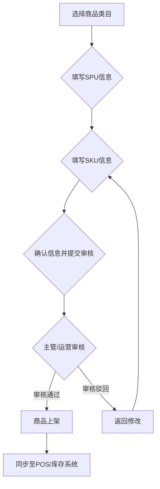

### **产品功能说明书 (PRD)**

### **1. 模块：商品中心 (Product Master Data Management)**

-----

#### **1.1 版本修订历史**

| 版本号 | 修订日期   | 修订人 | 修订内容         |
| :----- | :--------- | :----- | :--------------- |
| V1.0   | 2025-06-26 | 孙杨竣 | 初稿，创建商品中心核心功能 |

#### **1.2 模块概述**

商品中心是整个非油零售管理系统的核心基础，负责对所有非油商品信息进行统一、标准化的创建、管理和维护。本模块旨在建立一个结构清晰、信息完整、易于扩展的商品主数据库，为采购、库存、销售、财务和数据分析等所有下游业务模块提供准确、唯一的商品数据源 (Single Source of Truth)。

#### **1.3 功能范围与目标**

  * **目标一：标准化商品结构** - 建立SPU、SKU、SN的商品层级关系，实现对商品的精准管理。
  * **目标二：规范化分类与属性** - 通过三级类目与动态属性，满足灵活的商品组织和筛选需求。
  * **目标三：流程化商品发布** - 定义清晰的商品主数据生成流程，确保信息录入的完整性与准确性。
  * **目标四：支持多样化销售** - 支持对单品及组合商品的管理，满足加油站便利店的复杂销售场景。

-----

### **2. 核心功能设计**

#### **2.1 商品模型定义**

系统需支持三层商品模型，以应对复杂的商品管理需求。

  * **SPU (Standard Product Unit - 标准产品单元)**

      * **定义:** SPU是商品的标准化集合，代表一类具有共同关键属性的商品。例如，“农夫山泉550ml天然水”是一个SPU。
      * **核心字段:**
          * `SPU ID`: 系统唯一识别码。
          * `商品通用名`: 如“农夫山泉550ml天然水”。
          * `品牌 (Brand)`: 关联品牌库，如“农夫山泉”。
          * `商品主图`: SPU的代表性图片。
          * `商品描述`: 富文本描述，介绍商品特点。
          * `关键属性集`: 定义该SPU下的SKU会变化的属性，例如“包装方式”（单瓶/整箱）。

  * **SKU (Stock Keeping Unit - 库存量单位)**

      * **定义:** SKU是库存管理的最小单位，是真正物理存在、可进行销售和库存计量的商品。一个SPU下可包含一个或多个SKU。例如，“农夫山泉550ml天然水 (单瓶)”和“农夫山泉550ml天然水 (24瓶/箱)”是两个不同的SKU。
      * **核心字段:**
          * `SKU ID`: 系统唯一识别码。
          * `所属SPU ID`: 关联唯一的SPU。
          * `SKU名称`: 系统根据SPU通用名+销售属性自动生成或允许自定义，如“农夫山泉550ml天然水 (24瓶/箱)”。
          * `销售属性值`: 继承自SPU的关键属性，并赋予具体的值。如 `包装方式: 整箱`。
          * `商品条码 (Barcode)`: **核心字段**，用于POS扫描。支持一SKU多条码。
          * `规格/单位`: 如“箱”、“瓶”。
          * `供应商信息`: 关联供应商库，可指定主供应商。
          * `采购价/建议零售价/会员价`。
          * `库存相关属性`: 安全库存阈值、保质期（天）。
          * `财务相关属性`: 税率。
          * `SKU图片`: 可继承SPU主图或单独上传。
          * `状态`: 草稿、待审核、已上架、已下架。

  * **SN (Serial Number - 序列号)**

      * **定义:** 对单个商品实例的唯一标识。主要用于高价值、需要追溯或进行特殊管理的商品。对于加油站非油品，此项为**可选高级功能**，初期可不强制要求，但系统架构应预留接口。
      * **应用场景:** 价值较高的酒水、联名款模型、电子产品等。
      * **管理方式:** 在采购入库或销售出库时，通过扫描记录SN码，实现对单个商品的全程追溯。

#### **2.2 三级商品类目 (Category)**

  * **功能描述:** 建立一个标准的、树状的商品分类体系，最多支持三级，用于商品的归类、查找和统计分析。
  * **结构示例:**
      * 一级类目: 饮品
          * 二级类目: 瓶装水
              * 三级类目: 天然水
              * 三级类目: 纯净水
          * 二级类目: 碳酸饮料
              * 三级类目: 可乐
              * 三级类目: 气泡水
      * 一级类目: 食品零食
          * 二级类目: 方便速食
              * 三级类目: 方便面
  * **管理功能:**
      * 后台提供对类目的增、删、改、查及排序功能。
      * 修改或删除类目时，需有提示告知该操作对已关联商品的影响。
      * 每个三级类目可以绑定一套“属性模板”，在创建该类目下的商品时自动带出。

#### **2.3 商品属性与分组 (Attribute & Grouping)**

  * **功能描述:** 用于描述SPU和SKU的详细特征，分为关键属性和非关键属性，并支持属性分组展示，优化录入体验。
  * **属性类型:**
      * **关键属性 (Key Attribute):** 也称销售属性。是**区分不同SKU**的决定性属性。例如：`包装方式` (单瓶/整箱)、`口味` (原味/香辣)。用户在创建SPU时定义，在创建SKU时选择具体值。
      * **非关键属性 (Non-key Attribute):** 也称商品参数。是SPU下所有SKU都共享的描述性属性。例如：`产地` (浙江杭州)、`净含量` (550ml)、`配料表`。
  * **属性值录入方式:**
      * `下拉选择`: 预设可选值。
      * `手动输入`: 自由文本输入。
      * `多选框`: 适用于标签类属性。
  * **属性分组:**
      * 允许将属性进行分组管理，如“基本信息”、“主体参数”、“包装参数”等，使商品录入和展示页面更清晰。

#### **2.4 商品主数据生成流程 (Product Release Workflow)**

参照主流电商平台，建立一套严谨的商品发布流程，确保数据质量。

**流程图:**

**步骤分解:**

1.  **第一步：选择商品类目**

      * 操作员首先从三级类目中选择要发布的商品所属的末级类目。
      * 系统根据所选类目，自动加载绑定的属性模板。

2.  **第二步：填写SPU信息**

      * 填写SPU通用名、品牌、商品描述等。
      * 定义该SPU的关键属性（如：口味、规格），并给出可选值列表（如口味：[原味, 香辣, 藤椒]）。
      * 填写该SPU共享的非关键属性（如：产地、保质期）。
      * 上传SPU主图。

3.  **第三步：填写SKU信息**

      * 系统根据上一步定义的关键属性，动态生成一个SKU列表供操作员填写。
      * **例如:** 如果关键属性是 `口味` (原味/香辣) 和 `包装` (单包/五连包)，系统会生成4行SKU模板：[原味,单包]、[原味,五连包]、[香辣,单包]、[香辣,五连包]。
      * 操作员为每一个需要创建的SKU填写**条形码、供应商、采购价、建议零售价**等信息。可以批量填充相同的值。
      * 如果某个组合不需要创建（如没有“香辣五连包”），则不填写该行即可。
      * 为每个SKU上传独立的图片（可选）。

4.  **第四步：提交审核**

      * 操作员预览所有信息，确认无误后提交。商品状态变为“待审核”。

5.  **第五步：审核**

      * 具有审核权限的账号（如商品运营主管）在待办事项中看到审核任务。
      * 审核人检查所有信息的完整性、准确性、合规性。
      * **审核通过:** 商品状态变为“已上架”，系统触发数据同步任务，将商品信息下发至适用的加油站POS机和库存中心。
      * **审核驳回:** 填写驳回原因，商品状态变为“草稿”，退回给提交人修改。

#### **2.5 组合商品 (Bundled/Combo Product)**

  * **功能描述:** 支持将多个独立的SKU虚拟地捆绑成一个新的商品进行销售，常用于套餐或礼包。
  * **实现方式:**
      * 创建一个**新的、特殊的SKU**，其商品类型标记为“组合商品”。
      * 这个特殊的SKU不管理独立的物理库存，其“可售库存”由所包含的子SKU的最低库存决定。
      * **管理界面:**
          * 在创建组合商品SKU的页面，有一个“包含商品”的管理区域。
          * 操作员可以搜索并添加已存在的、独立的SKU作为其子商品，并定义每个子商品的数量。
          * **示例:** 创建一个“早餐优惠套餐” (组合SKU)，包含：
              * 子SKU 1: `“某品牌”包子` x 1
              * 子SKU 2: `“某品牌”豆浆` x 1
          * 为这个组合SKU单独设置一个套餐价（如 8元，低于单买总和）。
  * **销售与库存联动:**
      * 当POS端售出一份“早餐优惠套餐”时，后台系统会自动扣减`“某品牌”包子`和`“某品牌”豆浆`各自的物理库存。

-----

### **3. 非功能性需求**

  * **性能:** 商品列表页加载时间应在2秒以内，搜索响应时间在1秒以内。
  * **易用性:** 界面布局清晰，流程引导明确，支持批量操作（如批量修改价格、批量上下架）。
  * **安全性:** 关键操作（如修改价格、删除商品）需要权限控制和操作日志记录。

-----

以上是商品中心模块的核心功能说明。这份文档明确了“做什么”和“规则是怎样”，可以有效指导后续的设计和开发工作。接下来，我们可以基于此讨论UI/UX原型设计，或者深入下一个模块，例如“采购管理”。